# Java上半

## P157-常用API学习-System

System是一个工具类，提供一些与系统相关的方法
|方法名|说明|
|:-:|:-:|
|pulic static void exit(int status)|终止当前Java虚拟机|
|public static long currentTimeMills()|返回当前系统的毫秒值形式|
|public static void arraycopy(数据源数组,起始索引,目的地数组,起始索引,拷贝个数)|数组拷贝|

计算机时间原点:**1970年1月1日00：00：00**,我国在东八区,有八个小时时差,所以应该是**1970年1月1日00：08：00**

> public static void exit(int status),参数status，0为正常退出,非0是不正常推出

> public static long currentTimeMills()这个方法可以用它来计算函数的执行时间,下面是一个例子

```java
long start = System.currentTimeMillis();
        for(
int i = 1;
i< 1000;i++){
boolean result = isPrime1(i);
            if(result){
        System.out.

println(i);
            }
                    }
long end = System.currentTimeMillis();
        System.out.

println("程序执行时间"+(end -start));

long start1 = System.currentTimeMillis();
        for(
int i = 1;
i< 100;i++){
boolean result = isPrime2(i);
            if(result){
        System.out.

println(i);
            }
                    }
long end1 = System.currentTimeMillis();
        System.out.

println("程序执行时间"+(end1 -start1));

        }

public static boolean isPrime1(int num) {
    for (int i = 2; i < num; i++) {
        if (num % i == 0) {
            return false;
        }
    }
    return true;
}

public static boolean isPrime2(int num) {
    for (int i = 2; i < Math.sqrt(num); i++) {
        if (num % i == 0) {
            return false;
        }
    }
    return true;
}
```

这段代码是用来检测这两个判断是否为质数的执行速度的

> public static void arraycopy(数据源数组,起始索引,目的地数组,起始索引,拷贝个数)

```java
        // 如何使用System.arraycopy
//基本数据类型
int[] arr1 = {1, 2, 3, 4, 5, 6, 7, 8, 9, 10};
int[] arr2 = new int[10];
//参数一:要拷贝的源数组
//参数二:拷贝的索引
//参数三:目标数组
//参数四:目标数组索引
//参数五:需要复制的个数
        System.

arraycopy(arr1, 0,arr2, 0,10);

        for(
int arr22 :arr2){
        System.out.

println(arr22);
        }

//引用数据类型
Student s1 = new Student("wx", 12);
Student s2 = new Student("ww", 22);
Student s3 = new Student("wa", 99);

Student[] stuArr = {s1, s2, s3};
Person[] perArr = new Person[3];
        System.

arraycopy(stuArr, 0,perArr, 0,3);
        for(
Person person :perArr){
        System.out.

println(person.getAge() +","+person.

getName());
```

> 如果数据源数组和目的地数组都是基本数据类型,那么就需要保持两者的类型相同,否则就会报错例如:int[]不能拷贝到double[]中
> 如果数据源数组和目的地数组都是引用数据类型,那么子类对象可以赋值给父类类型,

## P158-常用API学习-Runtime

<font size=5>Runtime</font>
//这是一个修改，这是第二个
> Runtime表示当前虚拟机的运行环境

这个类对象不能自己new,需要使用方法获取

|                 方法名                 |                 说明                 |
|:-----------------------------------:|:----------------------------------:|
| public static Runtime getRuntime()  |            获取系统的运行环境对象             |
|    public void exit(int status)     | 停止虚拟机,跟上面的System.exit(int staus)相同 |
|  public int availableProcessors()   |              获取CPU线程数              |
|       public long maxMemory()       |     JVM虚拟机从系统中获取的总内存大小(单位byte)     |
|      pulic long totalMemory()       |      JVM虚拟机已经获取的内存大小(单位byte)       |
|      public long freeMemory()       |         JVM剩余内存大小(单位byte)          |
| public Process exec(String command) |              运行cmd命令               |

> 温馨提示:如果想要将byte转换为KB或者MB，需要byte / 1024 = KB ,因为1kb=1024byte

```java
恶搞别人个关机程序
        package JavaP158;

import java.awt.event.ActionEvent;
import java.awt.event.ActionListener;
import java.io.IOException;

import javax.swing.JButton;
import javax.swing.JDialog;
import javax.swing.JFrame;
import javax.swing.JLabel;
import javax.swing.WindowConstants;

public class JavaP58DemoJFame extends JFrame implements ActionListener {
    // 将按钮对象定义到成员位置,以便为了调用
    JButton yesBut = new JButton("帅炸了");
    JButton midBut = new JButton("我错了");
    JButton badBut = new JButton("好丑");
    // 获取系统runtime对象

    public JavaP58DemoJFame() {
        intitJFame();
        initView();
        // 设置显示
        setVisible(true);
    }

    public void intitJFame() {
        // 设置宽高
        setSize(500, 600);
        // 设置标题
        setTitle("恶搞基友");
        // 设置关闭模式
        setDefaultCloseOperation(WindowConstants.DO_NOTHING_ON_CLOSE);
        // 设置一直在最上面
        setAlwaysOnTop(true);
        // 设置居中
        setLocationRelativeTo(null);
        // 取消默认位置
        setLayout(null);
    }

    public void initView() {
        getContentPane().removeAll();
        JLabel test = new JLabel("你觉得我帅吗");

        // System.out.println(test.getText());
        test.setBounds(200, 150, 300, 50);
        // 设置按钮尺寸和位置
        yesBut.setBounds(100, 250, 300, 50);
        midBut.setBounds(200, 325, 100, 30);
        badBut.setBounds(160, 400, 180, 30);
        // 绑定事件监听
        yesBut.addActionListener(this);
        midBut.addActionListener(this);
        badBut.addActionListener(this);
        // 将按钮添加到界面中
        getContentPane().add(yesBut);
        getContentPane().add(midBut);
        getContentPane().add(badBut);
        // 添加提示语
        getContentPane().add(test);
        getContentPane().repaint();
    }

    @Override
    public void actionPerformed(ActionEvent e) {
        // 获取是哪个对象
        Object object = e.getSource();
        if (object == yesBut) {
            showDiwlog("谢谢夸奖");
        } else if (object == midBut) {
            showDiwlog("我错了");
            try {
                // 执行系统cmd程序
                Runtime.getRuntime().exec(new String[]{"shutdown", "-a"});
            } catch (IOException e1) {
                // TODO Auto-generated catch block
                e1.printStackTrace();
            }
        } else if (object == badBut) {
            showDiwlog("你完了");
            try {
                // 执行系统cmd程序
                Runtime.getRuntime().exec(new String[]{"shutdown", "-s", "-t", "100"});
            } catch (IOException e1) {
                // TODO Auto-generated catch block
                e1.printStackTrace();
            }
        }
    }

    public void showDiwlog(String context) {// 跳出弹框
        JDialog jdialog = new javax.swing.JDialog();
        // 设置弹窗尺寸
        jdialog.setSize(200, 150);
        // 始终再最上面
        jdialog.setAlwaysOnTop(true);
        // 设置一直居中
        jdialog.setLocationRelativeTo(null);
        // 弹窗不关闭就无法操作下面的界面
        jdialog.setModal(true);
        // 设置描述,添加到弹窗里面
        JLabel warn = new JLabel(context);
        // 设置描述大小
        warn.setBounds(0, 0, 200, 150);
        // 将弹窗添加到弹窗容器内
        jdialog.getContentPane().add(warn);
        // 让弹窗显示
        jdialog.setVisible(true);
    }

    执行方法:
            package JavaP158;

    public class JavaP158Demo {
        public static void main(String[] args) {
            new JavaP58DemoJFame();
        }

    }

}

```

## P159-常用API-Object

- Object类是所有类的顶级父类,所有类间接或直接继承于Object类
- Object类可以被所有子类访问,所以要学习Object类中的方法

Object构造方法
|方法名|空参构造|
|:-:|:-:|
|public Object()|空参构造|
|public String toString()|返回对象的字符串表示形式|
|public Object clone(int a)|对象克隆|

- **toString方法**

```java
// 1.toString,将对象以字符串格式返回
Object object = new Object();
String str = object.toString();
        System.out.

println(str);// java.lang.Object@5f5a92bb
// 有一个细节:这里并没有写toString,但是直接输出还是跟上面的相同
// System:类名
// out:静态常量名,这里的final修饰的是引用数据类型,地址值不能变,内容可以变
// println():方法名
// 参数:标识要输出的内容
// 核心逻辑,当我们打印一个对象的时候,底层会调用对象的toString方法,把对象变成字符串,然后再打印再控制台上,打印完毕换行处理
    
        System.out.

println(object);
//下面是图例
```


- **equals方法**

> 默认比较的是地址值,图例如下


如果不想要比较地址值的话,可以重写equals方法

```java
       //这是对equals的小练习
String s1 = "abc";
StringBuilder s2 = new StringBuilder("abc");
        
        System.out.

println(s1.equals(s2));
        // 因为equals是被s1调用的，而s1是字符串,调用的是字符串里面的equals方法
        // 字符串里面的equals方法,先判断参数是否是字符串
        // 但是s2是StringBuilder的类对象,所以就不相等
        // 所以就会返回false
        System.out.

println(s2.equals(s1));
        // 这里equals是被s2调用的,而s2是StringBuilder类对象
        // 在StringBuilder中,没有重写equals方法
        // 所以调用的是object中的equals方法
        // 在object中,==号比较的是地址值
        // 所以这两个记录地址值不一样,就会返回false
        }
```

## P160-常用API-浅克隆，深克隆，对象工具类Objects

把A对象的属性完全拷贝给B对象,也叫对象拷贝,对象复制

> protected权限修饰符解释
> 总之，当B extends A的时候，在子类B的作用范围内，只能调用本子类B定义的对象的protected方法(该方法从父类A中继承而来)
> 。而不能调用其他A类（A 本身和从A继承）对象的protected方法

克隆方式

- 浅克隆:不管对象内部属性是基本数据类型还是引用数据类型,都会完全拷贝过来
- 深克隆:基本数据类型拷贝过来,字符串复用,引用数据类型会重新创建新的

现在使用深克隆可以使用一个第三方工具Gson，只要导入就可以了

[Gson下载链接](https://search.maven.org/remotecontent?filepath=com/google/code/gson/gson/2.10.1/gson-2.10.1.jar)

使用方式

```java
// 对象的浅克隆，深克隆和对象工具类Objects
int[] data = {1, 2, 3, 4, 5, 67};
// 1.先创建一个对象
User u1 = new User(12, "wx", "123456", "美国大区", data);
        System.out.

println(u1);
// 2.进行对象的克隆
// 书写细节:重写Object中的clone方法
// 让JavaBean类实现Cloneable接口
// 创建原对象并调用clone就可以了

User u2 = (User) u1.clone();
        System.out.

println(u2);
// Object中的clone是浅克隆

int[] add = u1.getData();
add[0]=100;
        System.out.

println(u1);
        System.out.

println(u2);

//如果需要进行深克隆,需要重写Object类中的clone方法
//或者使用gson外部库
------------------------------------------


        /
// Gson是一个外部库,需要导入
// 创建一个对象
Gson gson = new Gson();
// 将对象变成Json字符串
String s = gson.toJson(u1);
// 打印Json字符串
        System.out.

println(s);

// 将字符串变回对象,有两个参数，前面是Json字符串，后面是对象的类型
User user = gson.fromJson(s, User.class);
// 打印user对象
        System.out.

println(user);

// 可以代替深克隆使用
User user2 = gson.fromJson(s, User.class);
        System.out.

println(user2);
```

Objects是一个工具类,提供了一些方法去完成一些功能

| 序号 |                       方法名                       |          说明          |
|:--:|:-----------------------------------------------:|:--------------------:|
| 1  | public static boolean equals(Object a,Object b) |   先做非空判断,然后比较两个对象    |
| 2  |      public staic boolean isNull(Object a)      | 判断对象是否为Null，是则返回true |
| 3  |     public staic boolean nonNull(Object a)      | 判断对象是否为Null，是则返回true |

- 1:细节

```java
// Objects工具类学习
Student s1 = new Student("zhangsan", 12);
Student soneHalf = null;
Student s2 = new Student("zhangsan", 12);
// System.out.println(s1.equals(s2));
        System.out.

println(Objects.equals(s1, s2));
        System.out.

println(Objects.equals(soneHalf, s2));
// Objects.equals方法细节
// 方法底层会判断s1是否为null,如果为Null，直接返回false
// 如果s1不为null,那么就利用s1再次调用equals方法
// 如果s1是Student类型,所以最终还是会调用Student中的equals方法
// 如果没有重写,比较地址值，如果重写了,比较属性值

```


## P161 常用API-BigInteger

在Java中,整数有四种类型

|  类型   | 占用字节大小 |
|:-----:|:------:|
| byte  |   1    |
| short |   2    |
|  int  |   4    |
| long  |   8    |

BigInteger构造方法
|方法名|说明|
|:-:|:-:|
|public BigInteger(int num,int Random rnd)|获取随机大整数:范围[0~2的num次方-1]|
|public BigInteger(String val)|获取指定大的整数|
|public BigInteger(String val,int radix)|获取指定进制的大整数|

有一个静态方法获取BigInteger对象，内部有优化的:
public static BigInteger valueOf(long val)
!注意:对象一旦创建内部的值无法改变不了

BigInteger常见成员方法

|                          方法名                           |         说明         |
|:------------------------------------------------------:|:------------------:|
|          public BigIntegeradd(BigInteger val)          |         加法         |
|       public BigInteger subtract(BigInteger val)       |         减法         |
|       public BigInteger multiply(BigInteger val)       |         乘法         |
|        public BigInteger divide(BigInteger val)        |       除法,获取商       |
| public BigInteger[] divideAndRemainder(BigInteger val) |     除法,获取商和余数      |
|            public boolean equals(Object x)             |       比较是否相同       |
|          public BigInteger pow(int exponent)           |         次幂         |
|       public BigInteger max/min(BigInteger val)        |      返回较大/较小值      |
|          public int intValue(BigInteger val)           | 转为int类型整数,超出范围数据有误 |

以下是代码笔记:

```java
   // BigInteger
// 1.获取一个随机大整数
BigInteger bigint = new BigInteger(100, new Random());
        System.out.

println(bigint);

// 2.获取一个指定的大整数
BigInteger bigint2 = new BigInteger("4892570235");
        System.out.

println(bigint2);

// 3.获取一个指定进制的整数
BigInteger bigint3 = new BigInteger("1000", 2);
        System.out.

println(bigint3);

// 4.有一个静态方法获取BigInteger对象，内部有优化的:
// public static BigInteger valueOf(long val)
// !注意:对象一旦创建内部的值无法改变
// 细节:参数是long类型的,比较小
// 这里可以获取long类型长度看一下
        System.out.

println("Long类型最大"+Long.MAX_VALUE);
// 这个方法对常用数字:-16~16做了优化 
// 提前把这个范围以内的数字创建好BigInteger对象,如果多次获取不会创建新的对象

BigInteger bigint4 = BigInteger.valueOf(5000);
        System.out.

println(bigint4);
// 只要计算就会产生一个新的BigInteger对象
```

## P162 常用API-BigDecimal

BigDecimal的作用

- 用于小数的精确计算
- 用来表示很大的小数

静态方法和成员方法斗鱼BigInteger类似
==细节==
> 1.如果要表示数字不大,没有超出double范围,建议使用BigDecimal的valueOf方法获取BigDecimal对象
> 2.如果要表示数字比较大,超出double范围，建议使用BigDecimal构造方法
> 3.如果我们创建的是0-10的整数,则会返回已经创建好的对象

BigDecimal常用方法
|方法名|说明|
|:-:|:-:|
|public BigDecimal divide(BigDecimal val)|除法|
|public BigDecimal devide(BigDecimal val,精确几位,舍入方式)|除法的重载方法|

其余都与BigInteger类似

**存储原理**:转成字符,转换为ascill,然后存入数组

要注意要会看Java的API帮助文档

## P163 正则表达式

开头先来一个体验,检验QQ是否符合要求

- 长度大于6且小于20
- 开头不能是0
- 中间必须全都是数字

```java
qq.matches("[1-9]\\d{5,19}")
```

正则表达式作用

- 作用1:检验字符串
- 作用2:在一段文本当中查找满足要求的内容

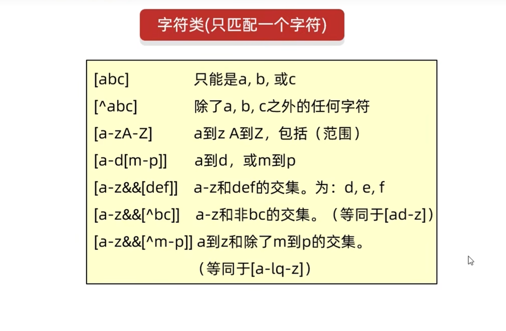

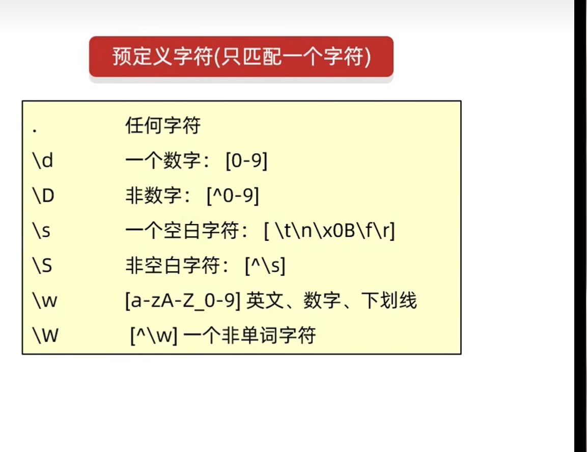

有一个方法

```java
public boolean matches(String regex):判断是否符合`regex`这段正则,符合返回true,不符合返回false
```

匹配数量词

|   字符   |         说明         |
|:------:|:------------------:|
|   X?   |     X,出现一次或者多次     |
|   X*   |     X,出现零次或者多次     |
|   X+   |     X,出现一次或者多次     |
|  X{n}  |      X,出现正好n次      |
| X{n,}  |      X,出现最少n次      |
| X{,m}  |      X,出现最多n次      |
| X{n,m} | X,出现次数大于n,且出现次数小于m |

例子:

```java
        // 正则表达式数量词
// 匹配数字字符和下划线,至少6次
String str2 = "890234whd";
        System.out.

println(str2.matches("\\w{6,}"));
// 只能出现数字和字符,正好4位
String str3 = "324h";
        System.out.

println(str3.matches("[\\w&&[^_]]{4}"));
```

### P163-常用API,正则表达式基本练习1

编写正则表达式验证用户输入手机号是否符合要求

```java
String str1 = "13706213154";
String regex1 = "1[3-9][0-9]{9}";
boolean flag1 = str1.matches(regex1);
System.out.

println(flag1);

结果:`true`
```

编写正则表达式验证用户输入手机号是否符合要求

```java
String str2 = "020-2324242";
String regex2 = "0[0-9]{2,3}-?[1-9]\\d{4,9}";
boolean flag2 = str2.matches(regex2);
System.out.

println(flag2);
System.out.

println("--------------------------------------------------");

结果:`true`
```

编写正则表达式验证用户输入手机号是否符合要求

```java
tring str3 = "3239498031@qq.com.cn";
String regex3 = "\\w+@[\\w&&[^_]]{2,6}(\\.[a-zA-z]{2,3}){1,2}";
boolean flag3 = str3.matches(regex3);
System.out.

println(flag3);

结果:`true`
```

额外:有一个插件叫`any-rule`,安装了这个插件以后查看使用文档可以直接将想要的正则显示出来

> IDEA和vscode都有

```java
String regex4 = "([01]\\d|2[0-3])(:[0-5]\\d){2}";
String str4 = "12：12：12";
System.out.

println(str4.matches(regex4));
```

> 被小括号括住的表示一组,表示这一个整体,后面加大括号可以控制出现次数

### P165-API11-正则表达式基本练习2

忽略大小写的格式:

在想要不区分大小写的字符前面写上(?i),如果在中间,那就((?i)字符)

## P169-API-15-JDK7时间-Date

Date类是一个JDK写好的JavaBean类,用来描述时间,精确到毫秒.
利用空参创造的对象,默认表示系统当前时间
利用有参构造创建的对象表示指定的时间

| 方法类型 |               代码               |      描述       |
|:----:|:------------------------------:|:-------------:|
| 构造方法 |         public Date()          | 创建Date,表示当前时间 |
| 构造方法 |     public Date(long date)     | 创建Date,表示指定时间 |
| 成员方法 | public void setTIme(long time) |   设置/修改毫秒植    |
| 成员方法 |     public long getTime()      |  获取时间对象的毫秒值   |

小练习代码

```java
package JavaP169;

import java.util.Date;
import java.util.Random;

public class DateDemo2 {
    public static void main(String[] args) {
        date();
        System.out.println();
        bigOrSmall();

    }

    public static void date() {
        //获取时间原点,就是格林威治时间,中国是+8个小时
        如果是Date date = new Date();
        就是获取当前时间
        Date date = new Date(0l);

        System.out.println(date);
        //获取当前时间毫秒值
        long time = date.getTime();
        System.out.println(time);
        //一年时间的毫秒值,要加l因为是long类型       
        time = time + 1000l * 60 * 60 * 24 * 365;
        //设置时间
        date.setTime(time);

        System.out.println(date);
    }

    public static void bigOrSmall() {
        //就是取出毫秒值,然后对毫秒值进行比较大小
        Random random = new Random();
        Date d1 = new Date(random.nextLong());
        Date d2 = new Date(random.nextLong());
        System.out.println(d1);
        System.out.println(d2);
        long d1Time = d1.getTime();
        long d2Time = d2.getTime();
        boolean result = d1Time > d2Time ? true : false;
        if (result) {
            System.out.println("d1>d2");
        } else {
            System.out.println("d1<d2");
        }
    }
}


```

## P170-API-16-JDK7时间-SimpleDateFormat

> SimpleDateFormat类作用 

- 格式化:把时间变成喜欢的格式
- 解析:把字符串表示为Date对象

|                  构造方法                   |             说明              |
|:---------------------------------------:|:---------------------------:|
|        public SimpleDateFormat()        | 构造一个SimpleDateFormat,使用默认格式 |
| public SimpleDateFormat(String pattern) | 构造一个SimpleDateFormat,使用指定格式 |

|                  字符                   |       说明        |
|:-------------------------------------:|:---------------:|
|                   y                   |        年        |
|                   M                   |        月        |
|                   d                   |        日        |
|                   E                   |       星期        |
|                   a                   |     AM/PM说明     |
|                 常用方法                  |       说明        |
|                  :-:                  |       :-:       |    
| public final String format(Date date) | 格式化(日期对象-> 字符串) |
|   public Date parse(String source)    |  解析(字符串->日期对象)  |

```java

package JavaP170;

import java.text.ParseException;
import java.text.SimpleDateFormat;
import java.util.Date;

public class SimDaFor {
    public static void main(String[] args) throws ParseException {
        /*
         * public SimpleDateFormat() 无参构造
         * public SimpleDateFormat(String pattern) 带参构造
         *
         * public final String format(Date date) 格式化(日期对象->字符串)
         * public Date format(String source) 格式化(日期对象->字符串)
         *
         */
        // getStr3();
        // getD1();
        // test1();
        // 定义字符串表示三个时间

        String startTime = "2023年11月11日 0：0：0";
        String endTime = "2023年11月11日 0：10：0";
        String JiaTime = "2023年11月11日 0：01：00";
        String PiTime = "2023年11月11日 0：11：0";
        // 解析三个时间获得Date对象
        SimpleDateFormat sdf1 = new SimpleDateFormat("yyyy年MM月dd日 HH：mm：ss");
        Date d1 = sdf1.parse(startTime);
        Date d2 = sdf1.parse(endTime);
        Date d3 = sdf1.parse(JiaTime);
        Date d4 = sdf1.parse(PiTime);
        // 3得到三个时间的毫秒值
        long startT = d1.getTime();
        long endT = d2.getTime();
        long JiaT = d3.getTime();
        long PiT = d4.getTime();
        // 判断
        if (JiaT >= startT && JiaT <= endT) {
            System.out.println("参与成功");
        } else {
            System.out.println("参与失败");
        }
        if (PiT >= startT && PiT <= endT) {
            System.out.println("参与成功");
        } else {
            System.out.println("参与失败");
        }
    }

    private static void test1() throws ParseException {
        // test
        String bright = "2000-11-11";
        SimpleDateFormat sdf = new SimpleDateFormat("yyyy-MM-dd");
        Date d1 = sdf.parse(bright);
        // System.out.println(d1);
        SimpleDateFormat sdf2 = new SimpleDateFormat("yyyy年MM月dd日");
        String result = sdf2.format(d1);
        System.out.println(result);
    }

    private static void getD1() throws ParseException {
        String str1 = "2023-11-11 22：22：22";
        SimpleDateFormat sdf = new SimpleDateFormat("yyyy-MM-dd HH：mm：ss");
        // 细节:创建对象的格式要和字符串格式完全一致
        Date d1 = sdf.parse(str1);
        // 打印结果
        System.out.println(d1);
    }

    private static void getStr3() {
        // 空参构造默认格式
        SimpleDateFormat sdf1 = new SimpleDateFormat();
        Date date = new Date(0l);
        String str1 = sdf1.format(date);
        System.out.println(str1);

        // 利用带参数构造创建SimpleDateFormat对象,指定格式
        SimpleDateFormat sdf2 = new SimpleDateFormat("yyyy-MM-dd");
        Date date2 = new Date(0l);
        String str2 = sdf2.format(date2);
        System.out.println(str2);

        // test
        SimpleDateFormat sdf3 = new SimpleDateFormat("yyyy年MM月dd日 a HH：mm：ss E");
        Date d3 = new Date();
        String str3 = sdf3.format(d3);
        System.out.println(str3);
    }
}

```

## P171 常用API-17-JDK时间-Calendar

- Calender代表了当前的时间的日历对象,可以单独修改,获取时间中的年,月,日
- 细节:Calender是一个抽象类,不能直接创建对象

所以要通过Calender中的静态方法获取Calender对象

|                 方法名                  |     说明      |
|:------------------------------------:|:-----------:|
| public static Calender getInstance() | 获取当前时间的日历对象 |\

Calendar常用方法

| 方法名                                    | 说明             |
|----------------------------------------|----------------|
| public final Date getTime()            | 获取时间对象         |
| public final void setTime()            | 给日历设置日期对象      |
| public long getTimeInMillis()          | 拿到时间毫秒值        |
| public void setTimeInMillis()          | 给日历设置时间毫秒值     |
| public int get(int field)              | 取日历中某个字段的信息    |
| public void set(int field,int value)   | 修改日历的某个字段的信息   |
| public void add(int field,int  amount) | 为某个字段增加/减少指定的值 |

底层原理:会根据系统的不同失去获取不同的日历对象,默认表示当前时间

细节2:

- input

```java
Date d = new Date(0l);
calendar.

setTime(d);
System.out.

println(calendar);
```

- output

```txt
java.util.GregorianCalendar[time=0,areFieldsSet=true,areAllFieldsSet=true,lenient=true,zone=sun.util.calendar.ZoneInfo[id="Asia/Shanghai",offset=28800000,dstSavings=0,useDaylight=false,transitions=31,lastRule=null],firstDayOfWeek=2,minimalDaysInFirstWeek=1,ERA=1,YEAR=1970,MONTH=0,WEEK_OF_YEAR=1,WEEK_OF_MONTH=1,DAY_OF_MONTH=1,DAY_OF_YEAR=1,DAY_OF_WEEK=5,DAY_OF_WEEK_IN_MONTH=1,AM_PM=0,HOUR=8,HOUR_OF_DAY=8,MINUTE=0,SECOND=0,MILLISECOND=0,ZONE_OFFSET=28800000,DST_OFFSET=0]
```

这里返回的月份是0,是因为这个范围是0-11,0实际上是1月

在老外眼中,周日是一周第一天,所以1(星期日),2(星期1)

/*

 \* | public int get(int field) | 取日历中某个字段的信息 |

 \* | public void set(int field,int value) | 修改日历的某个字段的信息 |

 \* | public void add(int field,int amount) | 为某个字段增加/减少指定的值 |

​         */

fieled

 // 0:纪元

 // 1:年

 //2:月

 // 3.一年中的第几周

 // 4.一个月中的第几周

 // 5.一个月中的第几天

 // ..

 // 16:

// 不过:Java为了方便,把索引的数字定义为常量,在Calendar类中可以看到

例子:

```java
        int year = calendar.get(Calendar.YEAR);
int month = calendar.get(Calendar.MONTH) + 1;
int day = calendar.get(Calendar.DAY_OF_MONTH);
int week = calendar.get(Calendar.DAY_OF_WEEK);
        System.out.

println(year +","+month+","+day+","+week);
		=============
                1970,1,1,5
```

## P172 常用API-18-JDK8时间类-时区,时间

为什么要学习JDK8新增时间相关类

- 代码层面
    - JDK7代码麻烦
    - JDK8简单
- 安全曾面
    - JDK7多线程环境下数据安全问题
    - JDK8时间按对象不可变,所以安全一点

JDK8新增类

1. Date类
    1. ZoneId:时区
    2. Instant:时间戳
    3. ZoneDateTime:带时区的时间
2. 日期格式化类SimpleDateFormat
    1. DateTimeFormatter:用于时间的格式化和解析
3. 日历类:Calendar
    1. LocalDate:年,月，日
    2. LocalTime:时分,秒
    3. LocalDateTime:年,月,日,时分,秒
4. 工具类
    1. Duration:时间间隔(秒,纳秒)
    2. Period:时间间隔(年，月，日)
    3. ChronoUnit:时间间隔(所有单位)

### Date相关类

- ZoneId时区

> Asia/Shanghai
>
> Asia/Taipei
>
> Asia/Chongqing

| 方法名                                      | 说明             |
|------------------------------------------|----------------|
| static Set<String> getAvailableZoneIds() | 获取Java中所有支持的时区 |
| static ZoneId systeemDefault()           | 获取系统默认时区       |
| static ZoneId of(String zoneId)          | 获取一个知道那个的时区    |
|                                          |                |

代码

```java
package JDK8newCkass.Zone;

import java.time.ZoneId;

public class ZoneIdTest {
    public static void main(String[] args) {
        // Zone时区
        // 获取所有时区名称
        for (String string : ZoneId.getAvailableZoneIds()) {
            System.out.println(string);
        }
        System.out.println("+++++++++++++++++++");
        // 获取系统默认时区
        ZoneId zoneId = ZoneId.systemDefault();
        System.out.println(zoneId);
        System.out.println("+++++++++++++++++++");
        // 获取指定时区
        ZoneId zoneId2 = ZoneId.of("Asia/Taipei");
        System.out.println(zoneId2);
    }
}

```

- Instant时间戳

| 方法名                                     | 说明                     |
|-----------------------------------------|------------------------|
| static Intant now()                     | 获取当前时间的Instant对象(标准时间) |
| static Instant ofXxxx(long epochMilli)  | 根据 (秒,毫秒,纳秒)获取时间对象     |
| ZoneDateTime atZone(ZoneId zone)        | 指定时区                   |
| boolean isXxx(Instant otherInstant)     | 判断时间先后的方法              |
| Instant minusXxx(Long millisToSubtract) | 减少时间系列的方法              |
| Instant plusXxx(Long millisToSubtract)  | 增加时间系列的方法              |

代码:

```java
package JDK8newCkass.Zone;

import java.time.Instant;
import java.time.ZoneId;
import java.time.ZonedDateTime;

public class InstantTest {
    public static void main(String[] args) {
        // Instant时间戳
        // 获取当前时间Instant对象
        Instant instant = Instant.now();
        System.out.println(instant);
        // 根据指定秒钟/毫秒/纳秒/获取Instant对象
        Instant instant2 = Instant.ofEpochSecond(10);
        System.out.println(instant2);
        // 指定时区
        ZonedDateTime instant3 = Instant.now().atZone(ZoneId.of("Asia/Shanghai"));
        System.out.println(instant3);

        // isXxx判断时间
        Instant instant4 = Instant.ofEpochSecond(0l);
        Instant instant5 = Instant.ofEpochSecond(1000l);
        if (instant4.isBefore(instant5)) {
            System.out.println("[]");
        }
        // minusXxxx(long millisToSubtract) 减少时间的方法
        Instant instant6 = Instant.ofEpochSecond(500l);
        System.out.println(instant6);
        // 因为Instant对象是不可修改的,所以这个方法会产生一个新的Instant对象
        Instant instant7 = instant6.minusSeconds(1000l);
        System.out.println(instant7);
        // plusXxxx(long millisToSubtract) 增加时间的方法
        Instant instant8 = Instant.ofEpochSecond(0l);
        System.out.println(instant8);
        Instant instant9 = instant8.plusSeconds(1l);
        System.out.println(instant9);

    }
}

```

- ZoneDateTime带时区时间

| 方法名                             | 说明                    |
|---------------------------------|-----------------------|
| static ZoneDateTime now()       | 获取当前时间的ZoneDateTime对象 |
| static ZoneDateTime ofXxxx(...) | 获取指定时间的ZoneDateTime对象 |
| ZoneDateTime withXxx(时间)        | 修改时间系列的方法             |
| ZoneDateTime minusXxxx(时间)      | 减少时间系列的方法             |
| ZoneDateTime plusXxx(时间)        | 增加时间系列的方法             |

代码:

```java
package JDK8newCkass.Zone;

import java.time.Instant;
import java.time.ZoneId;
import java.time.ZonedDateTime;

public class ZoneDateTimeTest {
    public static void main(String[] args) {
        /*
         * | 方法名 | 说明 |
         * | ------------------------------- | ------------------------------ |
         * | static ZoneDateTime now() | 获取当前时间的ZoneDateTime对象 |
         * | static ZoneDateTime ofXxxx(...) | 获取指定时间的ZoneDateTime对象 |
         * | ZoneDateTime withXxx(时间) | 修改时间系列的方法 |
         * | ZoneDateTime minusXxxx(时间) | 减少时间系列的方法 |
         * | ZoneDateTime plusXxx(时间) | 增加时间系列的方法 |
         */
        // 获取当前时间的ZoneDateTime对象
        ZonedDateTime zonedDateTime = ZonedDateTime.now();
        System.out.println(zonedDateTime);
        // 获取指定的时间对象(带时区)参数(年,月,日,时,分,秒,纳秒,时区)
        ZonedDateTime zonedDateTime2 = ZonedDateTime.of(2000, 2, 3, 23, 12, 22, 10000, ZoneId.systemDefault());
        System.out.println(zonedDateTime2);
        // 通过Instant+时区方式获取时间对象
        Instant instantTest = Instant.ofEpochSecond(0l);
        ZonedDateTime zonedDateTime3 = ZonedDateTime.ofInstant(instantTest, ZoneId.systemDefault());
        System.out.println(zonedDateTime3);
        // 3. withXxx修改时间
        ZonedDateTime zonedDateTime4 = zonedDateTime3.withYear(2000);
        System.out.println(zonedDateTime4);
        // 4. 减少时间
        ZonedDateTime zonedDateTime5 = zonedDateTime4.minusYears(1000l);
        System.out.println(zonedDateTime5);
        // 4.增加时间
        ZonedDateTime zonedDateTime6 = zonedDateTime5.plusYears(20l);
        System.out.println(zonedDateTime6);
        // 细节:JDK8以后的时间对象都是不可以变得,所以如果我们修改了减少了增加了时间
        // 调用者不会发生改变,而是产生一个新的对象

    }
}

```

### 格式化相关类

DateTimeFormatter用于时间的格式化和解析

| 方法名                                    | 说明        |
|----------------------------------------|-----------|
| static DateTimeFormatter ofPattern(格式) | 获取格式化对象   |
| String format(时间对象)                    | 按照指定方式格式化 |

代码

```java
package JDK8newCkass.SimpleDateFormat;

import java.time.Instant;
import java.time.ZoneId;
import java.time.ZonedDateTime;
import java.time.format.DateTimeFormatter;

public class DateTimeFormatterTest {
    public static void main(String[] args) {
        /*
         * | 方法名 | 说明 |
         * | ---------------------------------------- | ------------------ |
         * | static DateTimeFormatter ofPattern(格式) | 获取格式化对象 |
         * | String format(时间对象) | 按照指定方式格式化 |
         */
        Instant i1 = Instant.ofEpochSecond(0l);
        ZonedDateTime z1 = ZonedDateTime.ofInstant(i1, ZoneId.systemDefault());
        System.out.println(z1);
        // 创建格式化/解析器
        DateTimeFormatter d1 = DateTimeFormatter.ofPattern("yyyy-MM-dd");
        // 格式化
        System.out.println(d1.format(z1));
    }
}

```

### 日历相关类

LocalTime,LocalDate,LocalDateTime

| 方法名              | 说明           |
|------------------|--------------| 
| static XXX now() | 获取当前时间对象     |
| static XXX of()  | 获取指定时间对象     |
| get开头            | 获取日历中的年月日时分秒 |
| isBefore，isAfter | 比较两个时间先后     |
| with开头           | 修改时间         |
| minus开头          | 减少时间         |
| plus开头           | 增加时间         |

代码

```java
package JDK8newCkass.LocalTest;

import java.time.LocalDate;
import java.time.Month;
import java.time.MonthDay;

public class localtest {
    public static void main(String[] args) {
        /*
         * | 方法名 | 说明 |
         * | ----------------- | ------------------------ |
         * | static XXX now() | 获取当前时间对象 |
         * | static XXX of() | 获取指定时间对象 |
         * | get开头 | 获取日历中的年月日时分秒 |
         * | isBefore，isAfter | 比较两个时间先后 |
         * | with开头 | 修改时间 |
         * | minus开头 | 减少时间 |
         * | plus开头 | 增加时间 |
         */
        // 获取当前的时间
        LocalDate localDate = LocalDate.now();
        System.out.println(localDate);

        // 获取指定的时间
        LocalDate localDate0 = LocalDate.of(2000, 2, 12);
        System.out.println(localDate0);

        // 获取年
        int year = localDate.getYear();
        System.out.println(year);

        // 获取月
        // 方式一
        Month m = localDate.getMonth();
        System.out.println(m.getValue());
        System.out.println("============================");
        // 方式二
        int month = localDate.getMonthValue();
        System.out.println(month);
        System.out.println("============================");
        // 获取日
        int day = localDate.getDayOfYear();
        System.out.println(day);
        // 判断是否是生日
        LocalDate l1 = LocalDate.of(2007, 1, 26);
        LocalDate l2 = LocalDate.now();
        // 月日对象
        MonthDay m1 = MonthDay.of(l1.getMonthValue(), l1.getDayOfMonth());
        MonthDay m2 = MonthDay.from(l2);
        System.out.println("今天是你生日吗" + m1.equals(m2));
        System.out.println("============================");
        // 判断时间先后
        if (localDate.isBefore(localDate0)) {
            System.out.println("当前时间更快");
        } else {
            System.out.println("后面");
        }
        // LocalTime与LocalDate相似
        /*
         * LocalDateTime dt = LocalDateTime.now(); // 当前日期和时间
         * LocalDate d = dt.toLocalDate(); // 转换到当前日期
         * LocalTime t = dt.toLocalTime(); // 转换到当前时间
         */
    }
}
```

### 工具类Duration,Period,ChronoUnit

- Duration:用于计算两个时间间隔(秒,纳秒)

代码:

```java
package JDK8newCkass.时间间隔类;

import java.time.Duration;
import java.time.LocalDateTime;

public class durationDemo {
    public static void main(String[] args) {
        // 本地时间对象
        LocalDateTime today = LocalDateTime.now();
        System.out.println(today);

        // 出生日期时间对象
        LocalDateTime birthDay = LocalDateTime.of(2007, 1, 26, 12, 55, 10);
        System.out.println(birthDay);
        // 获取时间间隔对象duration,第二个减掉第一格
        Duration duration = Duration.between(birthDay, today);
        System.out.println("duration时间对象" + duration);
        System.out.println(duration.toDays()); // 日
        System.out.println(duration.toHours()); // 时
        System.out.println(duration.toMinutes()); // 分
        System.out.println(duration.toSeconds()); // 秒
        System.out.println(duration.toMillis()); // 毫秒
        System.out.println(duration.toNanos()); // 纳秒
    }
}
```

- Period:用于计算两个时间间隔(年，月，日)

代码:

```java
package JDK8newCkass.时间间隔类;

import java.time.LocalDate;
import java.time.Period;

public class periodDemo {
    public static void main(String[] args) {
        // 获取生日
        LocalDate birDate = LocalDate.of(2007, 1, 26);
        // 获取当前时间
        LocalDate today = LocalDate.now();

        // 时间间隔Period,第二各参数减掉第一格参数,会返回一个时间间隔对象
        Period period = Period.between(birDate, today);
        System.out.println("时间对象" + period);
        // 打印出间隔的年份，月,日
        System.out
                .println("你现在已经活了\n" + period.getYears() + "年\n" + period.getMonths() + "月\n" + period.getDays() + "日,💪");
    }
}
```

- ChronoUnit:计算两个时间间隔(所有单位)**重要**

代码:

```java
package JDK8newCkass.时间间隔类;

import java.time.LocalDate;
import java.time.LocalDateTime;
import java.time.temporal.ChronoUnit;

public class chronoUnitDemo {
    public static void main(String[] args) {
        // 本地时间对象
        LocalDateTime today = LocalDateTime.now();
        System.out.println(today);

        // 出生日期时间对象
        LocalDateTime birthDay = LocalDateTime.of(2007, 1, 26, 12, 55, 10);
        System.out.println(birthDay);

        System.out.println("相差年份:" + ChronoUnit.YEARS.between(birthDay, today)); // 比较年,以此类推
        System.out.println("相差月份:" + ChronoUnit.MONTHS.between(birthDay, today));
        System.out.println("相差周:" + ChronoUnit.WEEKS.between(birthDay, today));
        System.out.println("相差天:" + ChronoUnit.DAYS.between(birthDay, today));
        System.out.println("相差时:" + ChronoUnit.HOURS.between(birthDay, today));
        System.out.println("相差分:" + ChronoUnit.MINUTES.between(birthDay, today));
        System.out.println("相差秒:" + ChronoUnit.SECONDS.between(birthDay, today));
        System.out.println("相差毫秒:" + ChronoUnit.MILLIS.between(birthDay, today));
        System.out.println("相差微妙:" + ChronoUnit.NANOS.between(birthDay, today));
        System.out.println("相差的半天数:" + ChronoUnit.HALF_DAYS.between(birthDay, today));
        System.out.println("相差的十年数:" + ChronoUnit.DECADES.between(birthDay, today));
        System.out.println("相差的世纪数:" + ChronoUnit.CENTURIES.between(birthDay, today));
        System.out.println("相差千年:" + ChronoUnit.MILLENNIA.between(birthDay, today));
        System.out.println("相差纪元:" + ChronoUnit.ERAS.between(birthDay, today));
    }
}

```

## 包装类

### 什么是包装类

> 包装类:是基本数据类型的引用类型


### 为什么要去学习包装类

> 因为很多方法的参数都是Object类型的,但是此时基本数据类型就不行了,而且在后面,集合里面只能存引用数据类型

### 包装类对应关系

| 基本数据类型  | 对应的包装类    |
|---------|-----------|
| byte    | Byte      |
| short   | Short     |
| char    | Character |
| int     | Integer   |
| long    | Long      |
| float   | Float     |
| double  | Double    |
| boolean | Boolean   |

这里以*Integer*作为例子

### 创建Integer的方法

| 方法                                                | 说明                        |
|---------------------------------------------------|---------------------------|
| pubilc Integer(int value)                         | 根据传递的整数创建一个Integer对象,已过时  |
| pubilc Integer(String s)                          | 根据传递的字符串创建一个Integer对象,已过时 |
| public static Integer valueOf(int value)          | 根据传递的整数创建一个Integer对象      |
| public static Integer valueOf(String s)           | 根据传递的字符串创建一个Integer对象     |
| public static Integer valueOf(String s,int radix) | 根据传递的字符串和进制创建一个Integer对象  |

要实现包装类的相加,需要非常麻烦

### 手动拆箱与装箱

```java
老方法
// 装箱
Integer i1 = new Integer(1);
Integer i2 = new Integer(2);
int n1 = i1.intValue();
int n2 = i2.intValue();
int result = n1 + n2;
//装箱

Integer i3 = new Integer(result);
```

### 所以在JDK5以后,提出了自动装箱和自动拆箱


### Integer成员方法

| 方法名                                        | 说明                   |
|--------------------------------------------|----------------------|
| public static String toBinaryString(int i) | 得到二进制                |
| public static String toOctalString(int i)  | 得到八进制                |
| public static String toHexString(int i )   | 得到十六进制               |
| public static int parselnt(Stirng s)       | 将字符串类型的整数转换为int类型的整数 |

## P176-API-22-几道练习题

1. 用jdk7和jdk8实现一个程序,用来计算自己活了多少天

```java
package 包装类后的小练习;

import java.text.ParseException;
import java.text.SimpleDateFormat;
import java.time.LocalDate;
import java.time.temporal.ChronoUnit;
import java.util.*;

public class myBirthDemo {
    public static void main(String[] args) throws ParseException {
        getMyBirth7();
        getMyBirth8();
    }

    public static void getMyBirth7() throws ParseException {
        Scanner sc = new Scanner(System.in);
        System.out.println("输入你的生日,格式为xxxx年xx月xx日");
        String birth = sc.nextLine();
        SimpleDateFormat simpleDateFormat = new SimpleDateFormat("yyyy年MM月dd日");
        Date my_birth = simpleDateFormat.parse(birth);
        long myBirthTime = my_birth.getTime();
        // 获取当前毫秒值
        long myNowTime = System.currentTimeMillis();
        // 获取相隔时间毫秒值
        long result = myNowTime - myBirthTime;
        // 计算相隔多少天
        System.out.println("我已经活了" + result / 1000 / 60 / 60 / 24 + "天了");
        sc.close();
    }

    public static void getMyBirth8() {
        LocalDate myBirth = LocalDate.of(2007, 1, 26);
        LocalDate myNowTime = LocalDate.now();
        System.out.println("我已经活" + ChronoUnit.DAYS.between(myBirth, myNowTime) + "天了");
    }
}

```

2. 用jdk7和jdk8实现判断是否是闰年

```java
package 包装类后的小练习;

import java.time.LocalDate;
import java.util.Calendar;

public class getRunYear {
    public static void main(String[] args) {
        // 方法1
        if (yOnRun7(2001)) {
            System.out.println("平年");
        } else {
            System.out.println("闰年");
        }
        System.out.println("=======================");
        // 方法2
        if (yOnRun8(2001)) {
            System.out.println("平年");
        } else {
            System.out.println("闰年");
        }
        // 方法3：LocalDate有一个方法可以直接判断是否是闰年
        LocalDate ld = LocalDate.of(2000, 3, 1);
        if (ld.isLeapYear()) {
            System.out.println("是闰年");
        } else {
            System.out.println("是平年");
        }
    }

    public static boolean yOnRun7(int year) {
        Calendar calendar = Calendar.getInstance();
        // 设置时间
        calendar.set(Calendar.YEAR, year);
        calendar.set(Calendar.MONDAY, 2);
        calendar.set(Calendar.DAY_OF_MONTH, 1);
        // 将日期剪掉1看是28还是29天,来判断是闰年还是平年
        calendar.add(Calendar.DAY_OF_MONTH, -1);
        int day = calendar.get(Calendar.DAY_OF_MONTH);
        System.out.println(day);
        if (day == 28) {
            return true;
        }
        return false;

    }

    public static boolean yOnRun8(int year) {
        // 设置日期
        LocalDate localDate = LocalDate.of(year, 3, 1);
        // 减掉1天
        LocalDate localDate2 = localDate.minusDays(1);
        // 获取当前时间
        int day = localDate2.getDayOfMonth();
        System.out.println(day);
        if (day == 28) {
            return true;
        }
        return false;

    }
}
```

3. 自动装箱的练习

```java
package 包装类后的小练习;

import java.util.ArrayList;
import java.util.Scanner;

public class testDemo {
    public static void main(String[] args) {
        Scanner sc = new Scanner(System.in);
        ArrayList<Integer> list = new ArrayList<>();
        while (true) {
            System.out.println("请输入数字");
            int num = sc.nextInt();
            if (num >= 1 && num <= 100) {
                // 在添加的时候使用到了Java的自动装箱
                list.add(num);

                if (getSum(list) > 200) {
                    System.out.println("你输入的数字满足条件(>200)正在跳出");
                    for (Integer integer : list) {
                        System.out.print(integer + " ");
                    }
                    break;
                }
            } else {
                System.out.println("请重新输入");
            }
        }
        sc.close();
    }

    private static int getSum(ArrayList<Integer> list) {
        // TODO Auto-generated method stub
        int sum = 0;
        for (Integer i : list) {
            sum += i;
        }
        return sum;
    }
}
```

4. 提供一个int类型数字返回对应的二进制(字符串类型),等同于实现toBinaryString

```java
package 包装类后的小练习;

public class toBinaryStringDemo {
    public static void main(String[] args) {

        System.out.println(mytoBinaryString(6));
        System.out.println(Integer.toBinaryString(6));
    }

    public static String mytoBinaryString(int number) {
        StringBuilder sB = new StringBuilder();
        while (true) {
            if (number == 0) {
                break;
            } else {
                int result = number % 2;
                // append是在后面添加,这里可以用insert来插到前面
                // sB.append(result);
                sB.insert(0, result);
                number /= 2;
            }
        }
        return sB.toString();
    }
}
```

5. 手动实现parseInt的方法

```java
package 包装类后的小练习;

import JavaP165.regexDemo;

public class toParseInt {
    // 手动实现parseInt方法效果
    public static void main(String[] args) {
        int result = toParseInt("123455");
        System.out.println(result);
    }

    public static int toParseInt(String str) {
        if (str.matches("[1-9]\\d{0,9}")) {
            System.out.println("yes");
        }
        int number = 0;
        for (int i = 0; i < str.length(); i++) {
            // '1' - 50
            // '0' - 49
            // '1' - '0' = 1
            // '2' - '0' = 2
            int c = str.charAt(i) - '0';
            number = number * 10 + c;
        }
        return number;
    }

}

```

## P177-常见算法-01-基本,二分,插值和斐波那契

企业中的常见算法:**高德地图导航最优路线算法**,**外卖平台选择怎么搭配最便宜的算法**,**短视频推荐视频算法**

1. 查找算法

    1. 基本查找

        也叫做顺序查找

 说明：顺序查找适合于存储结构为数组或者链表。

> **基本思想**：顺序查找也称为线形查找，属于无序查找算法。从数据结构线的一端开始，顺序扫描，依次将遍历到的结点与要查找的值相比较，若相等则表示查找成功；若遍历结束仍没有找到相同的，表示查找失败。

   ```java
   package 常见算法.查找算法;

public class baseSelect {
    public static void main(String[] args) {
        int[] arr = {1, 2, 33, 22, 11, 33};
        if (selectNum(arr, 12)) {
            System.out.println("数字存在");
        } else {
            System.out.println("数字不存在");
        }

    }

    public static boolean selectNum(int[] arr, int num) {
        for (int i = 0; i < arr.length; i++) {
            if (arr[i] == num) {
                return true;
            }
        }
        return false;
    }
}

   ```

2. 二分查找/折半查找

   > 前提条件:数组中间的数据必须有序
   >
   > 核心逻辑:每次排除一般的查找范围

代码

```java
package 常见算法.查找算法.二分查找;

public class BinarySearch {
    public static void main(String[] args) {
        // 需求:定义一个方法利用二分查找，获取某个元素在数组中的索引
        int[] arr = {7, 23, 79, 81, 103, 127, 131, 147};
        System.out.println(binarySearch(arr, 131));
    }

    public static int binarySearch(int[] arr, int num) {
        // 最小索引
        int min = 0;
        // 最大索引
        int max = arr.length - 1;
        while (true) {

            int mid = (max + min) / 2;
            // 拿着mid指向的元素跟要查找的元素进行比较
            if (min > max) {
                return -1;
            } else if (arr[mid] < num) {
                // number在mid的左边
                // max不变,min = mid + 1;
                min = mid + 1;
            } else if (arr[mid] > num) {
                // number在mid的左边
                // min不变，max = mid - 1；
                max = mid - 1;
            } else {
                // 如果指向的元素相同,那就吧索引返回
                return mid;
            }
        }

    }

}
```

**二分查找好处:提高查找效率**

**使用二分查找前提:数据必须是有序的**

> 如果是无序的，也可以先进行排序。但是排序之后，会改变原有数据的顺序，查找出来元素位置跟原来的元素可能是不一样的，所以排序之后再查找只能判断当前数据是否在容器当中，返回的索引无实际的意义。

**基本思想**：也称为是折半查找，属于有序查找算法。用给定值先与中间结点比较。比较完之后有三种情况：

* 相等

  说明找到了

* 要查找的数据比中间节点小

  说明要查找的数字在中间节点左边

* 要查找的数据比中间节点大

  说明要查找的数字在中间节点右边

  ## P178-分块,分块扩展,哈希查找

> 分块的原则1:前一块中的最大数据,小于后一块中所有的数据,块内无序,块间有序
>
> 分块的原则2:块数数量一般等于数字的格式开根号,

分块查找的过程：

1. 需要把数据分成N多小块，块与块之间不能有数据重复的交集。
2. 给每一块创建对象单独存储到数组当中
3. 查找数据的时候，先在数组查，当前数据属于哪一块
4. 再到这一块中顺序查找

```java
class Block{//块
    int max;//块中最大值
    int startIndex;//起始索引
    int endIndex;//结束索引
}
```


分块查找代码

```java
package 常见算法.查找算法.分块查找;

public class BlockSearch {
    public static void main(String[] args) {
        /*
         * 分块查找
         * 核心思想:
         * 块内无序 块间有序
         * 实现步骤:
         * 1.创建blockArr存储每一个块对象的信息
         * 2.先查找blockArr确定查找的范围属于哪一块
         * 3.再单独遍历这一块数据即可
         */
        int[] arr = {16, 5, 9, 12, 21, 18,
                32, 23, 37, 26, 45, 34,
                50, 48, 61, 52, 73, 66};

        // 创建三个块对象
        Block b1 = new Block(21, 0, 5);
        Block b2 = new Block(45, 6, 11);
        Block b3 = new Block(73, 12, 17);
        // 创建数组管理三个Block(索引表)
        Block[] blockArr = {b1, b2, b3};
        // 调用方法:传递索引表,数据,要查找元素
        int num = 16;
        int index = getIndex(blockArr, arr, num);
        System.out.println(index);
    }

    // 利用分块查找的原理,查找num的索引
    private static int getIndex(Block[] blockArr, int[] arr, int num) {
        int index = fendIndexBlock(blockArr, num);
        if (index == -1) {
            return -1;
        }
        int startIndex = blockArr[index].getStartIndex();
        int endIndex = blockArr[index].getEndIndex();
        for (int i = startIndex; i <= endIndex; i++) {
            if (arr[i] == num) {
                return i;
            }
        }
        return -1;
    }

    // 定义一个方法,用来确定num在那一块
    private static int fendIndexBlock(Block[] blockArr, int num) {
        // Block b1 = new Block(21, 0, 5); -- 0
        // Block b2 = new Block(45, 6, 11);-- 1
        // Block b3 = new Block(73, 12, 17);-- 2
        // 从0开始遍历Blocck数组,如果num小于其中一块的max,那说明num就是那一块的
        for (int i = 0; i < blockArr.length; i++) {
            if (num <= blockArr[i].getMax()) {
                return i;
            }
        }
        return -1;
    }
}
```

Block类代码

```java
package 常见算法.查找算法.分块查找;

public class Block {
    private int max;
    private int startIndex;
    private int endIndex;

    public Block() {

    }

    public Block(int max, int startIndex, int endIndex) {
        this.max = max;
        this.startIndex = startIndex;
        this.endIndex = endIndex;
    }

    public int getMax() {
        return max;
    }

    public void setMax(int max) {
        this.max = max;
    }

    public int getStartIndex() {
        return startIndex;
    }

    public void setStartIndex(int startIndex) {
        this.startIndex = startIndex;
    }

    public int getEndIndex() {
        return endIndex;
    }

    public void setEndIndex(int endIndex) {
        this.endIndex = endIndex;
    }

}

```

分块查找扩展:

- 查找部分代码

```java
package 常见算法.查找算法.分块查找;

public class BlockSearchTest {
    public static void main(String[] args) {
        // 分块查找,无规则
        int[] arr = {27, 22, 30, 40,
                36, 13, 19, 16, 20,
                7, 10,
                43, 50, 48};
        BlockTest b1 = new BlockTest(22, 30, 0, 6);
        BlockTest b2 = new BlockTest(13, 36, 4, 8);
        BlockTest b3 = new BlockTest(7, 10, 9, 10);
        BlockTest b4 = new BlockTest(43, 50, 11, 13);
        BlockTest[] blockTestsArr = {b1, b2, b3, b4};
        int index = getIndex(blockTestsArr, arr, 7);
        System.out.println(index);
    }

    private static int getIndex(BlockTest[] blockTestsArr, int[] arr, int num) {
        int index = fendIndexBlock(blockTestsArr, num);
        if (index == -1) {
            return -1;
        }
        int startIndex = blockTestsArr[index].getStartIndex();
        int endIndex = blockTestsArr[index].getEndIndex();
        for (int i = startIndex; i <= endIndex; i++) {
            if (arr[i] == num) {
                return i;
            }
        }
        return -1;
    }

    // 定义一个方法,用来确定num在那一块
    private static int fendIndexBlock(BlockTest[] blockArr, int num) {

        for (int i = 0; i < blockArr.length; i++) {
            if (num >= blockArr[i].getMin() && num <= blockArr[i].getMax()) {
                return i;
            }
        }
        return -1;
    }
}
```

- Block类代码

```java
package 常见算法.查找算法.分块查找;

public class BlockTest {
    private int min;
    private int max;
    private int startIndex;
    private int endIndex;

    public BlockTest(int min, int max, int startIndex, int endIndex) {
        this.min = min;
        this.max = max;
        this.startIndex = startIndex;
        this.endIndex = endIndex;
    }

    public BlockTest() {
    }

    public int getMin() {
        return min;
    }

    public void setMin(int min) {
        this.min = min;
    }

    public int getMax() {
        return max;
    }

    public void setMax(int max) {
        this.max = max;
    }

    public int getStartIndex() {
        return startIndex;
    }

    public void setStartIndex(int startIndex) {
        this.startIndex = startIndex;
    }

    public int getEndIndex() {
        return endIndex;
    }

    public void setEndIndex(int endIndex) {
        this.endIndex = endIndex;
    }

}

```

## P-179-03-冒泡排序和选择排序

- 冒泡排序

1. 相邻的元素两两比较,小的在左边，大的在右边
2. 第一轮循环结束,最大值已经找到，在数组最右边
3. 接下来的循环只要找到剩余元素中的最大值就可以了
4. 如果有n个数据,只要循环n-1次就可以了

```java
package 常见算法.排序算法.冒泡排序;

public class MaoPao {
    public static void main(String[] args) {
        int[] arr = {3, 4, 1, 1, 3, 32, 32, 11, 22, 33, 10};
        System.out.println(arr.length);
        for (int i : maoPao(arr)) {
            System.out.print(i + " ");
        }

    }

    public static int[] maoPao(int[] arr) {
        // 外循环:如果有n个数据,只要执行n-1次就可以了
        for (int i = 0; i < arr.length - 1; i++) {
            // 内循环:每一轮中我如何比较数据并且找到当前的最大值
            // -1:为了防止数组越界
            // -i:为了提高效率,每一轮执行次数应该比上一轮少一次
            for (int j = 0; j < arr.length - i - 1; j++) {
                if (arr[j] > arr[j + 1]) {
                    int temp = arr[j + 1];
                    arr[j + 1] = arr[j];
                    arr[j] = temp;
                }
            }
        }
        return arr;
    }
}
```

- 选择排序

选择排序:从0索引开始,拿着每一个索引上的元素跟后面的元素依次比较,小的放前面,大的放后面,以此类推


代码:

```java
package 常见算法.排序算法.选择排序;

public class XuanZe {
    public static void main(String[] args) {
        int[] arr = {3, 4, 1, 2, 5};
        for (int i : xuanZe(arr)) {
            System.out.print(i + " ");
        }
    }

    public static int[] xuanZe(int[] arr) {
        for (int j = 0; j < arr.length - 1; j++) {
            for (int i = j + 1; i < arr.length; i++) {
                if (arr[j] > arr[i]) {
                    int temp = arr[j];
                    arr[j] = arr[i];
                    arr[i] = temp;
                }
            }
        }

        return arr;
    }
}
```

## P180-常见算法-01-插入排序和递归算法

- 插入排序

将0索引的元素到N索引的元素看做是有序的，把N+1索引的元素到最后一个当成是无序的。

遍历无序的数据，将遍历到的元素插入有序序列中适当的位置，如遇到相同数据，插在后面。

N的范围：0~最大索引

代码

```java
package 常见算法.排序算法.插入排序;

public class ChaRu {
    public static void main(String[] args) {
        /*
         * 将0索引的元素到N索引的元素看做是有序的，把N+1索引的元素到最后一个当成是无序的。
         *
         * 遍历无序的数据，将遍历到的元素插入有序序列中适当的位置，如遇到相同数据，插在后面。
         *
         * N的范围：0~最大索引
         */
        int[] arr = {3, 44, 38, 5, 47, 15, 36, 26, 27, 2, 46, 4, 19, 50, 50};
        for (int i : chaRu(arr)) {
            System.out.print(i + " ");
        }
    }

    public static int[] chaRu(int[] arr) {
        // 1.找到无序的一组数据的索引从哪里开始的
        int startIndex = -1;
        for (int i = 0; i < arr.length; i++) {
            if (arr[i] > arr[i + 1]) {
                startIndex = i + 1;
                break;
            }
        }
        // 2.遍历从startIndex开始的所有元素,一次得到无序的那一组的每一个元素
        for (int i = startIndex; i < arr.length; i++) {
            // 问题:如何把遍历到的数据,插入到前面有序的一组当中
            // System.out.print(arr[i] + " ");
            // 记录当前要插入数据的索引
            int j = i;
            while (j > 0 && arr[j] < arr[j - 1]) {
                // 交换位置
                int temp = arr[j];
                arr[j] = arr[j - 1];
                arr[j - 1] = temp;
                j--;
            }
        }
        return arr;

    }
}
```

- 递归算法

递归指方法中调用方法本身

> 递归必须要有结束条件,否则会报**stackoverflow**栈内存溢出的错误

递归算法的作用:把一个复杂的问题转换成一个与原问题相似的规模较小的问题来求解

递归策略只需少量的程序就可以描述出解题所需过程的多次计算过程

书写递归的两个核心:

- 找出口:什么时候不再调用方法
- 找规则:如何把大问题变成小问题


执行过程:好好看看


代码

```java
package 常见算法.排序算法.快速排序.递归算法;

public class DiGuiT1 {
    public static void main(String[] args) {
        System.out.println(getFactorialRecursion(5));
    }

    // 这个方法含义为
    // get得到,factorial阶乘,recursion是递归
    public static int getFactorialRecursion(int number) {
        /*
         * 5!=5*4!
         * 4!=4*3!
         * 3!=3*2!
         * 2!=2*1!
         * 1!=1
         */
        if (number == 1) {
            return 1;
        }
        return number * getFactorialRecursion(number - 1);
    }
}
```

## P181-05-快速排序


代码:

```java
package 常见算法.排序算法.快速排序.递归算法;

import java.util.Random;

public class QuickSort {
    public static void main(String[] args) {
        /*
         * 快速排序:
         * 第一轮:把0索引的数字作为基准数,确定基准数在数组中的正确的位置
         * 比基准数小的放左边,比基准数大的放右边
         */
        // YI
        int[] arr2 = new int[1000000];
        Random r = new Random();
        for (int i = 0; i < arr2.length; i++) {
            arr2[i] = r.nextInt();
        }
        long start = System.currentTimeMillis();
        quickSort(arr2, 0, arr2.length - 1);
        long end = System.currentTimeMillis();
        System.out.println(end - start + "ms");
        // ER
        int[] arr = {6, 1, 2, 7, 9, 3, 4, 5, 10, 8};
        quickSort(arr, 0, arr.length - 1);
        for (int i : arr) {
            System.out.print(i + " ");
        }
    }

    /*
     * 参数一:需要排序的数组
     * 参数二:要排序数组的开始索引
     * 参数三:要排序数组的结束索引
     */
    public static void quickSort(int[] arr, int startIndex, int endIndex) {
        // 用两个变量记录要查找的范围
        int start = startIndex;
        int end = endIndex;
        // 递归出口
        if (start > end) {
            return;
        }
        // 记录基准数
        int baseNumber = arr[startIndex];
        // 利用循环找到要交换的数字
        while (start != end) {
            // 利用end从后往前,找比基准数小的数字
            while (true) {
                if (end <= start || arr[end] < baseNumber) {
                    break;
                }
                end--;
            }
            // 利用start从前往后,找比基准数大的数字
            while (true) {
                if (end <= start || arr[start] > baseNumber) {
                    break;
                }
                start++;
            }
            // 把end和start指向的元素交换
            int temp = arr[start];
            arr[start] = arr[end];
            arr[end] = temp;
        }
        // 当end和start指向同一个元素,那么上面的循环就会结束
        // 表示已经找到了基准数在数组中的位置
        // 基准数归位
        int temp = arr[startIndex];
        arr[startIndex] = arr[start];
        arr[start] = temp;

        // 确定6左边的范围,重复刚刚的动作
        quickSort(arr, startIndex, start - 1);
        // 确定6右边的范围,重复刚刚的动作
        quickSort(arr, start + 1, endIndex);
    }
}
```

课程小结：


## P182 常见算法的API-06-Arrays

Arrays

 操作数组的工具类

| 方法名                                            | 说明           |
|:-----------------------------------------------|:-------------|
| public static String toString(数组)              | 把数组拼接成一个字符串  |
| public static int binarySearch(数组，查找的元素)       | 二分查找法查找元素    |
| public static int[] copyOf(原数组,新数组长度)          | 拷贝数组         |
| public static int[] copyOfRange(原数组,起始索引,结束索引) | 拷贝数组（指定范围）   |
| public static void fill(数组,元素)                 | 填充数组         |
| public static void sort(数组)                    | 按照默认方式进行数组排序 |
| public static void sort(数组，排序规则)               | 按照指定的规则排序    |

代码:

```java
package 常见算法.常见算法的API;

import java.util.Arrays;

public class MyArrayDemo {
    /*
     * | public static String toString(数组) | 把数组拼接成一个字符串 |
     * | public static int binarySearch(数组，查找的元素) | 二分查找法查找元素 |
     * | public static int[] copyOf(原数组,新数组长度) | 拷贝数组 |
     * | public static int[] copyOfRange(原数组,起始索引,结束索引) | 拷贝数组（指定范围） |
     * | public static void fill(数组,元素) | 填充数组 |
     * | public static void sort(数组) | 按照默认方式进行数组排序 |
     * | public static void sort(数组，排序规则) | 按照指定的规则排序 |
     */
    public static void main(String[] args) {
        int[] arr = {1, 2, 3, 4, 5, 6, 7, 8, 9, 10};
        // 将数组变成字符串
        System.out.println("--------toString---------");
        System.out.println(Arrays.toString(arr));
        // 二分查找
        System.out.println("--------binarySearch---------");
        // 二分查找的前提:数据必须是有序而且是升序,
        // 细节1:如果元素存在,返回的是真实的索引
        // 细节2:如果元素不存在,返回的是-插入点-1
        System.out.println(Arrays.binarySearch(arr, 10));
        System.out.println(Arrays.binarySearch(arr, 5));
        // 拷贝数组
        System.out.println("--------copyOf--------");
        // 第一个参数是原数组
        // 第二个参数是创建新数组的长度
        // 如果短于原来的数组,部分拷贝
        // 如果等于原来的数组,完全拷贝
        // 如果长于原来的数组,会将多余的补上默认值
        int[] newArr = Arrays.copyOf(arr, 10);
        System.out.println(Arrays.toString(newArr));
        // 拷贝指定长度数组
        System.out.println("--------copyOfRange--------");
        // 包头不包尾
        int[] newArr1 = Arrays.copyOfRange(arr, 0, 9);
        System.out.println(Arrays.toString(newArr1));
        // fill填充元素
        System.out.println("--------fill--------");
        Arrays.fill(newArr1, 20);
        System.out.println(Arrays.toString(newArr1));
        // sort排序:默认情况下,给基本数据类型作升序,底层使用的是快速排序
        System.out.println("--------sort--------");
        int[] arrX = {1, 2, 3, 3, 1, 1, 11, 1, 1, 1, 2, 323, 23, 1, 12, 4, 24, 24, 23, 23};
        Arrays.sort(arrX);
        System.out.println(Arrays.toString(arrX));

    }
}
```

代码2:

```java
package 常见算法.常见算法的API;

import java.util.Arrays;
import java.util.Comparator;

public class MyArrayDemo2 {
    public static void main(String[] args) {
        /*
         * public static void sort(数组,排序规则)
         * 细节:只能对引用数据类型排序
         * 如果是基本数据类型,那就需要变成对应的包装了
         */

        Integer[] arr = {1, 2, 3, 1, 22, 2, 22, 1, 111, 112};
        // 第二个参数是一个接口,我们在调用方法时,需要传递一个这个接口的实现类对象,作为排序的规则
        // 但是这个实现类,我只需要使用一次,所以就没必要专门写一个类,所以直接采取匿名内部类
        // 底层原理:
        // 利用插入排序和二分查找的方式进行排序
        // 默认把0索引的数据当做有序的,1到最后都是无序的
        // 遍历无序的序列得到里面每一个元素
        // 把A往有序序列中插入,在插入时,是利用二分查找确定A元素的插入点
        // 拿着A元素,跟插入点的元素进行比较,比较的规则就是compare方法的方法体
        // 如果方法的返回值是负数,拿着A元素继续向前比较
        // 如果方法的返回值是正数,拿着A额后面元素比较
        // 如果方法返回值是0,拿着A额后面元素比较
        Arrays.sort(arr, new Comparator<Integer>() {
            // compare方法参数
            // o1表示在无序序列中的,遍历得到的每一个元素
            // o2表示在有序序列中的,遍历得到的每一个元素

            // 返回值:负数:表示当前要插入的元素是小的,放在前面
            // 返回值:正数:表示当前要插入的元素是大的,放在后面
            // 返回值:0:表示当前要插入的元素是一样的,放在后面
            @Override
            public int compare(Integer o1, Integer o2) {
                // System.out.println("--------------------");
                // System.out.println("o1=" + o1);
                // System.out.println("o2=" + o2);

                return o2 - o1;
            }
        });
        // lambda写法
        Arrays.sort(arr, (Integer o1, Integer o2) -> {
            return o2 - o1;
        });
        Arrays.sort(arr, (o1, o2) -> o2 - o1);

        System.out.println(Arrays.toString(arr));
        // 上面一段的简单理解:
        // o1-o2升序 // o2-o1降序
    }
}
```

## P193-lambda表达式

初识lambda表达式

```java
package 常见算法.常见算法的API.lambda表达式;

import java.util.*;

public class LambdaDemo {
    public static void main(String[] args) {

        Integer[] arr = {1, 2, 3, 1, 22, 2, 22, 1, 111, 112};
        Arrays.sort(arr, new Comparator<Integer>() {
            @Override
            public int compare(Integer o1, Integer o2) {
                return o2 - o1;
            }
        });
        // lambda表达式
        Arrays.sort(arr, (Integer o1, Integer o2) -> {
            return o2 - o1;
        });
        Arrays.sort(arr, (o1, o2) -> o2 - o1);

        System.out.println(Arrays.toString(arr));
        // 上面一段的简单理解:
        // o1-o2升序 // o2-o1降序
    }
}
```

**函数式编程**

> 函数式编程(Functional programming)是一种思想特点

面向对象:先找对象,让对象做事情

函数式编程思想:忽略面向对象的语法,强调做什么,而不是谁去做.

Lambda就是这种思想的体现

Lambda的标准格式:

```java
()	  -> 

{}
```

- （）形参
- -> 固定格式
- {} 方法体

注意点:

- Lambda可以简化匿名内部类的写法
- Lambda只能简化函数式接口的匿名内部类写法

> 函数式接口:有且只有一个抽象方法的接口叫做函数式接口,接口上方可以写上@FunctionalInterface注解

1. Lambda的基本作用

> 简化函数式接口的匿名内部类写法

2. Lambda有什么使用前提

> 必须是接口的匿名内部类,接口中只能有一个抽象方法

3.Lambda的好处


Lambda的省略写法:

 省略核心:可推导,可省略

省略规则:


> ​     ** lambda省略规则：参数类型可以省略不写*
>
> ​     ** 如果只有一个参数,参数类型可以省略,同时()也可以省略*
>
> ​     ** 如果lambda方法体只有一行,大括号，分号，return也可以省略不写.需要同时省略*

代码:

```java
package 常见算法.常见算法的API.lambda表达式;

import java.util.Arrays;
import java.util.Comparator;

public class LambdaTest {
    public static void main(String[] args) {
        /*
         * Lambda表达式简化Comparator接口的匿名形式
         * 定义一个数组存储字符串.利用Arrays里里面的sort方法惊喜进行排序
         * 要求:按照字符串长度怕排序，短的在前面,长的在后面
         */

        String[] arr = {"hello", "world", "Mike", "Java", "C"};
        Arrays.sort(arr, new Comparator<String>() {
            @Override
            public int compare(String o1, String o2) {
                return o1.length() - o2.length();
            }

        });
        //省略写法
        Arrays.sort(arr, (o1, o2) -> o1.length() - o2.length());
        System.out.println(Arrays.toString(arr));
    }
}

```

## P184五道经典算法题

### 题目1:

​          *题目介绍:
​         *定义数组并且存储一些女朋友对象,利用Arrays中的sort排序
​         *要求1:属性要有姓名,年龄,身高
​         *要求2:按照年龄大小排序,年龄一样,按身高来排,身高一样,按字母顺序排
​         *姓名中不能出现中文或者特殊字符,会涉及到后面的知识

|                                  | 说明        |
|----------------------------------|-----------|
| public int compareTo(String str) | 比较字符先后的方法 |

> 解释：字符会先被转换为ASCII码表,然后进行比较,如果调用的字符大于传入的字符,返回1,小于则返回0
>
> 如果长度大于1，则会遍历,直到找到不同


"a".compareTo("b")

返回值-1

意思是a小于B

```java
String d = "d";
String c = "c";
int i = d.compareTo(c);
System.out.

println(i);
//返回
1
```

如果长度大于1个字符,则遍历

代码

```java
package 常见算法.五道算法题.T1;

public class GirlFriend {
    private String name;
    private int age;

    public GirlFriend() {

    }

    public GirlFriend(String name, int age, int height) {
        this.name = name;
        this.age = age;
        this.height = height;
    }

    public String getName() {
        return name;
    }

    public void setName(String name) {
        this.name = name;
    }

    public int getAge() {
        return age;
    }

    public void setAge(int age) {
        this.age = age;
    }

    public int getHeight() {
        return height;
    }

    public void setHeight(int height) {
        this.height = height;
    }

    private int height;

    @Override
    public String toString() {
        return "GirlFriend [name=" + name + ", age=" + age + ", height=" + height + "]";
    }

}

package 常见算法.五道算法题.T1;

import java.util.Arrays;
import java.util.Comparator;

public class Test1 {
    public static void main(String[] args) {
        /*
         * 题目介绍:
         * 定义数组并且存储一些女朋友对象,利用Arrays中的sort排序
         * 要求1:属性要有姓名,年龄,身高
         * 要求2:按照年龄大小排序,年龄一样,按身高来排,身高一样,按字母顺序排
         * 姓名中不能出现中文或者特殊字符,会涉及到后面的知识
         */
        String d = "dac";
        String c = "da";
        int i = d.compareTo(c);
        System.out.println(i);
        GirlFriend[] girlArr = {new GirlFriend("wb", 20, 170), new GirlFriend("wa", 20, 160),
                new GirlFriend("wc", 20, 170), new GirlFriend("wx", 10, 160)};

        // 利用Arrays中的sort排序,匿名内部类
        Arrays.sort(girlArr, new Comparator<GirlFriend>() {
            @Override
            public int compare(GirlFriend o1, GirlFriend o2) {
                // 要求2:按照年龄大小排序,年龄一样,按身高来排,身高一样,按字母顺序排
                double temp = o1.getAge() - o2.getAge();
                temp = temp == 0 ? o1.getHeight() - o2.getHeight() : temp;
                temp = temp == 0 ? o1.getName().compareTo(o2.getName()) : temp;
                if (temp > 0) {
                    return 1;
                } else if (temp < 0) {
                    return -1;
                } else {
                    return 0;
                }
            }
        });
        // lambda形式
        Arrays.sort(girlArr, (o1, o2) -> {
            double temp = o1.getAge() - o2.getAge();
            temp = temp == 0 ? o1.getHeight() - o2.getHeight() : temp;
            temp = temp == 0 ? o1.getName().compareTo(o2.getName()) : temp;
            if (temp > 0) {
                return 1;
            } else if (temp < 0) {
                return -1;
            } else {
                return 0;
            }
        });
        for (GirlFriend girlFriend : girlArr) {
            System.out.println(girlFriend.toString());
        }
    }
}

```

### 题目2:

> */**
>
> ​     ** 练习题2:有一对兔子,从出生后第三个月起每个月都生一对兔子,小兔子长到三个月后每个月有生一对兔子*
>
> ​     ** 假如兔子都不死,第十二个月兔子对数是多少*
>
> ​     ** <斐波那契数列>*
>
> ​     **/*

代码:

```java
package 常见算法.五道算法题.T2;

public class Test2 {
    public static void main(String[] args) {
        /*
         * 练习题2:有一对兔子,从出生后第三个月起每个月都生一对兔子,小兔子长到三个月后每个月有生一对兔子
         * 假如兔子都不死,第十二个月兔子对数是多少
         * <斐波那契数列>
         */
        // 方法1:创建长度为12的数组,给0和1索引赋值为1,
        // 循环相加
        int[] arr = new int[12];
        arr[0] = 1;
        arr[1] = 1;
        for (int i = 2; i < arr.length; i++) {
            arr[i] = arr[i - 1] + arr[i - 2];
        }
        System.out.println(arr[11]);
        // 方式2(递归):
        // 考虑出口
        // 找到规律
        //Fn(12)=Fn(11)+Fn(10)
        //....
        //Fn(2)=1
        //Fn(1)=1
        System.out.println(fibonacciSequence(12));

    }

    public static int fibonacciSequence(int num) {

        if (num == 1 || num == 2) {
            return 1;
        }
        return fibonacciSequence(num - 1) + fibonacciSequence(num - 2);
    }
}
```

### 题目3

> 猴子吃桃子:*// 有一堆桃子,猴子每天吃掉一半,在多吃一个,以后每天都吃一半,再多吃一个,第十天(还没吃)*
>
> ​    *// 发现只剩一个桃子了,请问总控有多少桃子*
>
> ​    *// day10：1*
>
> ​    *// day9:(day10+1)\*2*
>
> ​    *// day8:(day9+1)\*2*
>
> ​    *// ...*
>
> ​    *// day1:(day2+1)\*2*

代码:

```java
package 常见算法.五道算法题.T3;

public class Test3 {
    public static void main(String[] args) {
        // 有一堆桃子,猴子每天吃掉一半,在多吃一个,以后每天都吃一半,再多吃一个,第十天(还没吃)
        // 发现只剩一个桃子了,请问总控有多少桃子
        // day10：1
        // day9:(day10+1)*2
        // day8:(day9+1)*2
        // ...
        // day1:(day2+1)*2
        System.out.println(fibonacciSequence(1));

    }

    public static int fibonacciSequence(int day) {
        // 反向递归
        if (day <= 0 || day >= 11) {
            System.out.println("当前时间错误");
            return -1;
        }
        if (day == 10) {
            return 1;
        }
        return (fibonacciSequence(day + 1) + 1) * 2;
    }
}
```

这道题还不了解,多多看看

### 题目4

> 爬楼梯:小明有时候一次爬一个台阶,有的时候爬两个台阶,如果楼梯有二十个台阶,小明一共有多少种爬法

代码

```java
package 常见算法.五道算法题.T4;

public class Test4 {
    public static void main(String[] args) {
        /*
         * 爬楼梯:小明有时候一次爬一个台阶,有的时候爬两个台阶,
         * 如果楼梯有二十个台阶,
         * 小明一共有多少种爬法
         */
        System.out.println(getSum(20));
    }

    public static int getSum(int num) {
        if (num == 1) {
            return 1;
        }
        if (num == 2) {
            return 2;
        }
        if (num == 3) {
            return 3;
        }
        return getSum(num - 1) + getSum(num - 2) + getSum(num - 3);
    }
}
好好看看多回来复习复习

```

## P185 集合进阶-01-单列集合顶层接口-Collection

**集合体系结构**

- Collection单列集合
    - 每次只添加一个
- Map双列集合
    - 每次添加一对数据


- list系列集合

> 添加的元素有序(存和取顺序一致),可重复,有索引

- set系列集合

> 添加的元素无序,不重复,无索引

### Collection

> Collection是单列集合的祖宗接口，他的功能所有单列集合都可以继承使用

| 方法名称                                | 说明               |
|-------------------------------------|------------------|
| public boolean add(E e)             | 把给定的对象添加到当前集合中   |
| public void clear()                 | 清空集合中所有的元素       |
| public boolean remove(E e)          | 把给定的对象在当前集合中删除   |
| public boolean contains(Object obj) | 判断当前集合中是否包含给定的对象 |
| public boolean isEmpty()            | 判断当前集合是否为空       |
| public int size()                   | 返回集合中元素的个数/集合的长度 |

代码

```java
package MyCollection;

import java.util.ArrayList;
import java.util.Collection;

public class MyCollectionDemo1 {
    public static void main(String[] args) {
        /*
         * | 方法名称 | 说明 |
         * | ----------------------------------- | -------------------------------- |
         * | public boolean add(E e) | 把给定的对象添加到当前集合中 |
         * | public void clear() | 清空集合中所有的元素 |
         * | public boolean remove(E e) | 把给定的对象在当前集合中删除 |
         * | public boolean contains(Object obj) | 判断当前集合中是否包含给定的对象 |
         * | public boolean isEmpty() | 判断当前集合是否为空 |
         * | public int size() | 返回集合中元素的个数/集合的长度 |
         */
        // Collection是一个接口,不能直接生成他的对象,所以
        // 如果要学习他的方法,智能创建他实现类的对象
        // 实现类ArrayList
        // 下列是使用多态的形式创建的
        Collection<String> coll = new ArrayList<>();
        // 1.添加元素
        // 细节:返回值(true false),如果往list集合内添加数据,那么方法永远返回true,因为list允许元素重复
        // 细节:如果往Set集合内添加数据,如果数据没有,方法返回true,则添加成功,如果数据已存在,返回false,则添加失败
        // 因为Set集合不允许重复
        coll.add("a");
        coll.add("a");
        coll.add("b");
        coll.add("c");
        coll.add("c");

        System.out.println(coll);
        // coll.clear();
        // 删除元素不存在会返回false,成功则返回true
        // 不能通过索引删除,只能通过元素删除
        coll.remove("a");
        // 底层依赖equals方法来判断是否存在
        System.out.println(coll.contains("c"));
        System.out.println(coll.size());
        System.out.println(coll);
    }
}
```

代码2

```java
package MyCollection;

import java.util.ArrayList;
import java.util.Collection;

public class MyCollectionDemo2 {
    public static void main(String[] args) {
        Collection<Student> list = new ArrayList<>();
        Student s1 = new Student("zhangsan", 23);
        Student s2 = new Student("Sili", 24);
        Student s3 = new Student("aa", 12);

        Student s4 = new Student("zhangsan", 23);
        list.add(s1);
        list.add(s4);
        list.add(s3);
        list.add(s2);
        System.out.println(list.contains(s4));
    }
}
    }

public void setName(String name) {
    this.name = name;
}

public int getAge() {
    return age;
}

public Student(String name, int age) {
    this.name = name;
    this.age = age;
}

public Student() {

}

public void setAge(int age) {
    this.age = age;
}

@Override
public int hashCode() {
    final int prime = 31;
    int result = 1;
    result = prime * result + ((name == null) ? 0 : name.hashCode());
    result = prime * result + age;
    return result;
}

@Override
public boolean equals(Object obj) {
    if (this == obj)
        return true;
    if (obj == null)
        return false;
    if (getClass() != obj.getClass())
        return false;
    Student other = (Student) obj;
    if (name == null) {
        if (other.name != null)
            return false;
    } else if (!name.equals(other.name))
        return false;
    if (age != other.age)
        return false;
    return true;
}

}
```

## P186-集合进阶-迭代器

Collection的遍历方式

**迭代器遍历**

- 迭代器不依赖索引
- 迭代器在Java中的类是Iterator,迭代器是集合专用的遍历方式

Collection集合获取迭代器

| 方法名                    | 说明                   |
|------------------------|----------------------|
| Iterator<E> iterator() | 返回迭代器对象,默认指向当前集合的0索引 |

Iterator中的常见方法

| 方法名称              | 说明                                |
|-------------------|-----------------------------------|
| boolean hasNext() | 判断当前位置是否有元素,有元素返回true,没有元素返回false |
| E next()          | 获取当前位置的元素,并将迭代器对象移动到下一个位置         |

*// 细节注意点:*

​    *// 1.报错NoSuchElementException*

​    *// 2.迭代器遍历完毕,指针不会复位*

​    *// 3.循环中只能使用一次next方法*

​    *// 4.迭代器遍历时,不能使用集合的方法进行增加或删除*‘


## P187-集合进阶-03-增强for介lambda表达式

增强for遍历

- 增强for循环的底层就是迭代器,为了简化迭代器的代码书写的
- JDK5以后出现,其内部就是一个Iterator迭代器

- 所有的单列集合和数组才可以使用增强for循环进行遍历

格式如下

```java
for(元素类型 变量名:数组或者是集合){
    
}
```

增强for循环细节:

> 如果修改了增强for循环里面的变量,原来数组的数据不会被改变

### Lambda表达式遍历

| 方法名                                                  | 说明           |
|------------------------------------------------------|--------------|
| default void forEach(Consumer <? extends T> action); | 结合Lambda遍历集合 |

*forEach底层原理*

​     ** 其实也会自己遍历集合,依次得到每一个元素*

​     ** 把得到的每一个元素,一次传递给accept方法*

​     ** s代表集合中的每一个元素*


代码(匿名内部类形式):

```java
coll.forEach(new Consumer<String>() {
    // t表示其中的每一个元素
    @Override
    public void accept (String t){
        System.out.println(t);
    }
});
```

代码(Lambda表达式):

```java
coll.forEach(t ->System.out.

println(t));
```

## P188-集合进阶-04-List中常见的方法以及5种遍历方式

List集合的特有方法:

- Collection的方法List都继承了
- List集合因为有索引,所以多了很多索引操作的方法

| 方法名                           | 说明                 |
|-------------------------------|--------------------|
| void add(int index,E element) | 在集合中指定位置插入指定元素     |
| E remove(int index)           | 删除指定位置的元素,返回被删除的元素 |
| E set(int index,E element)    | 修改索引处的元素,返回被修改的元素  |
| E get(int index)              | 返回指定索引处的元素         |

其他四种遍历方式省略:

**列表迭代器**(ListIterator)

ListIterator可以在遍历时添加元素,也可以倒着遍历


代码:

```java
package MyList;

import java.util.*;

public class MyListIteratorDemo {
    public static void main(String[] args) {
        List<String> list = new ArrayList<>();
        list.add("a");
        list.add("B");
        list.add("null");
        list.add("ada");
        // ListIterator,索引从零开始
        ListIterator<String> lt = list.listIterator();
        // hasNext检测当前位置是否存在元素
        while (lt.hasNext()) {
            String str = lt.next();
            if ("a".equals(str)) {
                lt.add("我前面一个是a");
            }
        }
        System.out.println(list);

        System.out.println("-----------------------------");
        // while (lt.hasPrevious()) {
        // System.out.println(lt.previous());
        // }
    }
}
```

## P-189-集合进阶-05-数据结构(栈,队列,数组,链表)

什么是数据结构:

> 计算机存储,组织数据的方式
>
> 是指数据相互之间是以什么方式排列在一起的
>
> 数据结构的出现是为了更加方便的遍历和使用数据,
>
> 一般情况下,精心选择的数据结构可以带来更高的运行效率或者存储效率

不同的业务场景需要使用不同的数据结构

要了解:

- 每种数据结构的样子
- 如何添加数据
- 如何删除数据

常见的数据结构

1. 栈
2. 队列
3. 数组
4. 链表
5. 二叉树
6. 二叉查找树
7. 平衡二叉树
8. 红黑树

### 数据结构(栈)

特点:后进先出,先进后出

数据进入栈模型的过程称为:**压/进栈**

数据离开栈模型的过程称为:**弹/出栈**


### 数据结构(队列)

队列特点:先进先出,后进后出

数据从后端进入队列模型的过程为:**入队列**
数据从前端离开队列模型的过程为:**出队列**

### 数据结构(链表)


## P190-集合进阶-06-ArrayList源码分析

ArrayList集合底层原理

1. 利用空参创建的集合,在底层创建一个默认长度为0的数组
2. 添加第一个元素时,底层会创建一个新的长度为10的数组数组的名字叫`elementData`
3. 存满时,会扩容1.5倍
4. 如果一次添加多个元素,1.5倍也放不下,则以新创建的长度为标准

**番外篇**:Java中的位运算符,<<(左移),>>(右移，>>>(无符号右移)

1. 左移运算:
   例子:26<<1（意思是将26的二进制向左移动一位,移出去的数字舍弃,在后面补零,再转化为10进制,为52,如果是26<<2,那就是104）

> 由此可以得出左移是乘法运算，左移n位就是数字本身乘以2的n次方
>
> m<<n = m * 2<sup>n</sup>(负数相同)
>
>

2. 有符号右移运算

 例子:26>>1（整数右移：左侧补零，负数右移：左侧补一）

> 右移运算：除法运算
>
> m>>n = m / 2<sup>n</sup>(负数相同)
>
> 注意如果结果有小数,小数部分将被舍弃

3. 无符号右移运算
4. 26>>>1（正数右移：左侧补零。负数右移：左侧补零）

## P191-集合进阶-07-LinkedList和迭代器的源码分析

- 底层数据结构是双链表,查询慢，增删快,但是如果操作的是首尾元素，速度也是极快的
- LinkedList本身多了很多直接操作首尾元素的特有API

| 特有方法                      | 说明               |
|---------------------------|------------------|
| public void addFirst(E e) | 在该列表开头插入指定的元素    |
| public void addLast(E e)  | 将指定的元素追加到此列表的末尾  |
| public E getFirst()       | 返回此列表中的第一个元素     |
| public E getlast()        | 返回此列表中的最后一个元素    |
| public E removeFirst()    | 从此列表中删除并返回第一个元素  |
| public E removeLast()     | 从此列表中删除并返回最后一个元素 |

LinkedList底层源码:


迭代器源代码练习:


## P192 集合进阶-08-泛型类,泛型方法,泛型接口

泛型深入:

- 泛型:是JDK5中引入的特性,可以在编译阶段约束操作的数据类型,并进行检查
- 泛型格式:<数据类型>
    - 注意:只 支持引用数据类型

泛型可以在添加数据的时候将类型进行统一,而且获取数据时,也省得强转了

把运行期间会遇到的问题,在编译期间就解决

**扩展**:Java的泛型是伪泛型

泛型的擦除

泛型的细节:

1. 泛型中不可以书写基本数据类型
2. 指定泛型的具体类型以后,传递数据时,可以传入该类类型或者其子类类型
3. 如果不写泛型,类型默认时Object

泛型可以在很多地方定义:
| 地方 | 说明 |
| :------: | :------: |
| 类后面 | 泛型类 |
| 方法上面 | 泛型方法 |
| 接口后面 | 泛型接口 |

### 泛型类:

> 使用场景:当一个类中,某个变量的数据类型不确定时,就可以使用带泛型的类

格式:

```java
修饰符 class 类名<类型>{
    
}
```

例子:

```java
public class ArrayList<E>{
    
}
```

此处E可以理解为变量,但是不是用来记录数据的，而是用来记录数据的类型,可以写成T,E,K,V等

代码演示:

泛型类:

```java
package 泛型.泛型类;

import java.util.Arrays;

import practiceCode.bookP143.bookP143;

/*
 * 当我们编写一个类的时候,如果不确定类型,可以使用泛型类
 */
public class MyArrayList<E> {
    Object[] objects = new Object[10];
    int size;

    // 这里的T表示不确定的类型,该类型在类名后面已经定义好了,t表示形参名字
    public boolean add(E e) {
        objects[size] = e;
        size++;
        return true;

    }

    public E get(int index) {
        return (E) objects[index];

    }

    @Override
    public String toString() {
        return "MyArrayList [objects=" + Arrays.toString(objects) + ", size=" + size + "]";
    }

}

```

Test类:

```java
        MyArrayList<String> list = new MyArrayList<>();
        list.

add("adw");
        list.

add("adwadw");
        System.out.

println(list.get(1));
        System.out.

println(list);
```

### 泛型方法

方法中形参类型不确定时,可以使用类名后面定义的泛型<E>

代码:

```java
package 泛型.泛型方法;

import java.util.ArrayList;

public class ListUtil {
    private ListUtil() {

    }

    public static <E> void addAll(ArrayList<E> list, E e1, E e2, E e3) {
        list.add(e1);
        list.add(e2);
        list.add(e3);
    }

}
```

Test代码:

```java
package 泛型.泛型方法;

import java.util.ArrayList;

public class test {
    public static void main(String[] args) {
        ArrayList<String> list = new ArrayList<>();
        ListUtil.addAll(list, "adwa", "adw", "1");
        System.out.println(list);

    }
}

```

泛型接口:

格式

```java
修饰符 interface 接口名<类型>{
    
}
例子:

public interface List<E>{
    
}
```

重点:如何使用一个带泛型的接口

方法1：实现类给出具体类型


方法2：实现类延续泛型,创建对象时再确定


## P193 集合进阶-09-泛型的通配符和综合练习


代码参考vscode

## 集合进阶-10数据结构-（二叉树，二叉查找树）

- ArrayList ---> Array:数组,List属于List系列的一员

- LinkedList --->Linked:链表,List属于List系列的一员

- HashSet--->  Hash:哈希表,Set:属于Set系列的一员

- TreeSet---> Tree:树,Set:属于Set系列一员

- LinkedHashSet--->Linked:链表,HashSet:父类

**数据结构(树)**

> 


数据结构术语:

- 度:每一个节点的子节点数量

> 二叉树中,任意节点度<=2

- 树高:树的总层数
- 根节点:最顶层的节点
- 左子节点:左下方的节点
- 右子节点:右下方的节点
- 根节点的左子树和右子树

> 如图左子树:蓝虚线,右子树:绿虚线
>
> 


数据结构(二叉查找树)

> 又称为二叉排序树或者二叉搜索树

特点：

- 每一个节点最多有两个子节点
- 任意节点的左子树上的值小于当前节点
- 任意节点的右子树上的值大于当前节点


添加节点:

规则:小的存左边，大的存右边，一样就不存

**数据结构(二叉树)遍历方式**:4种

前序遍历

> 从根节点开始，然后按照==当前==节点，==左==子节点,==右==子节点的顺序遍历


中序遍历

> 从根节点开始，然后按照==左==节点，==中间==子节点,==左==子节点的顺序遍历


后序遍历

> 从根节点开始，然后按照==左==节点，==右==子节点,==当前==子节点的顺序遍历


层序遍历

> 从根节点一层一层开始遍历


全部总结


数据结构(二叉树)弊端:

> 容易变成 下图情况:


所以现在有一个解决方式 使用==平衡二叉树==

在二叉查找树上又提出一个规则:

> 任意节点的左右子树高度不超过1

## 集合进阶-11-数据结构(平衡二叉树旋转机制)

旋转机制:

1. 规则一：左旋

> 确定支点:从添加的节点开始，不断的往父节点找不平衡的点
>
>
>
> 1. > 简单情况
     >    >
     >    > 步骤:
     >    >
     >    > - 以不平衡的点做支点（左右子树高度差超过1的节点就是不平衡的节点）
     >    > - 把支点左旋降级，变成做左子节点
     >    > - 晋升为原来的右子节点
     >    >
     >    > 原来:
     >    >
     >    > 
     >    >
     >    > 旋转后:
     >    >
     >    > 
>    >
>    >
>    >
>    >
>
> 2. > 复杂情况:
     >    >
     >    > 步骤:
     >    >
     >    > - 以不平衡的点做支点（左右子树高度差超过1的节点就是不平衡的节点）
     >    > - 将根节点的右侧向左拉
     >    > - 原先的右节点变成新的父节点，并把多余的左节点出让，给已经降级的根节点当右节点
     >    >
     >    > 原来:
     >    >
     >    > 
     >    >
     >    > 旋转后:
     >    >
     >    > 
>
> 规则二：右旋
>
> 跟左旋正好相反

平衡二叉树需要旋转的情况

1. 左左

    - 当根节点左子树的左子树有节点插入，导致二叉树不平衡
    - 需要一次右旋可以搞定
    - 之前:
    - 

    - 之后
    - 

1. 左右:当根节点的左子树的右子树有数据插入，导致二叉树不平衡
    - 一次局部左旋和一次整体右旋
    - 之前:
    - 
    - 中间:先局部左旋
    - 
    - 之后:再右旋
    - 

1. 右右
    - 与上图左左相反

1. 右左
    - 与上图左右相反

触发时机：当添加一个节点时，该树不再是一个平衡二叉树

## 集合进阶-12-数据结构(红黑树，红黑规则，添加节点处理方案)

数据结构（红黑树）

- 红黑树是一种自平衡的二叉查找树，是计算机科学中的一种数据结构
- 1972年出现，当时被称为平衡二叉B树，后来，1978年被修改为如今的“==红黑树==”
- 它是一种特殊的二叉查找树，红黑树的每一个节点都有存储位表示节点的颜色
- ==每一个节点可以是红或者黑==，红黑树==不是高度平衡的==，他的平衡是通过==红黑规则==实现的

红黑规则

1. 每一个节点或是红色的，或是黑色的
2. 根节点必须是黑色
3. 如果一个节点没有子节点或者父节点，则该节点相应的指针属性值为==Nil==,这些==Nil==被视为叶节点，每个叶节点（==Nil==）都是==黑色==的
4. 如果某一个节点是红色，那么他的子节点必须是黑色（不能出现两个红色节点相连的情况）
5. 对每一个节点，从该节点到其所有后代叶节点的简单路径上，均包含相同数目的黑色节点；
6. 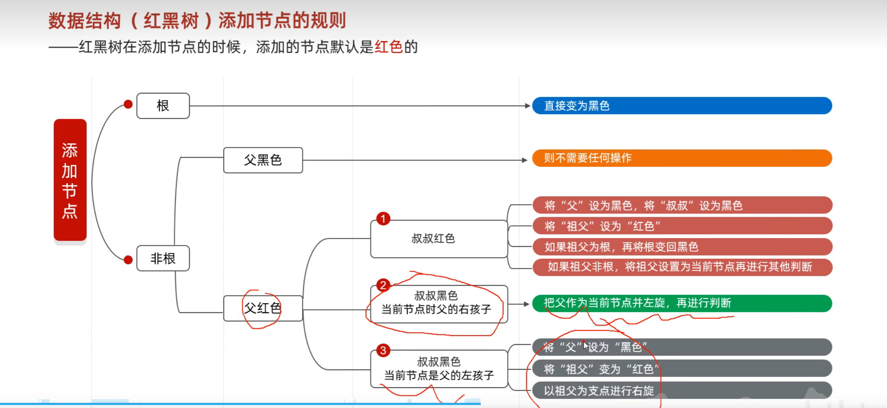

## 集合进阶-13-HashSset,LinkedHashSet详解

- List 系列集合:添加的元素是有序，可重复，有索引
- Set 系列结婚:添加的元素是无须，不重复，无索引

> 无序:存取顺序不一致
> 不重复:可以去重
> 无索引:没有带索引的方法，只能使用类似增强for循环之类的

Set集合实现类:

1. HashSet
    - 无序
    - 不重复
    - 无索引
2. LinkedHashSet
    - **有序**
    - 不重复
    - 无索引
3. TreeSet
    - 可排序
    - 不重复
    - 无索引

!!> Set集合的方法基本和Connection中的API相同
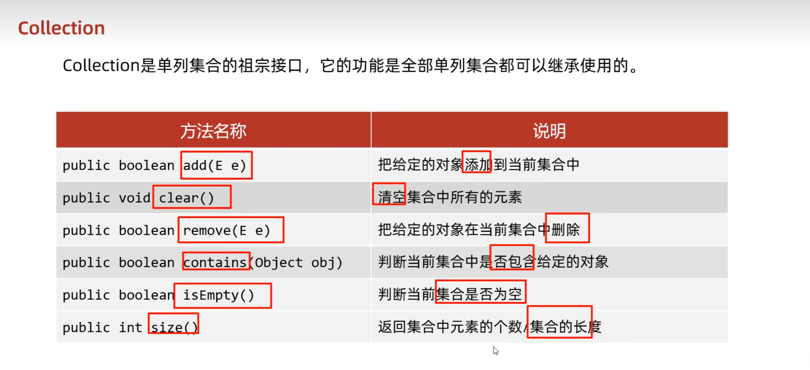

1. HashSet底层原理

> - HashSet底层使用**哈希表**存储数据
> - 哈希表是一种对于增删改查数据性能比较好的结构

> Hash表的组成
> - JDK8以前->数组+链表
> - JDK8以后->数组+链表+红黑树

- 哈希值

> 哈希值:对象的整数表现形式

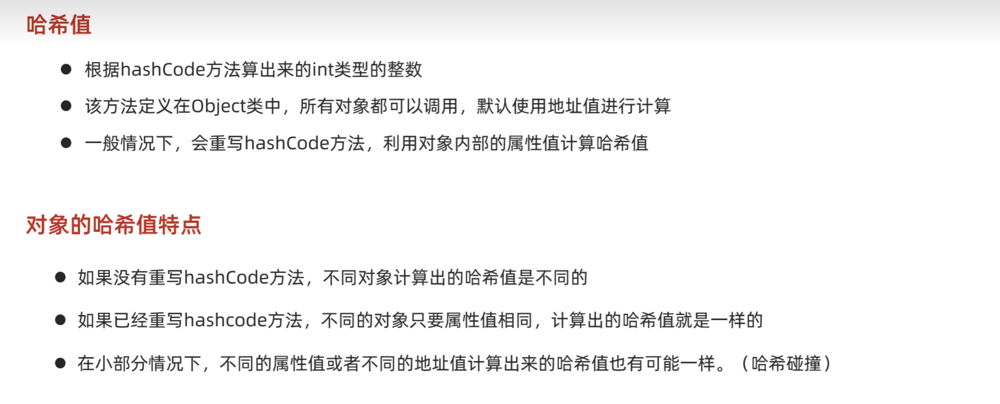

案例1：没有重写hashcode方法
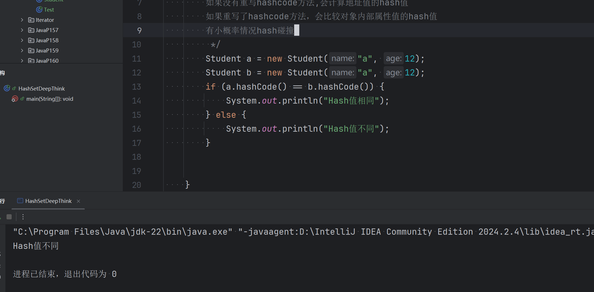
案例2：重写了hashcode方法

> HashSet JDK8以前底层原理
> 1. 创建一个默认长度是16，默认加载因子是0.75的数组，名称是table
> 2. 根据元素的哈希值跟当前数组的长度计算出应存入的位置
     `公式:int index=(数组长度 - 1) & 哈希值;`
> 3. 判断当前位置是否为null,为null直接存入
> 4. 如果当前位置不是null,表示有元素,则会调用equlas方法比较数值
> 5. 一样:不 不一样:存入链表,形成数组
> 6. JDK8以前:新元素存入数组,老元素挂在新元素下面
> 7. JDK8以后:新元素直接挂在老元素下面
> 8. JDK8以后:链表长度大于8且数组长度大于64时，自动转化为红黑树
> 9. 如果集合中添加的是自定义元素，需要重写equals和hashcode方法

## 集合进阶-14-TreeSet第一种排列方式超详细

Tree特点:

- 不重复,无索引,**可排序**
- 可排序:默认按照元素的默认规则排序(从小到大)
- TreeSet底层依赖**红黑树的数据结构**实现排序的,增删查改效率高

题目1:用TreeSet排列整数

```java
        TreeSet<Integer> ts = new TreeSet<Integer>();
        ts.

add(2);
        ts.

add(1);
        ts.

add(4);
        ts.

add(1);
        ts.

add(2);
        System.out.

println(ts);


        System.out.

println("----------");
```

TreeSet集合默认规则:

- 对于数值类型来说:Integer,Double,默认按照从小到大排序
- 对于字符或者字符串类型，按照ascll码表中数字升序进行排列

对于自定义的类排序规则:
如果不写排序规则,就会报错
例:
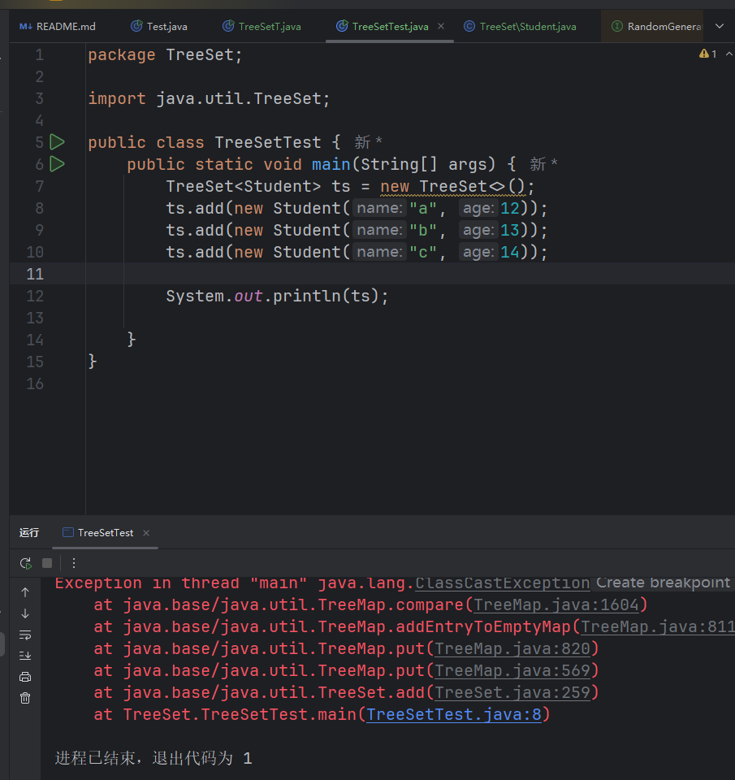

- 方式1:默认排序/自然排序:JavaBean实现Comparable接口指定比较规则
    - 要让自定义类实现comparable接口，并且重写里面的抽象方法
        - @Override
          public int compareTo(Student o) {
          // 指定排序排序规则
          return o.getAge() - this.getAge();
          }
        - this表示当前要添加的元素,o代表已经在红黑树的元素
        - 返回值:
            - 负数:认为当前要添加的元素是小的,存左边
            - 正数:认为当前要添加的元素是大的,存右边
            - 0:认为当前要添加元素已存在,丢弃

## 集合进阶-15-TreeSet第二种排列方式超详细

排序方式2:比较器排序:创建Treeset对象时,传递比较器Comparator指定规则
> 使用方法2的时机:
> 例如:你要先比较字符串长度,然后比较首字母排序,不过由于String类已经写好了排序规则
> 所以只能使用第二种方法来自定义规则
> 使用原则:默认第一种,有其他需求的话,使用第二种
> 如果方法一方法二同时存在,先使用方法二的,参考String类
> 练习题目1:

要求:使用自然排序或者比较器排序
存入四个字符串:c,ab,df,qwer
按长度排序，如果长度相等，则比较首字母

代码:

```java
package TreeSet.Test2;

import java.util.Comparator;
import java.util.TreeSet;

public class TreeSetT2 {
    public static void main(String[] args) {
/*
  要求:使用自然排序或者比较器排序
  存入四个字符串:c,ab,df,qwer
  按长度排序，如果长度相等，则比较首首字母
 */

        TreeSet<String> ts = new TreeSet<>(new Comparator<String>() {
            @Override
            //o1:当前要添加的元素,o2:已存在的元素
            //返回值规则与之前相同
            //匿名内部类形式
            public int compare(String o1, String o2) {
                //自己写的
//                if (o1.length() - o2.length() > 0) {
//                    return 1;
//                }
//                return o1.compareTo(o2);
                //黑马程序员的

                int i = o1.length() - o2.length();
                //长度相等,比较首字母,长度不相等,按长短排序
                return i == 0 ? o1.compareTo(o2) : i;

            }
        });
        //Lambda方式
        TreeSet<String> ts1 = new TreeSet<>(((o1, o2) -> o1.length() - o2.length() == 0 ? o1.compareTo(o2) : o1.length() - o2.length()));
        //添加元素
        ts.add("c");
        ts.add("ab");
        ts.add("df");
        ts.add("qwer");
        ts1.add("c");
        ts1.add("ab");
        ts1.add("df");
        ts1.add("qwer");

        System.out.println(ts);
        System.out.println(ts1);
    }
}
```

练习题目2:
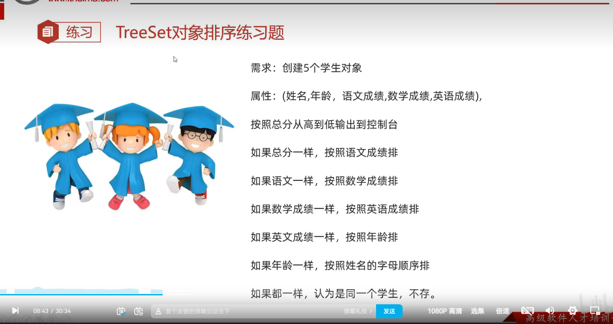
主类:TreeSetTest1

```java

```

学生类:Student

```java
package TreeSet.Test2;


public class Student implements Comparable<Student> {
    private String name;
    private int age;
    private double englishScore;
    private double mathScore;
    private double chineseScore;

    public Student(String name, int age, double englishScore, double mathScore, double chineseScore) {
        this.name = name;
        this.age = age;
        this.englishScore = englishScore;
        this.mathScore = mathScore;
        this.chineseScore = chineseScore;
    }

    @Override
    public String toString() {
        return "Student{" +
                "name='" + name + '\'' +
                ", age=" + age +
                ", englishScore=" + englishScore +
                ", mathScore=" + mathScore +
                ", chineseScore=" + chineseScore +
                '}' + "总分=" + (englishScore + mathScore + chineseScore);

    }

    public String getName() {
        return name;
    }

    public void setName(String name) {
        this.name = name;
    }

    public int getAge() {
        return age;
    }

    public void setAge(int age) {
        this.age = age;
    }

    public double getEnglishScore() {
        return englishScore;
    }

    public void setEnglishScore(double englishScore) {
        this.englishScore = englishScore;
    }

    public double getMathScore() {
        return mathScore;
    }

    public void setMathScore(double mathScore) {
        this.mathScore = mathScore;
    }

    public double getChineseScore() {
        return chineseScore;
    }

    public void setChineseScore(double chineseScore) {
        this.chineseScore = chineseScore;
    }


    @Override
    public int compareTo(Student o) {
        double i = (o.chineseScore + o.mathScore + o.englishScore) - (this.englishScore + this.mathScore + this.chineseScore);
        //如果总分一样,按照语文成绩排序
        i = i == 0 ? o.getChineseScore() - this.getChineseScore() : i;
        //如果语文成绩一样,按照数学成绩排序
        i = i == 0 ? o.getMathScore() - this.getMathScore() : i;
        //如果数学成绩一样,按照英语成绩排序
        i = i == 0 ? o.getEnglishScore() - this.getEnglishScore() : i;
        //如果英语成绩一样,按照年龄排序
        i = i == 0 ? o.getAge() - this.getAge() : i;
        //如果年龄一样,按照名字字幕顺序排序
        i = i == 0 ? o.getName().compareTo(this.getName()) : i;

        return (int) i;

    }
}

```

总结:
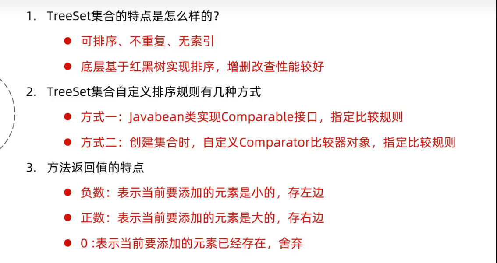
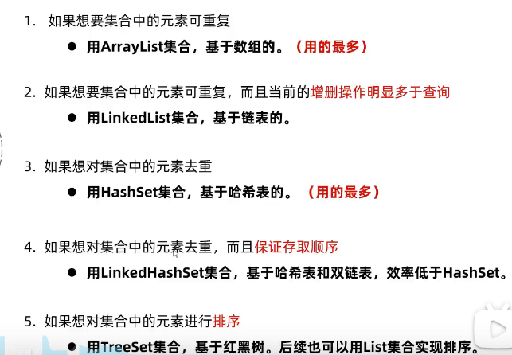
从小到大:o1-o2
从大到小:o2-o1

# Java下半

## P1 双列集合的特点

1. 双列集合一次需要存一对数据，分别为键和值
2. 键不可以重复，值可以重复
3. 键和值一一对应,每个键只能找到自己的值
4. 健＋值这个整体称为键值对或者键值对对象,Java中叫做"Entry对象"

## P2 Map集合常用API


Map是双列集合的顶层接口,他的功能是全部双列集合可以继承使用的

| 方法名称                                | 说明                 |
|-------------------------------------|--------------------|
| V put(K key, V value)               | 添加元素               |
| V remove(Object key)                | 根据键删除键值对元素         |
| void clear()                        | 移除所有的键值对元素         |
| boolean containsKey(Object key)     | 判断集合是否包含指定的键       |
| boolean containsValue(Object value) | 判断集合是否包含指定的值       |
| boolean isEmpty()                   | 判断集合是否为空           |
| int size()                          | 集合的长度，也就是集合中键值对的个数 |

代码

```java
package Java下半章.Map常见API;

import java.util.HashMap;
import java.util.Map;

/*
 * 方法名称	说明
V put(K key, V value)	添加元素
V remove(Object key)	根据键删除键值对元素
void clear()	移除所有的键值对元素
boolean containsKey(Object key)	判断集合是否包含指定的键
boolean containsValue(Object value)	判断集合是否包含指定的值
boolean isEmpty()	判断集合是否为空
int size()	集合的长度，也就是集合中键值对的个数
 */
public class MapJH {
    public static void main(String[] args) {
        // 创建Map集合的对象
        Map<String, String> list = new HashMap<>();
        // 添加元素
        // put方法细节
        // 添加/覆盖
        // 在添加数据时，如果键不存在，则直接把键值对添加到map集合中,并且方法返回null
        // 在添加数据时，若键已存在，会把原有的键值对对象覆盖，会把被覆盖的值返回

        list.put("1", "a");
        // System.out.println(value1);
        list.put("2", "b");
        list.put("3", "c");

        // String value = list.put("1", "d");
        // System.out.println(value);
        // 会返回删除key的value
        String result = list.remove("1");
        System.out.println(result);
        // 清空map无返回值
        // list.clear();
        // 查看是否包含
        boolean re = list.containsKey("2");
        System.out.println(re);
        boolean re1 = list.containsValue("b");
        System.out.println(re1);
        // 打印出来
        System.out.println(list);

    }
}
```

## P3 Map集合的第一种遍历方式(键找值)

Map遍历方式

- 键找值

- 键值对
- Lambda表达式

代码:

```java
package Java下半章.Map常见APT;

import java.util.HashMap;
import java.util.Iterator;
import java.util.Map;
import java.util.Set;
import java.util.function.Supplier;
import java.util.function.*;

public class MapFor {
    public static void main(String[] args) {
        // 第一种遍历方式键找值
        Map<String, String> map = new HashMap<>();
        map.put("a", "1");
        map.put("b", "2");
        map.put("c", "3");
        // keyset方法可以把一个map集合的键变成一个单列集合
        Set<String> keys = map.keySet();
        // 遍历单列集合
        for (String key : keys) {
            String value = map.get(key);
            System.out.println(key + "+" + value);
        }
        // 键找值练习2
        Iterator<String> iter = keys.iterator();
        while (iter.hasNext()) {
            System.out.println(map.get(iter.next()));
        }
        // 键找值3
        keys.forEach(key -> System.out.println(key + "" + map.get(key)));
        Supplier<Integer> random = () -> (int) (Math.random() * 100);
        Supplier<Integer> random2 = new Supplier<Integer>() {
            @Override
            public Integer get() {
                return (int) (Math.random() * 100);

            }

        };
        System.out.println(random.get());
        System.out.println(random2.get());
        Function<Integer, Integer> square = x -> x * x;
        int result1 = square.apply(5);
        System.out.println(result1);
        BiFunction<Integer, Integer, String> compartTo = (x, y) -> {
            return x > y ? "大于" : "小于";
        };
        System.out.println(compartTo.apply(12, 22));
    }
}

```

## P4Map集合的第二种遍历方式(键值对)

代码:

```java
package Java下半章.Map常见APT;

import java.util.HashMap;
import java.util.Map;
import java.util.Set;
import java.util.Map.Entry;
import java.util.Iterator;

public class MapFor1 {
    public static void main(String[] args) {
        // Map集合第二种遍历方式

        // 1.创建map集合的对象
        Map<String, String> map = new HashMap<>();
        // 2.添加元素
        map.put("猴头", "孙悟空");
        map.put("老猪", "猪八戒");
        map.put("沙师弟", "沙悟净");
        // 3。遍历（通过键值对对象遍历）
        // 3.1通过一个方法获取所有的键值对对象
        Set<Entry<String, String>> result = map.entrySet();
        // 遍历Entry集合,增强for方法
        for (Entry<String, String> entry : result) {// entry --> "猴头","孙悟空"
            System.out.println(entry.getKey() + " " + entry.getValue());
        }
        System.out.println();
        // 遍历Entry集合，迭代器方式
        Set<Entry<String, String>> result1 = map.entrySet();
        Iterator<Entry<String, String>> iterator = result1.iterator();
        while (iterator.hasNext()) {
            System.out.println(iterator.next());
        }
        System.out.println(" ");
        // 遍历Entry方式,Lambda表达式
        Set<Entry<String, String>> result2 = map.entrySet();
        result2.forEach(x -> System.out.println(x.getKey() + "=" + x.getValue()));
    }
}

```

## P5Map集合的第三种遍历方式(Lambda表达式)

| 方法                                                            | 说明                 |
|---------------------------------------------------------------|--------------------|
| default void foreach(BiConsumer<? super K, ? super V> action) | 结合lambda表达式遍历map集合 |
|                                                               |                    |

代码:

```java
package Java下半章.Map常见APT;

import java.util.*;
import java.util.Map.Entry;
import java.util.function.BiConsumer;

public class MapFor2 {
    public static <T> void main(String[] args) {
        // 第三种遍历方式,Lambda方式

        // 1.创建map集合的对象
        Map<String, String> map = new HashMap<>();
        // 2.添加元素
        map.put("猴头", "孙悟空");
        map.put("老猪", "猪八戒");
        map.put("沙师弟", "沙悟净");
        // Set<Entry<String, String>> result = map.entrySet();
        // 底层：使用了第二种遍历方式，遍历一次获得每一个键和值
        map.forEach(new BiConsumer<String, String>() {
            @Override
            public void accept(String k, String v) {
                System.out.println(k + "=" + v);
            }

        });
        map.forEach((k, y) -> System.out.println(k + "=" + y));
    }
}
```

## P6-HashMap基本的使用

> HashMap的特点
>
> 1. HashMap是Map里面的一个实现类s
> 2. 没有额外学习的特有方法,直接使用map里面的方法就可以了
> 3. 特点都是由键决定的:无序，不重复，无索引
> 4. HashMap和HashSet的底层结构一样，都是哈希表结构

HashMap底层原理

1. HashMap底层是哈希表结构
2. 以来hashCode方法和equals方法保证键的唯一性
3. 如果键存储的是自定义对象，需要重写hashCode和equals方法
4. 如果值存储自定义对象，不需要重写hashCode和equals方法

## P7 HashMap练习题


代码:

```java
package Java下半章.HashMapTest.Test1;

import java.util.HashMap;

public class Test1 {
    public static void main(String[] args) {

        HashMap<Student, String> map = new HashMap<>();
        map.put(new Student("wangsan", 12), "jiangsu");
        map.put(new Student("wangsi", 11), "beijing");
        map.put(new Student("wangsan", 12), "nanjing");
        map.forEach((x, y) -> System.out.println(x + "=" + y));
    }
}
Student类:

        package Java下半章.HashMapTest.Test1;

public class Student {
    private String name;

    private int age;

    public int getAge() {
        return age;
    }

    public Student() {

    }

    public Student(String name, int age) {
        this.name = name;
        this.age = age;
    }

    public void setAge(int age) {
        this.age = age;
    }

    public String getName() {
        return name;
    }

    public void setName(String name) {
        this.name = name;
    }
    @Override
    public String toString() {
        return "Student [name=" + name + ", age=" + age + "]";
    }

    @Override
    public int hashCode() {
        final int prime = 31;
        int result = 1;
        result = prime * result + ((name == null) ? 0 : name.hashCode());
        result = prime * result + age;
        return result;
    }

    @Override
    public boolean equals(Object obj) {
        if (this == obj)
            return true;
        if (obj == null)
            return false;
        if (getClass() != obj.getClass())
            return false;
        Student other = (Student) obj;
        if (name == null) {
            if (other.name != null)
                return false;
        } else if (!name.equals(other.name))
            return false;
        if (age != other.age)
            return false;
        return true;
    }

}


```

需要重写equals和

## P7 LinkedHashMap

- 由键决定:**有序**,不重复,无索引
- 这里的有序代表存储和取出的顺序相同
- 原理:底层依旧是哈希表，只是每个键值对元素又额外多了一个双链表的机制记录存储的顺序

代码:

```java
package Java下半章.LinkedHashMap;

import java.util.LinkedHashMap;

public class LinkedHashMapT {
    public static void main(String[] args) {
        // LinkedHashMap测试
        LinkedHashMap<String, Integer> linkedHashMap = new LinkedHashMap<>();
        linkedHashMap.put("a", 1);
        linkedHashMap.put("b", 2);
        linkedHashMap.put("c", 3);
        linkedHashMap.forEach((x, y) -> System.out.println(x + "=" + y));
    }
}
```

结果:

```java
a=1
b=2
c=3
```

## P10 集合进阶-TreeMap的基本使用和基础练习

TreeMap

- TreeMap底层和TreeSet一样,都是红黑树结构
- 由键决定特性:不重复,无索引,可排序
- 可排序:指对键排序

> !!!注意:默认按照键的从小到大排序,也可以自己定义规则

自定义规则书写方式

1. 实现comparable接口，重写compartTo方法
2. 在创建TreeSet或者TreeMap集合时,传递Comparator比较器对象

练习1:键是整数,值是字符串,分别以键进行升序和降序排列

```java
package Java下半章.TreeMap;

import java.util.TreeMap;

public class TreeMapT1 {
    public static void main(String[] args) {
        //Integer,Double类型默认按升序排列
        //String类时按照ASCII码表对应数字排序
        //升序
        TreeMap<Integer, String> treeMap = new TreeMap<>();
        treeMap.put(1, "矿泉水");
        treeMap.put(4, "手机");
        treeMap.put(2, "鼠标");
        treeMap.put(3, "显示器");
        treeMap.forEach((x, y) -> System.out.println(x + " " + y));
        System.out.println("------------------");
        //降序
        //o1:要存储的元素
        //o2:已经存在的元素
        TreeMap<Integer, String> treeMap1 = new TreeMap<>((o1, o2) -> o2 - o1);
        treeMap1.put(1, "矿泉水");
        treeMap1.put(4, "手机");
        treeMap1.put(2, "鼠标");
        treeMap1.put(3, "显示器");
        treeMap1.forEach((x, y) -> System.out.println(x + " " + y));

    }
}
```

## P11 集合进阶-TreeMap的基础练习2-键位置添加自定义类

代码:
Student类
```java
package TreeSet.Test2;


public class Student implements Comparable<Student> {
    private String name;
    private int age;
    private double englishScore;
    private double mathScore;
    private double chineseScore;

    public Student(String name, int age, double englishScore, double mathScore, double chineseScore) {
        this.name = name;
        this.age = age;
        this.englishScore = englishScore;
        this.mathScore = mathScore;
        this.chineseScore = chineseScore;
    }

    @Override
    public String toString() {
        return "Student{" +
                "name='" + name + '\'' +
                ", age=" + age +
                ", englishScore=" + englishScore +
                ", mathScore=" + mathScore +
                ", chineseScore=" + chineseScore +
                '}' + "总分=" + (englishScore + mathScore + chineseScore);

    }

    public String getName() {
        return name;
    }

    public void setName(String name) {
        this.name = name;
    }

    public int getAge() {
        return age;
    }

    public void setAge(int age) {
        this.age = age;
    }

    public double getEnglishScore() {
        return englishScore;
    }

    public void setEnglishScore(double englishScore) {
        this.englishScore = englishScore;
    }

    public double getMathScore() {
        return mathScore;
    }

    public void setMathScore(double mathScore) {
        this.mathScore = mathScore;
    }

    public double getChineseScore() {
        return chineseScore;
    }

    public void setChineseScore(double chineseScore) {
        this.chineseScore = chineseScore;
    }


    @Override
    public int compareTo(Student o) {
        //从高到低排序o-this,this表示要添加的，o表示已经存在红黑树的元素
        double i = (o.chineseScore + o.mathScore + o.englishScore) - (this.englishScore + this.mathScore + this.chineseScore);
        //如果总分一样,按照语文成绩排序
        i = i == 0 ? o.getChineseScore() - this.getChineseScore() : i;
        //如果语文成绩一样,按照数学成绩排序
        i = i == 0 ? o.getMathScore() - this.getMathScore() : i;
        //如果数学成绩一样,按照英语成绩排序
        i = i == 0 ? o.getEnglishScore() - this.getEnglishScore() : i;
        //如果英语成绩一样,按照年龄排序
        i = i == 0 ? o.getAge() - this.getAge() : i;
        //如果年龄一样,按照名字字幕顺序排序
        i = i == 0 ? o.getName().compareTo(this.getName()) : i;

        return (int) i;

    }
}
```
Test类
```java
package TreeSet.Test2;

import java.util.TreeSet;

public class TreeSetTest1 {
    public static void main(String[] args) {
        Student s1 = new Student("zhangsan", 12, 80, 90, 100);
        Student s2 = new Student("lisi", 28, 20, 90, 99);
        Student s3 = new Student("wangwu", 17, 12, 10, 10);
        Student s4 = new Student("zhaosi", 13, 12, 10, 10);
        Student s5 = new Student("xiaoliu", 12, 82, 70, 60);
        Student s6 = new Student("xiaoliu", 12, 82, 70, 60);
        TreeSet<Student> ts = new TreeSet<>();
        ts.add(s1);
        ts.add(s2);
        ts.add(s3);
        ts.add(s4);
        ts.add(s5);
        ts.add(s6);
        ts.forEach(x -> System.out.println(x));
    }
}
```

## P12 集合进阶-利用TreeMap进行统计每个字符出现的个数
注意:计数器思想
代码:
```java
package Java下半章.TreeMap;

import java.util.Comparator;
import java.util.TreeMap;
import java.util.function.BiConsumer;

public class TreeMapT3 {
    public static void main(String[] args) {
        String str = "aabbccddesioadfhjasldfhasfeuahsfkjdfhasiufhesae";
        //统计一个字符出现的次数
        //新的统计思想
        //如果不需要排序:HashMap
        //需要排序:TreeMap
        //计数器思想
        TreeMap<Character, Integer> treeMap = new TreeMap<>(new Comparator<Character>() {
            @Override
            public int compare(Character o1, Character o2) {
                return o2 - o1;
            }
        }
        );
        for (int j = 0; j < str.length(); j++) {
            char key = str.charAt(j);
            if (treeMap.containsKey(key)) {
                int value = treeMap.get(key);
                value++;
                treeMap.put(key, value);
            } else {
                treeMap.put(key, 1);
            }
        }
        treeMap.forEach((x, y) -> System.out.print(x + "(" + y + ")" + " \n"));
        treeMap.forEach(new BiConsumer<Character, Integer>() {
            @Override
            public void accept(Character character, Integer integer) {
                System.out.println(character + ":" + integer);
            }
        });

    }
}

```

## P13-P16 HashMap源码讲解笔记

> HashMap啥时候变成红黑树作为底层存储结构
> 在Java的`HashMap`类中，当以下条件满足时，它将自动转换为使用红黑树（
Balanced Tree）作为存储结构：

 **负载因子超过 0.75**：当哈希表中的 Entry 数量超过了容器的 3/4 部分时，
   HashMap 会认为当前的负载因子太高，需要转换到红黑树来维护平衡。
 **Entry 个数达到阈值**： HashMap 的实现中，有一个名为 `threshold` 的变量
   ，它决定了哈希表中的 Entry 个数是否需要转换到红黑树。默认情况下，这个阈值是
   16。

当满足以上条件之一时，HashMap 会自动将其转换为使用红黑树作为存储结构。这意味
着哈希表中的 Entry 将被重新组织成一个红黑树，以提高查找效率和避免 Hash 冲突
。

需要注意的是，在实际使用中，HashMap 的负载因子和阈值都可以通过配置来调整，这
取决于具体的应用场景和性能要求。

具体讲解代码:文件在markdown文件夹下，使用gedit查看内容


## 集合进阶-19-可变参数


可变参数格式:`元素类型...变量名`

代码
```java
package 可变参数_Collections_综合练习.可变参数;

public class Test {
    public static void main(String[] args) {
        System.out.println(getSum(12, 12, 12, 12, 12, 12, 12, 12, 12));

    }
    public static int getSum(int...e){
        int sum=0;

        for (int i : e) {
            sum+=i;
        }
        return sum;
    }
}

```
可变参数细节:
- 方法形参只能写一个可变参数
- 如果除了可变参数还有其他元素，可变参数必须要在最后出现

file:///home/hexiaolei/%E5%9B%BE%E7%89%87/%E6%88%AA%E5%9B%BE/%E6%88%AA%E5%9B%BE%202024-11-16%2019-20-46.png


## 集合进阶-20-集合工具类Collections

**Collections**
- Java.util.Collections:集合工具类
- 作用:Collections不是集合，是工具类


Collections常用api

|                                方法名称                                |            说明            |
|:------------------------------------------------------------------:|:------------------------:|
| `public static <T> boolean addAll(Collection<T> c, T... elements)` |          批量添加元素          |
|             `public static void shuffle(List<?> list)`             |      打乱List集合元素的顺序       |
|            `public static <T> void sort(List<T> list)`             |            排序            |
|    `public static <T> void sort(List<T> list, Comparator<T> c)`    |       根据指定的规则进行排序        |
|     `public static <T> int binarySearch(List<T> list, T key)`      |        以二分查找法查找元素        |
|      `public static <T> void copy(List<T> dest, List<T> src)`      |         拷贝集合中的元素         |
|         `public static <T> int fill(List<T> list, T obj)`          |       使用指定的元素填充集合        |
|        `public static <T> void max/min(Collection<T> coll)`        |     根据默认的自然排序获取最大/小值     |
|     `public static <T> void swap(List<T> list, int i, int j)`      |       交换集合中指定位置的元素       |

## 集合进阶-综合练习1-6

```java
package 可变参数_Collections_综合练习.综合练习;

import java.util.*;

public class T1 {
    public static final int MAN = 1;
    //    public static final int WOMAN = 0;
    static Random r = new Random();


    public static void main(String[] args) {
        //随机点名1.0
        ArrayList<String> list = new ArrayList<>();
        Collections.addAll(list, "Marry", "Cindy", "Mike", "Trump", "Elon Mask");
        System.out.println(list.get(r.nextInt(list.size())));
        //随机点名2.0,Man 70% Woman 30%
        ArrayList<Integer> list1 = new ArrayList<>();
        //设置几率
        Collections.addAll(list1, 1, 1, 1, 1, 1, 1, 1, 0, 0, 0);
        //打乱
        Collections.shuffle(list1);
//        System.out.println(list1);

        //添加集合元素
        ArrayList<String> manList = new ArrayList<>();
        Collections.addAll(manList, "也门", "Mike", "Dick", "qiqi", "ii", "aa", "aav");
        ArrayList<String> girlList = new ArrayList<>();
        Collections.addAll(girlList, "妮妮", "赫赫", "基极");


        int result = list1.get(r.nextInt(list1.size()));
        System.out.println(result);
        if (result == MAN) {
            int index = r.nextInt(manList.size());
            System.out.println(manList.get(index));
        } else {
            int index = r.nextInt(girlList.size());
            System.out.println(girlList.get(index));
        }
        //练习3，有x名学生,被点到的不会再被点到，如果点完就进行第二轮
        //定义集合
        {
            for (int j = 0; j < 5; j++) {
                System.out.println("=====================第" + j + "轮开始了======================");
                ArrayList<String> oldStudent = new ArrayList<>();
                ArrayList<String> newStudent = new ArrayList<>();
                //添加数据
                Collections.addAll(oldStudent, "s1", "s2", "s3", "s4", "s5", "s6", "s7");
                //随机点名
                while (!oldStudent.isEmpty()) {
                    //如果remove方法是通过索引删除的，将会返回泛型中定义的数据类型
                    //将被删除的元素添加到新的集合中
                    newStudent.add(oldStudent.remove(r.nextInt(oldStudent.size()))); //删除一个元素,范围是oldStudent的长度,返回删除的元素
                    //每点到一个就删除一个,
                }
                //将new里面的所有东西添加到old里面,上面那个循环就是随机抽取的行为
                oldStudent.addAll(newStudent);
                System.out.println(oldStudent);
                //再将new里面的东西清除
                newStudent.clear();
            }
            //练习4-5由于涉及IO,权重随机算法,所以等到之后学会了再回来做
            //练习6--集合嵌套
            {
                /*
                图中的文字内容是一个关于Map集合的案例，需求如下：

                定义一个Map集合，键用表示省份名称（province），值表示市（city），但是市会有多个。添加完毕后，遍历结果格式如下：

                江苏省 = 南京市，扬州市，苏州市，无锡市，常州市
                    湖北省 = 武汉市，孝感市，十堰市，宜昌市，鄂州市
                    河北省 = 石家庄市，唐山市，邢台市，保定市，张家口市
                */
                //创建集合
                HashMap<String, ArrayList<String>> hashMap = new HashMap<>();
                ArrayList<String> JiangSu = new ArrayList<>();
                Collections.addAll(JiangSu,"江阴","苏州","淮安");
                ArrayList<String> GuangZhou = new ArrayList<>();
                Collections.addAll(GuangZhou,"g1","g2","g3");
                ArrayList<String> BeiJing = new ArrayList<>();
                Collections.addAll(BeiJing,"B1","B2","B3");

                hashMap.put("苏州省", JiangSu);
                hashMap.put("广州省",GuangZhou);
                hashMap.put("北京省",BeiJing);
                //方式1
                hashMap.forEach((x,y)-> System.out.println(x+"="+y));
                //方式2
                Set<Map.Entry<String,ArrayList<String>>> entries =  hashMap.entrySet();
                for (Map.Entry<String, ArrayList<String>> entry : entries) {
                    String key = entry.getKey();
                    StringJoiner stringJoiner = new StringJoiner(",","","");
                    for (String s : entry.getValue()) {
                        stringJoiner.add(s);
                    }
                    System.out.println(key+"="+stringJoiner);
                }


            }

        }
    }
}

```


## 斗地主


```java
暂时先停,周末或者有时间来做
```


## 不可变集合详细解释

**创建不可变集合**

>  不可变集合:不可修改的集合

应用场景:

- 如果某个数据不能被修改，把他防御性的拷贝到不可变集合是个很好的方法
- 当集合对象被不可信对象调用时，不可变形式是安全的
- 简单理解：不想被别人修改集合里面的内容

在List,Set,Map集合里面都有一个静态的of方法，可以获取一个不可变得集合

| 方法名称                                    | 说明                               |
| ------------------------------------------- | ---------------------------------- |
| `static <E> List<E> of(E... elements)`      | 创建一个具有指定元素的List集合对象 |
| `static <E> Set<E> of(E... elements)`       | 创建一个具有指定元素的Set集合对象  |
| `static <K, V> Map<K, V> of(K... elements)` | 创建一个具有指定元素的Map集合对象  |

这个集合不可以添加，删除，修改

 代码

```java
package ImmutableDemo;
/**
 * Immutable不可变的
 */

import java.util.HashMap;
import java.util.List;
import java.util.Map;
import java.util.Set;

public class test {
    public static void main(String[] args) {
        //一旦创建完毕，只能查询，不能修改或者删除JDK9才支持
        List<Integer> list = List.of(1,2,3,4,5,6,6);
        list.forEach(System.out::println);
        //当我们要获取一个不可变的Set集合时，里面的参数要保证唯一性
//        Set<String> set = Set.of("a","b","v","b");
//        for (String s : set) {
//            System.out.println(s);
//        }
        //创建Map的不可变集合
//        Map<String,Integer> = Map.of(...);
        //最多20个参数，10个键值对
        //键不可以重复


        //如果要传入大于10个键值对对象，可以调用Map.ofEntries方法,可以传入很多entries对象
        HashMap<String,String> map = new HashMap<>();
        map.put("猴头", "孙悟空");
        map.put("老猪", "猪八戒");
        map.put("沙师弟", "沙悟净");
        //接收到所有的键值对对象(Entry对象)
        Set<Map.Entry<String, String>> entries = map.entrySet();
        //把entries变成一个数组传入Map.ofEntries
        //toArray方法底层会比较集合的长度和传入的数组长度
        //若集合长度大于数组长度，将会根据实际数据的个数创建新的数组
        //若集合长度小于数组长度，则会直接添加进去
        Map.Entry[] array = entries.toArray(new Map.Entry[10]);
        //不可变集合Map1
//        Map map1 = Map.ofEntries(array);
//        一行解决的方式
        //Map.ofEntries参数为Entries<K,V> entries,所以传入一个数组也是可以的
        Map<Object, Object> objectObjectMap = Map.ofEntries(map.entrySet().toArray(new Map.Entry[0]));
        objectObjectMap.forEach((x,y)-> System.out.println(x+"="+y));
        //还有一个更加简洁的方式,如果本身为不可变集合则直接返回，如果不是则会返回不可变集合
        //since JDK10 
        Map<String, String> stringStringMap = Map.copyOf(map);
        stringStringMap.put("a","a");
//      Exception in thread "main" java.lang.UnsupportedOperationException

    }
}

```


**总结**


## Stream流

### Stream流-1

初爽:

- 创建一个集合，存储多个字符串元素


```java
package Stream流;

import java.util.ArrayList;

public class Test {
    public static void main(String[] args) {
        ArrayList<String> list = new ArrayList<>();
        list.add("张无忌");
        list.add("宋小宝");
        list.add("王雷");
        list.add("张强");
        list.add("张三丰");
        //新的集合
        ArrayList<String> list2 = new ArrayList<>();
        //原来的方法
        //以张开头的人添加到新数组中
        for (String name : list) {
            if (name.startsWith("张")){
                list2.add(name);
            }
        }
        System.out.println(list2);
        //将以张开头且长度大于2的添加到新数组中
        ArrayList<String> list3 = new ArrayList<>();
        for (String name : list2) {
            if (name.length() >=3){
                list3.add(name);
            }
        }
        System.out.println(list3);


        //Stream效果
        list.stream().filter(name-> name.startsWith("张")).filter(name->name.length()==3).forEach(System.out::println);

    }
}

```


### Stream流-2

> Stream的思想和获取Stream流

Stream流一般结合了Lambda表达式，简化集合数组的操作

使用步骤:

1. 先得到一条Stream流,并把数据放上去
2. 利用Stream流中的API进行各种操作
   - 先中间方法:方法调用完毕后还可以调用其他方法
     - 过滤，转换
   - 后终结方法:最后一步，调用完毕后，不能调用其他的方法
     - 统计，打印

| 获取方式     | 方法名                                          | 说明                     |
| ------------ | ----------------------------------------------- | ------------------------ |
| 单列集合     | `default Stream<E> stream()`                    | Collection中的默认方法   |
| 双列集合     | 无                                              | 无法直接使用stream流     |
| 数组         | `public static <T> Stream<T> stream(T[] array)` | Arrays工具类中的静态方法 |
| 一堆零散数据 | `public static<T> Stream<T> of(T... values)`    | Stream接口中的静态方法   |

代码

```java
package Stream流;

import java.util.ArrayList;
import java.util.Collections;
import java.util.stream.Stream;

public class StreamDemo1 {
    public static void main(String[] args) {
        /*
        | 获取方式     | 方法名                                          | 说明                     |
        | ------------ | ----------------------------------------------- | ------------------------ |
        | 单列集合     | `default Stream<E> stream()`                    | Collection中的默认方法   |
        | 双列集合     | 无                                              | 无法直接使用stream流     |
        | 数组         | `public static <T> Stream<T> stream(T[] array)` | Arrays工具类中的静态方法 |
        | 一堆零散数据 | `public static<T> Stream<T> of(T... values)`    | Stream接口中的静态方法   |
         */

        ArrayList<String> list = new ArrayList<>();
        Collections.addAll(list,"a","b","c","d","e","f");
        //获取一条Stream流,并把数据放在流水线上
        Stream<String> stream = list.stream();
        //使用终结方法打印
         stream.forEach(s -> System.out.println(s));

    }
}
```

双列集合

```java
package Stream流;

import java.util.HashMap;

public class StreamDemo2 {
    public static void main(String[] args) {
//         | 双列集合     | 无                                              | 无法直接使用stream流     |

        HashMap<String, Integer> hm = new HashMap<>();
        hm.put("a", 1);
        hm.put("b", 2);
        hm.put("c", 3);
        hm.put("d", 4);
        hm.put("e", 5);
        hm.keySet().stream().forEach(x-> System.out.println(x+hm.get(x)));
        hm.entrySet().stream().forEach(x-> System.out.println("key="+x.getKey()+"\tValue="+x.getValue()));

    }
}
```

数组

```java
package Stream流;

import java.util.Arrays;

public class StreamDemo3 {
    public static void main(String[] args) {
//        | 数组         | `public static <T> Stream<T> stream(T[] array)` | Arrays工具类中的静态方法 |
        int[] arr = new int[]{1,2,3,4,5,6,6,7,8,8,9,9,23,2,3,4,34,34,34,34,};
        Arrays.stream(arr).forEach(x-> System.out.println(x));
    }
}
```

零碎数据

```java
package Stream流;

import java.util.stream.Stream;

public class StreamDemo4 {
    public static void main(String[] args) {
//               | 一堆零散数据 | `public static<T> Stream<T> of(T... values)`    | Stream接口中的静态方法   |
        //Stream接口中静态方法of细节 ：
        //方法的参数是可变参数，也可以传递数组
        //但必须是引用数据类型的否则就会出现以下情况,因为如果传递基本数据类型的话，会把这个数组当成一个元素，放到Stream流中
        //[I@f6f4d33
        int[] arr = new int[]{123,123,123};
        Stream.of(arr).forEach(x-> System.out.println(x));
        Stream.of(1,2,3,4,5,6).forEach(x-> System.out.println(x));
    }
}

```


### Stream中间方法

| 名称                                               | 说明                                 |
| -------------------------------------------------- | ------------------------------------ |
| `Stream<T> filter(Predicate<? super T> predicate)` | 过滤                                 |
| `Stream<T> limit(long maxSize)`                    | 获取前几个元素                       |
| `Stream<T> skip(long n)`                           | 跳过前几个元素                       |
| `Stream<T> distinct()`                             | 元素去重，依赖(hashCode和equals方法) |
| `static <T> Stream<T> concat(Stream a, Stream b)`  | 合并a和b两个流为一个流               |
| `Stream<R> map(Function<T, R> mapper)`             | 转换流中的数据类型                   |


#### `Stream<T> filter(Predicate<? super T> predicate)`  过滤

```java
package Stream流;

import java.util.ArrayList;

public class Test {
    public static void main(String[] args) {
        ArrayList<String> list = new ArrayList<>();
        list.add("张无忌");
        list.add("宋小宝");
        list.add("王雷");
        list.add("张强");
        list.add("张三丰");
        //新的集合
        ArrayList<String> list2 = new ArrayList<>();
        //原来的方法
        //以张开头的人添加到新数组中
        for (String name : list) {
            if (name.startsWith("张")){
                list2.add(name);
            }
        }
        System.out.println(list2);
        //将以张开头且长度大于2的添加到新数组中
        ArrayList<String> list3 = new ArrayList<>();
        for (String name : list2) {
            if (name.length() >=3){
                list3.add(name);
            }
        }
        System.out.println(list3);


        //Stream效果
        list.stream().filter(name-> name.startsWith("张")).filter(name->name.length()==3).forEach(System.out::println);


    }
}
```

#### `Stream<T> limit(long maxSize)`  获取前几个元素 & `Stream<T> skip(long n)`  跳过前几个元素

```java
package Stream流;

import java.util.ArrayList;
import java.util.Collections;
import java.util.function.Predicate;

public class StreamDemo5 {
    public static void main(String[] args) {
        /*
        Stream中间方法:
       | 名称                                                   | 说明                                       |
|--------------------------------------------------------|--------------------------------------------|
| `Stream<T> filter(Predicate<? super T> predicate)`     | 过滤                                       |
| `Stream<T> limit(long maxSize)`                        | 获取前几个元素                             |
| `Stream<T> skip(long n)`                               | 跳过前几个元素                             |
| `Stream<T> distinct()`                                 | 元素去重，依赖(hashCode和equals方法)       |
| `static <T> Stream<T> concat(Stream a, Stream b)`      | 合并a和b两个流为一个流                     |
| `Stream<R> map(Function<T, R> mapper)`                 | 转换流中的数据类型                         |
         */

        ArrayList<String> list = new ArrayList<>();
        Collections.addAll(list, "张无忌", "周芷若", "赵明", "张强", "张三丰", "张翠花", "张良");
        //Lambda
        list.stream().filter(name -> name.startsWith("张")).forEach(x -> System.out.println(x));
        //匿名函数
        list.stream().filter(new Predicate<String>() {
            @Override
            //s代表每一个元素
            public boolean test(String s) {
                //如果为true就保留，如果是false就去掉
                return s.startsWith("张");
            }
        }).forEach(x -> System.out.printf(x + ""));
        //推荐使用这种方式,简洁易懂
        list.stream()
                .filter(name -> name.startsWith("张"))
                .filter(name -> name.length() == 3)
                .forEach(System.out::println);
        System.out.println("===========Limit===========");
        //limit(获取前几个元素)和skip(跳过前几个元素)
        list.stream()
                .limit(2)
                .forEach(System.out::println);
        System.out.println("========skip=========");
        list.stream()
                .skip(2)
                .forEach(System.out::println);
        //Test "张强", "张三丰", "张翠花"
        System.out.println("==============T1===================");
        //先获取前六个跳过前三个
        list.stream()
                .limit(6)
                .skip(3)
                .filter(name->name.startsWith("张"))
                .forEach(System.out::println);
        //跳过前三个，再获取三个
        System.out.println("T2");
        list.stream()
                .skip(3)
                .limit(3)
                .filter(name->name.startsWith("张"))
                .forEach(System.out::println);
    }
}

```

#### Stream<T> distinct()`  元素去重，依赖(hashCode和equals方法) & static <T> Stream<T> concat(Stream a, Stream b)`  合并a和b两个流为一个流

```java
package Stream流;

import java.util.ArrayList;
import java.util.Collections;
import java.util.stream.Stream;

public class StreamDemo7 {
    public static void main(String[] args) {

        /*
        | `Stream<T> distinct()`                            | 元素去重，依赖(hashCode和equals方法) |
        | ------------------------------------------------- | ------------------------------------ |
        | `static <T> Stream<T> concat(Stream a, Stream b)` | 合并a和b两个流为一个流               |
         */

        ArrayList<String> list1 = new ArrayList<>();
        Collections.addAll(list1, "张无忌", "张无忌","张无忌", "张强", "张三丰", "张翠山", "张良", "王二麻子", "谢广坤");
        list1.stream()
                // Set<T> keys = map.keySet();
                //                    if (seenNull.get()) {
                //                        // TODO Implement a more efficient set-union view, rather than copying
                //                        keys = new HashSet<>(keys);
                //                        keys.add(null);
                //                    }
                //底层使用HashSet去重的
                .distinct()
                .forEach(System.out::println);
        ArrayList<String> list2 = new ArrayList<>();
        Collections.addAll(list2, "周芷若", "赵敏");
        //合并流
        System.out.println("====合并后====");
        Stream.concat(list1.stream(),list2.stream())
                .forEach(System.out::println);

    }
}

```

#### `Stream<R> map(Function<T, R> mapper)`  转换流中的数据类型

```java
package Stream流;

import java.util.ArrayList;
import java.util.Collections;
import java.util.function.Function;

public class StreamDemo8 {
    public static void main(String[] args) {
//        `Stream<R> map(Function<T, R> mapper)`转换流中的数据类型
        ArrayList<String> list = new ArrayList<>();
        Collections.addAll(list,"张三-13","李四-14","刘星-20");
        //需求：只获取并打印其中的年龄
        //apply形参s,集合中的每一个数据
        //返回值：转换之后的数据
        list.stream()
                //泛型里面不能写基本数据类型
                .map(new Function<String, Integer>() {
            @Override
            public Integer apply(String s) {
                return Integer.parseInt(s.substring(3));
            }
        })
                .forEach(x-> System.out.println(x));
        //匿名内部类形式
        list.stream()
                .map(str->Integer.parseInt(str.substring(3)))
                .forEach(x-> System.out.println(x));
    }
}

```

### Stream终结方法

| 名称                          | 说明                       |
| ----------------------------- | -------------------------- |
| void forEach(Consumer action) | 遍历                       |
| long count()                  | 统计                       |
| toArray()                     | 收集流中的数据，放到数组中 |
| collect(Collector collector)  | 收集流中的数据，放到集合中 |

#### forEach,count,toArry

```java
package Stream流.finalMethod;

import java.util.ArrayList;
import java.util.Collections;
import java.util.function.IntFunction;

public class StreamDemo1 {
    public static void main(String[] args) {
        ArrayList<String> list = new ArrayList<>();
        Collections.addAll(list, "张无忌", "张无忌","张无忌", "张强", "张三丰", "张翠山", "张良", "王二麻子", "谢广坤");
        list.stream().forEach(x-> System.out.println(x));
        System.out.println(list.stream().count());

        //InFunction泛型：具体类型的数组
        //apply，流中数据的个数，需要跟数组长度一直
        //方法体：创建数组
        //toArray的作用：创建一个指定类型的数组
        String[] array = list.stream().toArray(new IntFunction<String[]>() {
            @Override
            public String[] apply(int value) {
                return new String[value];
            }
        });
        for (String s : array) {
            System.out.println(s);
        }
        //Lambda
        String[] array1 = list.stream()
                .toArray(value -> new String[value]);
        for (String s : array1) {
            System.out.println(s);
        }
    }
}
```

### collect超详解

collect(Collector collector)  收集流中的数据，放到集合中 

```java
package Stream流.finalMethod;

import java.util.*;
import java.util.function.Function;
import java.util.stream.Collectors;

public class StreamDemo2 {
    public static void main(String[] args) {
        //collect(Collector collector)收集流中的数据，放到集合中
        ArrayList<String> list = new ArrayList<>();
        Collections.addAll(list, "张无忌-男-12", "张无忌-男-12", "张强-男-11", "张三丰-男-20", "张翠山-女-33", "张良-男-22", "王二麻子-女-20", "谢广坤-男-90");

        //收到List集合里面
        //把所有男性收集到List
        List<String> list1 = list.stream()
                .filter(name -> name.split("-")[1].equals("男"))
                .collect(Collectors.toList());
//                .forEach(x-> System.out.println(x));
        System.out.println(list1);

        //收集到Set集合里面
        Set<String> collect = list.stream()
                .filter(name -> "男".equals(name.split("-")[1]))
                .collect(Collectors.toSet());
        System.out.println(collect);


        //收到map集合里面
        //所有男性收集起来
        //键:姓名,值:年龄
        Map<String, Integer> collect1 = list.stream()
                .filter(name -> "男".equals(name.split("-")[1]))
                .distinct()
                /*
                toMap详细解释:
                参数一:键的生成规则
                参数二:值的生成规则

                参数一
                    Function泛型1:表示流中每一个数据的类型
                            泛型2:表示map集合中键的类型
                    方法apply形参:一次表示流中的每一个数据
                            方法体:生成键的代码
                            返回值:已经生成的键
                 参数二
                    Function泛型1:表示流中每一个数据的类型
                            泛型2:表示map集合中值的类型
                     方法apply形参:一次表示流中的每一个数据
                            方法体:生成值的代码
                            返回值:已经生成的值

                   !!!注意点:如果要添加到Map集合当中,必须要保持键是唯一的
                 */
                .collect(Collectors.toMap(new Function<String, String>() {
                    @Override
                    //key
                    public String apply(String s) {
                        return s.split("-")[0];
                    }
                    //value
                }, new Function<String, Integer>() {
                    @Override
                    public Integer apply(String s) {
                        return Integer.parseInt(s.split("-")[2]);
                    }
                }));

        System.out.println(collect1);
        //Lambda形式
        Map<String, Integer> collect2 = list.stream()
                .filter(name -> "男".equals(name.split("-")[1]))
                .distinct()
                .collect(Collectors.toMap(
                        key -> key.split("-")[0],
                        value -> Integer.parseInt(value.split("-")[2])));
        System.out.println(collect2);
    }
}
```
总结:


### 综合练习6-8

T3要求


代码:

```java
package Stream流.StreamTest;

import java.util.*;
import java.util.stream.Collectors;
import java.util.stream.Stream;

public class T1 {
    public static void main(String[] args) {
        //存储1-10,过滤奇数，只保留偶数
        System.out.println("Test1");
        ArrayList<Integer> t1 = new ArrayList<>();
        Collections.addAll(t1, 1, 2, 3, 4, 5, 6, 7, 8, 9, 10);
        Set<Integer> collect = t1.stream()
                .filter(n -> n % 2 == 0)
                .collect(Collectors.toSet());
        System.out.println(collect);
        //保留年龄大于24，并将结果保存在map集合中
        System.out.println("Test2");
        ArrayList<String> t2 = new ArrayList<>();
        Collections.addAll(t2, "zhangsan,23", "lisi,24", "wangwu,25");
        Map<String, Integer> collect1 = t2.stream()
                .filter(c -> Integer.parseInt(c.split(",")[1]) >= 24)
                .collect(Collectors.toMap(
                        key -> key.split(",")[0],
                        value -> Integer.parseInt(value.split(",")[1])
                ));
        System.out.println(collect1);
        //自定义集合Actor,
        //属性name,age
        //具体见typora
        System.out.println("Test3");

        ArrayList<String> t3_B = new ArrayList<>();
        Collections.addAll(t3_B, "张三,23",
                "李四a,24",
                "嘻哈b,11",
                "黎明c,60",
                "徐有,22",
                "你哈,2"
        );
        ArrayList<String> t3_G = new ArrayList<>();
        Collections.addAll(t3_G,
                "杨梅,23",
                "杨妹,24",
                "小兰花,11",
                "杨美,60",
                "徐徐,22",
                "阿阿,2"
        );
        //1
        Stream<String> streamBoy = t3_B.stream()
                .limit(2)
                .filter(str -> str.split(",")[0].length() == 3);
        //2
        Stream<String> streamGirl = t3_G.stream()
                .skip(1)
                .filter(str -> str.split(",")[0].startsWith("杨"));
        //3
        Stream<String> concat = Stream.concat(streamBoy, streamGirl);
        //4
        Stream<Actor> actorStream = concat.map(actor -> new Actor(actor.split(",")[0], Integer.parseInt(actor.split(",")[1])));
        //5
        List<Actor> list = actorStream.toList();
        System.out.println(list);
//        一次性写完
        List<Actor> list1 = Stream.concat(t3_B.stream()
                        .limit(2)
                        .filter(str -> str.split(",")[0].length() == 3)
                , t3_G.stream()
                        .skip(1)
                        .filter(name -> name.split(",")[0].startsWith("杨"))
        ).map(actor -> new Actor(actor.split(",")[0], Integer.parseInt(actor.split(",")[1]))).toList();
        System.out.println(list1); 
    }
}

```


## 方法引用

### 方法引用概述

> 把已经有的方法拿过来用,当作函数式接口的方法体


代码:

```java
package MethodReference;

import java.util.Arrays;

public class Demo1 {
    public static void main(String[] args) {
        //创建一个数据倒序输出
        Integer[] integers = new Integer[]{1, 2, 3, 4, 5};

        //匿名内部类
//        Arrays.sort(integers, new Comparator<Integer>() {
//            @Override
//            public int compare(Integer o1, Integer o2) {
//                return o2 - o1;
//            }
//        });
//        System.out.println(Arrays.toString(integers));
//        //Lambda
//        Arrays.sort(integers, (Integer o1, Integer o2) -> {
//            return o2 - o1;
//        });
//        //Lambda简化
//        Arrays.sort(integers, ((o1, o2) -> o2 - o1));

        //方法引用
        //1调用处必须是函数式接口
        //2被引用的方法需要存在
        //3被引用方法的形参和返回值需要和抽象方法的形参和返回值保持一致
        //4被引用方法的功能需要满足当前的需求
        //引用了Demo1里面的subtraction方法
        //把这个方法作为抽象方法的方法体
        Arrays.sort(integers,Demo1::subtraction);
        System.out.println(Arrays.toString(integers));

    }
    //可以是Java写好的,也可以是第三方工具类
    public static int subtraction(int n1,int n2){
        return n2-n1;
    }
}
```

总结:


### 方法引用的分类

#### 引用静态方法

- 格式:类名::方法名
- 例子:Integer::parseInt
- 练习:将"1","2","3","4","5"变成数字

代码:

```java
package MethodReference;

import java.util.ArrayList;
import java.util.Collections;
import java.util.function.Function;

public class Demo2 {
    public static void main(String[] args) {
        /*
        方法引用:(静态方法)
        格式:类::方法名
        集合中有以下类型数据,"1","2","3","4","5"
        变成int类型输出
         */
        //添加元素
        ArrayList<String> list = new ArrayList<>();
        Collections.addAll(list,"1","2","3","4","5");
        //都变成int类型,匿名内部类形式
        list.stream().map(new Function<String, Integer>() {
            @Override
            public Integer apply(String s) {
                return Integer.parseInt(s);
            }
        }).forEach(System.out::println);
        //方法引用方式
        list.stream()
                .map(Integer::parseInt)
                .forEach(System.out::println);
    }

}
```


#### 引用成员方法

> 格式:对象::成员方法

代码

```java
package MethodReference;

import java.util.ArrayList;
import java.util.Collections;

public class Demo3 {
    public static void main(String[] args) {
        ArrayList<String> list = new ArrayList<>();
        Collections.addAll(list, "张无忌", "周芷若", "赵敏", "张强", "张三丰");
//要求三个字以张开头
        //Lambda
        list.stream()
                .filter(name -> name.startsWith("张"))
                .filter(name -> name.length() == 3)
                .forEach(System.out::println);
        list.stream()
                .filter(new Demo3()::filtername) 
                .forEach(System.out::println);

    }

}
class filterName {
    public boolean filtername(String s){
        return s.startsWith("张") && s.length() == 3;

    }
}
```


##### 其他类成员方法

> 格式:其他类对象::方法名

代码 

```java
package MethodReference;

import java.util.ArrayList;
import java.util.Collections;

public class Demo3 {
    public static void main(String[] args) {
        ArrayList<String> list = new ArrayList<>();
        Collections.addAll(list, "张无忌", "周芷若", "赵敏", "张强", "张三丰");
//要求三个字以张开头
        //Lambda
        list.stream()
                .filter(name -> name.startsWith("张"))
                .filter(name -> name.length() == 3)
                .forEach(System.out::println);
        list.stream()
                .filter(new filterName()::filtername) 
                .forEach(System.out::println);

    }

}

```

filterName类代码

```java
package MethodReference;

public class filterName {
    public boolean filtername(String s){
        return s.startsWith("张") && s.length() == 3;

    }
}
```


##### 本类成员方法

> 格式:this::方法名

**因为static里面没有this**

**所以如果要调用本类成员方法,需要创建对象以后再引用**

代码

```java
package MethodReference.jframe;

import javax.swing.*;
import java.awt.*;
import java.awt.event.ActionEvent;

public class LoginJFrame extends JFrame {


    JButton go = new JButton("Go");

    public LoginJFrame() {
        //设置图标
        setIconImage(Toolkit.getDefaultToolkit().getImage("logo.jpg"));

        //设置界面
        initJframe();

        //添加组件
        initView();

        //界面显示出来
        this.setVisible(true);

    }

    //添加组件
    public void initView() {
        JLabel image = new JLabel(new ImageIcon("kit.jpg"));
        image.setBounds(100,50,174,174);
        this.getContentPane().add(image);


        go.setFont(new Font(null,1,20));
        go.setBounds(120,274,150,50);
        go.setBackground(Color.WHITE);

//        go.addActionListener(super::method1);
        go.addActionListener(this::method1);

        this.getContentPane().add(go);

    }

    //设置界面
    public void initJframe() {
        //设置标题
        this.setTitle("随机点名器");
        //设置大小
        this.setSize(400, 500);
        //设置关闭模式
        this.setDefaultCloseOperation(JFrame.EXIT_ON_CLOSE);
        //设置窗口无法进行调节
        this.setResizable(false);
        //界面居中
        this.setLocationRelativeTo(null);
        //取消内部默认居中放置
        this.setLayout(null);
        //设置背景颜色
        this.getContentPane().setBackground(Color.white);
        this.setAlwaysOnTop(true);//置顶
    }
    public void method1(ActionEvent e) {
        System.out.println("go按钮被点击了");
    }
}
```


**this::方法名,引用处不能为静态方法**


##### 父类成员方法

> 格式:super::方法名

代码

```java
package MethodReference.jframe;

import javax.swing.*;
import java.awt.*;
import java.awt.event.ActionEvent;

public class LoginJFrame extends MyJFrame {


    JButton go = new JButton("Go");

    public LoginJFrame() {
        //设置图标
        setIconImage(Toolkit.getDefaultToolkit().getImage("logo.jpg"));

        //设置界面
        initJframe();

        //添加组件
        initView();

        //界面显示出来
        this.setVisible(true);

    }

    //添加组件
    public void initView() {
        JLabel image = new JLabel(new ImageIcon("kit.jpg"));
        image.setBounds(100,50,174,174);
        this.getContentPane().add(image);


        go.setFont(new Font(null,1,20));
        go.setBounds(120,274,150,50);
        go.setBackground(Color.WHITE);

        go.addActionListener(super::method1);
//        go.addActionListener(this::method1);

        this.getContentPane().add(go);

    }

    //设置界面
    public void initJframe() {
        //设置标题
        this.setTitle("随机点名器");
        //设置大小
        this.setSize(400, 500);
        //设置关闭模式
        this.setDefaultCloseOperation(JFrame.EXIT_ON_CLOSE);
        //设置窗口无法进行调节
        this.setResizable(false);
        //界面居中
        this.setLocationRelativeTo(null);
        //取消内部默认居中放置
        this.setLayout(null);
        //设置背景颜色
        this.getContentPane().setBackground(Color.white);
        this.setAlwaysOnTop(true);//置顶
    }
//    public void method1(ActionEvent e) {
//        System.out.println("go按钮被点击了");
//    }
}
```

MyJframe类

```java
package MethodReference.jframe;

import javax.swing.*;
import java.awt.event.ActionEvent;

public class MyJFrame extends JFrame {

    public void method1(ActionEvent e) {
        System.out.println("go按钮被点击了");
    }
}
```


#### 引用构造方法

> 格式:类名::new

例子:Student::new

代码

```java
package MethodReference.ReferenceConstructorMethod;

import java.util.ArrayList;
import java.util.Collections;
import java.util.List;
import java.util.stream.Collectors;

public class Demo1 {
    public static void main(String[] args) {
        /*
        练习：,集合里面存储姓名和年龄，比如：张无忌，15,要求：将数据封装成Student对象并收集到List集合中
         */
        ArrayList<String> list = new ArrayList<>();
        Collections.addAll(list,"张无忌,12","小芳,19","王雷,27","kmg,22");
        List<Demo1Student> list1 = list.stream().map(str -> new Demo1Student(str.split(",")[0], Integer.parseInt(str.split(",")[1]))).collect(Collectors.toList());
        //引用构造方法
        List<Demo1Student> list2 = list.stream().map(Demo1Student::new).collect(Collectors.toList());
        System.out.println(list1);
        System.out.println(list2);
        list1.forEach(x-> System.out.println(x));
        list1.forEach(System.out::println);

    }
}
```

Demo1Student类

```java
package MethodReference.ReferenceConstructorMethod;

public class Demo1Student {
    private String name;
    private int age;

    public Demo1Student() {
    }
    public Demo1Student(String str){
        this.name = str.split(",")[0];
        this.age = Integer.parseInt(str.split(",")[1]);
    }
    public Demo1Student(String name, int age) {
        this.name = name;
        this.age = age;
    }

    public String getName() {
        return name;
    }

    public void setName(String name) {
        this.name = name;
    }

    public int getAge() {
        return age;
    }

    public void setAge(int age) {
        this.age = age;
    }

    @Override
    public String toString() {
        return getName()+":"+getAge();
    }
}
```

#### Other

##### 使用类名调用成员方法

代码

```java
package MethodReference.Other;

import java.util.ArrayList;
import java.util.Collections;
import java.util.List;
import java.util.function.Function;
import java.util.stream.Collectors;

public class Demo1 {
    public static void main(String[] args) {
        /*
        方法引用(类名引用成员方法)
        将集合内小写字母转化为大写字母
        方法引用的规则:这种方式特有的
        1.要有函数式接口
        2.被引用方法必须已经存在
        3.被引用方法的形参，需要跟抽象方法的第二个形参到最后一个形参相同,返回值保持一致
        4.被引用方法功能需要满足当前的需求
        抽象方法形参详细解释:
        第一个参数:表示被引用方法的调用者,决定可以引用哪些类中的方法
            在Stream流中，第一个参数一般都表示流里面的每一个数据(String s)
            假设流里面的类型是字符串,那么使用这种方式进行方法引用，只能引用String类中的方法
        第二个参数到最后一个参数:跟被引用方法(String::toUpperCase)的形参保持一致，如果没有，那么被引用的方法就要是无参的成员方法

        局限性:
        不能引用所有类中的成员方法,
        是跟抽象方法的第一个参数有关系,这个参数是什么类型的，那么只能引用这个类里面的方法
         */


        ArrayList<String> list = new ArrayList<>();
        Collections.addAll(list,"aaa","bbb","ccc");
        List<String> collect = list.stream().map(new Function<String, String>() {
            @Override
            public String apply(String s) {
                return s.toUpperCase();
            }
        }).collect(Collectors.toList());
        System.out.println(collect);
        //方法引用
        //拿着流里面每一个数据，调用String类中的toUpperCase方法，方法的返回值就是转换之后的结果
        List<String> collect1 = list.stream().map(String::toUpperCase).collect(Collectors.toList());
        System.out.println(collect1);
        collect1.forEach(System.out::println);
    }
}
```


##### 引用数组构造方法

> 格式:数据类型[]::new

范例:`int[]::new`

代码

```java
package MethodReference.ReferenceArrayConstructorMethod;

import java.util.ArrayList;
import java.util.Arrays;
import java.util.Collections;
import java.util.function.IntFunction;

public class Demo1 {
    public static void main(String[] args) {
        /*
          > 格式:数据类型[]::new

        范例:`int[]::new`

        练习:在集合里面存储一些整数，收集到数组当中
         */
        ArrayList<Integer> list = new ArrayList<>();
        Collections.addAll(list,1,2,3,4,5,6);
        Integer[] array = list.stream().toArray(new IntFunction<Integer[]>() {
            @Override
            public Integer[] apply(int value) {
                return new Integer[value];
            }
        });
        System.out.println(Arrays.toString(array));
        //方法引用
           // 此时它会去创建一个Integer类型的数组，长度和流里面数组的个数是一样的，并把流里面的数据放到数组中
        Integer[] array1 = list.stream().toArray(Integer[]::new);
        System.out.println(Arrays.toString(array1));
    }
}

```


### 方法引用练习


代码

T1类

```java
package MethodReference.Test.T1;

import java.util.ArrayList;
import java.util.Arrays;
import java.util.Collections;

public class T1 {
    public static void main(String[] args) {
        /*
        练习1的内容是关于方法引用的编程练习。具体要求如下：

    集合中存储一些字符串格式的数据，例如："张三,23"。
    将这些字符串数据收集到一个Student类型的数组中。
    完成这个任务需要使用方法引用。
         */
        ArrayList<String> list = new ArrayList<>();
        Collections.addAll(list, "张三,22", "李四,11", "张宝,22");
        T1Student[] array = list.stream().map(T1Student::new).toArray(T1Student[]::new);
//        Student[] array1 = list.stream().map(Student::new).toArray(new IntFunction<Student[]>() {
//            @Override
//            public Student[] apply(int value) {
//                return new Student[value];
//            }
//        });
        System.out.println(Arrays.toString(array));
    }
}
```

Student代码

```java
package MethodReference.Test.T1;

public class Student {
    private String name;
    private int age;

    public Student() {
    }
    public Student(String str){
        this.name = str.split(",")[0];
        this.age = Integer.parseInt(str.split(",")[1]);
    }
    public Student(String name, int age) {
        this.name = name;
        this.age = age;
    }
    public String getName() {
        return name;
    }

    public void setName(String name) {
        this.name = name;
    }

    public int getAge() {
        return age;
    }

    public void setAge(int age) {
        this.age = age;
    }

    @Override
    public String toString() {

       return "name="+getName()+" age="+getAge();
    }
}

```


代码

Demo1类

```java
package MethodReference.Test.T2;

import java.util.ArrayList;
import java.util.Arrays;
import java.util.Collections;

public class Demo1 {
    public static void main(String[] args) {
        ArrayList<T2Student> list = new ArrayList<>();
        Collections.addAll(list,new T2Student("a",1),
                new T2Student("b",12),
                new T2Student("c",11),
                new T2Student("d",14),
                new T2Student("e",11));

        String[] array = list.stream().map(T2Student::getName).toArray(String[]::new);
        System.out.println(Arrays.toString(array));
    }
}

```

T2Student类:

```java
package MethodReference.Test.T2;

public class T2Student {
    private String name;
    private int age;

    public T2Student() {
    }

    public T2Student(String name, int age) {
        this.name = name;
        this.age = age;
    }

    public String getName() {
        return name;
    }

    public void setName(String name) {
        this.name = name;
    }

    public int getAge() {
        return age;
    }

    public void setAge(int age) {
        this.age = age;
    }

    @Override
    public String toString() {
        return getName()+"-"+getAge();
    }
}
```


Demo1类

```java
package MethodReference.Test.T3;

import java.util.ArrayList;
import java.util.Arrays;
import java.util.Collections;

public class Demo1 {
    public static void main(String[] args) {
        ArrayList<T3Student> list = new ArrayList<>();
        Collections.addAll(list,new T3Student("a",1),
                new T3Student("b",12),
                new T3Student("c",11),
                new T3Student("d",14),
                new T3Student("e",11));
        String[] array = list.stream().map(T3Student::toString).toArray(String[]::new);
        System.out.println(Arrays.toString(array));
    }
}
```

T3Student类

```java
package MethodReference.Test.T3;

public class T3Student {
    private String name;
    private int age;

    public T3Student() {
    }

    public T3Student(String name, int age) {
        this.name = name;
        this.age = age;
    }

    public String getName() {
        return name;
    }

    public void setName(String name) {
        this.name = name;
    }

    public int getAge() {
        return age;
    }

    public void setAge(int age) {
        this.age = age;
    }
    @Override
    public String toString() {
        return getName()+"-"+getAge();
    }
}

```

## 异常(Exception)

> 什么是异常:==异常==:**代表程序出现的问题**

### 异常体系介绍

误区:不是让我们以后不出异常，而是程序出了异常以后如何处理

以下是几个例子异常:

```java
System.out.println(2 / 0);
# ArithmeticException(算术异常)
   
int[] arr = {1,2,3};
sout(arr[3]);
# ArrayIndexOutOfBoundsException(数组越界异常)
    
```


总结:


### 编译时异常和运行时异常


### 异常在代码中的作用

作用1:异常是用来**查询Bug的关键参考信息**

作用2:异常可以作为方法内部的**一种特殊返回值**，**以便通知调用者底层的执行情况**

例子:

Test类

```java
package ExceptionDemo;

public class ExceptionDemo1 {
    /*
   作用0:异常是用来**查询Bug的关键参考信息**

    作用1:异常可以作为方法内部的**一种特殊返回值**，**以便通知调用者底层的执行情况**
     */
    public static void main(String[] args) {
        Student student = new Student("张三,11");
        System.out.println(student);
    }
}
```

Studnet类

```java
package ExceptionDemo;

public class Student {
    private String name;
    private int age;

    public Student() {
    }
    public Student(String str){
        this.name = str.split("-")[0];
        this.age = Integer.parseInt(str.split("-")[1]);
    }
    public Student(String name, int age) {
        this.name = name;
        this.age = age;
    }

    public String getName() {
        return name;
    }

    public void setName(String name) {
        this.name = name;
    }

    public int getAge() {
        return age;
    }

    public void setAge(int age) {
        this.age = age;
    }
}
```

> 因为构造方法里是用-分隔,但是调用构造方法是传入的是张三,23


作用2解释:

我们要返回给调用处而不是控制台

之前代码

```java
 public void setAge(int age) {
        if (age < 18 || age > 40) {
            //平时,不推荐
            System.out.println("超出范围");
        }
        this.age = age;
    }
```


现在代码:

```java
if (age < 18 || age > 40) {
            //平时,不推荐
//            System.out.println("超出范围");
            throw new RuntimeException("超出范围");
        }
        this.age = age;
    }
```


### JVM虚拟机默认处理异常的方式

- JVM默认处理方式

> - 把异常的名称，异常的原因和出现的位置输出到控制台
> - 程序停止执行，下面的代码不会再执行了

- 自己处理(捕获异常)

> try..catch捕获异常
>
> 格式: 
>
> ```java
> try{
>     可能出现异常的代码;
> }catch(异常类名 变量名){
>     异常的处理代码;
> }
> ```
>
> 目的:当代码出现问题时，可以让程序继续执行

- 抛出异常

### 捕获异常四大问题(一二)

- 如果try中没有问题，该怎么执行

> 将不会执行catch里面的内容，会执行完try里的内容后，直接执行后面的内容

- 如果try中有多个问题，该怎么办

> 只会捕获第一个问题,然后会直接跳出?
>
> 如果想要两个异常用同一种处理方式,可以使用以下方式
>
> ```java
> catch(ArrayIndexOfBoundsException | ArithmeticException e){
>     sout(e.getMessage());
> }
> ```
>
> 写的时候父类异常要写在最下面

### 捕获异常四大问题(一二)

- 如果没有捕获到问题，会怎么样

> 会直接将异常信息以红色字体返回到控制台(JVM默认处理方式)

- 如果try中遇到了问题，那么try下面的代码还会执行吗

> 不会，捕获到问题以后，会直接执行catch的代码，然后是其他代码

**总结**


### 异常常见方法

| 方法名称                      | 说明                              |
| ----------------------------- | --------------------------------- |
| public String getMessage()    | 返回此 throwable 的详细消息字符串 |
| public String toString()      | 返回此可抛出的简短描述            |
| public void printStackTrace() | 把异常的错误信息输出在控制台      |

- printStackTrace()

> 细节：会将错误信息输出红色字体到控制台，然后会继续执行下面的代码，不会像之前那样退出运行（JVM默认处理方式那里）

代码

```java
package ExceptionDemo;

public class ExceptionMethod {
    public static void main(String[] args) {
//       | 方法名称                      | 说明                              |
//| ----------------------------- | --------------------------------- |
//| public String getMessage()    | 返回此 throwable 的详细消息字符串 |
//| public String toString()      | 返回此可抛出的简短描述            |
//| public void printStackTrace() | 把异常的错误信息输出在控制台      |
        int[] arr = {1, 2, 3};


//        try {
//            System.out.println(arr[4]);
//        } catch (ArrayIndexOutOfBoundsException e) {
//            System.out.println("=====getMessage()=====");
//            String str = e.getMessage();
//            System.out.println(str);//Index 4 out of bounds for length 3
//            System.out.println("====toString======");
//            String str1 = e.toString();
//            System.out.println(str1);
//            System.out.println("====printStackTrace======");//常用,底层使用System.err.println输出,把异常信息以红色字体输出到控制台，不会影响正常程序运行
//            e.printStackTrace();
//        }
//        System.out.println("看看我执行了吗");
//

        System.out.println("扩展");//System.err
        System.out.println("正常输出语句");
        System.out.println(123);
        System.out.println("异常输出语句(指红色字体打印出来)");
        System.err.println(123);//作了解
    }
}
```

### 抛出处理

**throws**

> 写在方法定义处，表示声明一个异常，告诉调用者，使用本方法可能会有哪些异常

例子
```java
public void method() throws Exception1,Exception2(){
	...
}
如果是编译时异常：必须要写
运行时异常：可以不写
```
**throw**

> 写在方法内，结束方法
>
> 手动抛出异常对象，交给调用者
>
> 方法下面的代码不再执行

例子

```java
public void method(){ 
    throw new Exception();
}
```


测试代码

```java
package ExceptionDemo.ThrowExceptions;

import java.util.Scanner;

public class Test {
    public static void main(String[] args) {
        GirlFriend girlFriend = new GirlFriend();
        //录入
        Scanner sc = new Scanner(System.in);
        //名字
        //如果try里面的内容有问题就会直接抛出然后被下面的catch接收，然后继续循环，直到所有数据正确，才会执行到break跳出
        while (true) {
            try {
                System.out.print("输入名字");
                String name=sc.nextLine();
                girlFriend.setName(name);
                //年龄
                System.out.print("输入年龄");
                String age = sc.nextLine();
                //可以避免年龄输入非数字
                girlFriend.setAge(Integer.parseInt(age));
                //如果所有数据都是正确的，就会跳出
                break;
            } catch (NumberFormatException e) {
                System.out.println("数字格式有误");
            }catch (RuntimeException e){
                System.out.println("名字或者年龄有误");
            }
        }
        System.out.println(girlFriend);
       }
    }

//    public static String getGirlFriend() throws Exception {
//        Scanner sc = new Scanner(System.in);
//        String name;
//        int age;
//        System.out.print("输入姓名:");
//        name =sc.next();
//        System.out.print("输入年龄:");
//        age = sc.nextInt();
//        if (name.length() < 3 || name.length() > 10 || name.matches("\\w")) throw new Exception("姓名过长或过短");
//        if (age < 18 || age > 40) throw new Exception("年龄过大或过小");
//        return name+age;
//    }


```


GirlFriend类

```java
package ExceptionDemo.ThrowExceptions;

public class GirlFriend {
    private String name;
    private int age;


    public GirlFriend() {
    }

    public GirlFriend(String name, int age) {
        this.name = name;
        this.age = age;
    }

    public String getName() {
        return name;
    }

    public void setName(String name) {
        if (name.length() < 3 || name.length() > 10) throw new RuntimeException();
        this.name = name;
    }

    public int getAge() {
        return age;
    }

    public void setAge(int age) {
        if (age < 18 || age > 40) throw new RuntimeException();
        this.age = age;
    }

    @Override
    public String toString() {
        return getName() + " " + getAge();
    }
}

```


### 自定义异常

1. 定义异常类（类名见名知意）
2. 写继承关系
3. 空参和带参构造

> 类名长就是为了让控制台报错见名知意

test类

```java
package ExceptionDemo.ThrowExceptions.CustomerException;

import java.util.Scanner;

public class Test {
    public static void main(String[] args) {
        GirlFriend girlFriend = new GirlFriend();
        //录入
        Scanner sc = new Scanner(System.in);
        //名字
        //如果try里面的内容有问题就会直接抛出然后被下面的catch接收，然后继续循环，直到所有数据正确，才会执行到break跳出
        while (true) {
            try {
                System.out.print("输入名字");
                String name=sc.nextLine();
                girlFriend.setName(name);
                //年龄
                System.out.print("输入年龄");
                String age = sc.nextLine();
                //可以避免年龄输入非数字
                girlFriend.setAge(Integer.parseInt(age));
                //如果所有数据都是正确的，就会跳出
                break;
            } catch (NumberFormatException e) {
                e.printStackTrace();
//                System.out.println("数字格式有误");
            }catch (NameFormatException e){
                e.printStackTrace();
//                System.out.println("名字有误");
            }catch (AgeOutOfBoundsException e){
                e.printStackTrace();
//                System.out.println("年龄有误");
            }
        }
        System.out.println(girlFriend);
       }
    }

//    public static String getGirlFriend() throws Exception {
//        Scanner sc = new Scanner(System.in);
//        String name;
//        int age;
//        System.out.print("输入姓名:");
//        name =sc.next();
//        System.out.print("输入年龄:");
//        age = sc.nextInt();
//        if (name.length() < 3 || name.length() > 10 || name.matches("\\w")) throw new Exception("姓名过长或过短");
//        if (age < 18 || age > 40) throw new Exception("年龄过大或过小");
//        return name+age;
//    }


```

NameFormatException类

```java
package ExceptionDemo.ThrowExceptions.CustomerException;

public class NameFormatException extends RuntimeException{
    //技巧:NameFormat表示异常的名字
    //Exception表示这是一个异常类


    //运行时异常:RuntimeException 核心 由于参数错误导致的问题
    //编译时异常:Exception 核心 提醒程序员检查本地信息
    public NameFormatException() {
        super();
    }

    public NameFormatException(String message) {
        super(message);
    }
}

```

AgeOutOfBoundsException类

```java
package ExceptionDemo.ThrowExceptions.CustomerException;

public class AgeOutOfBoundsException extends RuntimeException{
    public AgeOutOfBoundsException() {
        super();
    }

    public AgeOutOfBoundsException(String message) {
        super(message);
    }
}
```

## File

### File概述和构造方法

- File对象就表示一个路径，可以是文件的路径，也可以是文件夹的路径

- 这个路径可以存在，也可以不存在

| 方法名称                                   | 说明                                               |
| ------------------------------------------ | -------------------------------------------------- |
| `public File(String pathname)`             | 根据文件路径创建文件对象                           |
| `public File(String parent, String child)` | 根据父路径名字符串和子路径名字符串创建文件对象     |
| `public File(File parent, String child)`   | 根据父路径对应文件对象和子路径名字符串创建文件对象 |

   代码

```java
package File;

import java.io.File;

public class FileDemo1 {
    public static void main(String[] args) {
        /*
        | 方法名称                                   | 说明                                               |
| ------------------------------------------ | -------------------------------------------------- |
| `public File(String pathname)`             | 根据文件路径创建文件对象                           |
| `public File(String parent, String child)` | 根据父路径名字符串和子路径名字符串创建文件对象     |
| `public File(File parent, String child)`   | 根据父路径对应文件对象和子路径名字符串创建文件对象 |
         */

        //根据字符串表示的路径创建File对象
        File file = new File("/home/hexiaolei/JavaTestFile/a.txt");
        System.out.println(file);

        //根据父路径/home/hexiaolei/JavaTestFile/和子路径a.txt创建File对象
        String parent = "/home/hexiaolei/JavaTestFile/";
        String child = "b.txt";
        File file1 = new File(parent, child);
        System.out.println(file1);


        //把一个File对象和String字符串拼接
        File file2 = new File("/home/hexiaolei/JavaTestFile/");
        String child1 = "c.txt";
        File file3 = new File(file2,child1);
        System.out.println(file3);
    }
}

```


### File的成员方法(判断和获取)

| 方法名称                          | 说明                                 |
| --------------------------------- | ------------------------------------ |
| `public boolean isDirectory()`    | 判断此路径名表示的File是否为文件夹   |
| `public boolean isFile()`         | 判断此路径名表示的File是否为文件     |
| `public boolean exists()`         | 判断此路径名表示的File是否存在       |
| `public long length()`            | 返回文件的大小（字节数量）           |
| `public String getAbsolutePath()` | 返回文件的绝对路径                   |
| `public String getPath()`         | 返回定义文件时使用的路径             |
| `public String getName()`         | 返回文件的名称，带后缀               |
| `public long lastModified()`      | 返回文件的最后修改时间（时间毫秒值） |


练习代码

```java
package File;

import java.io.File;
import java.io.IOException;
import java.text.SimpleDateFormat;
import java.util.Date;

public class File02 {
    public static void main(String[] args) throws IOException {
        /*
| 方法名称                                      | 说明                                   |
|-------------------------------------------|--------------------------------------|
| `public boolean isDirectory()`            | 判断此路径名表示的File是否为文件夹       |
| `public boolean isFile()`                 | 判断此路径名表示的File是否为文件        |
| `public boolean exists()`                 | 判断此路径名表示的File是否存在         |

         */
        //判断文件
        File file = new File("/home/hexiaolei/JavaTestFile/a.txt");
        System.out.println(file);
        System.out.println("对一个文件路径判断");
        System.out.println("是否为文件夹:" + file.isDirectory());
        System.out.println("是否是一个文件" + file.isFile());
        System.out.println("是否存在" + file.exists());
        //判断文件夹
        File file1 = new File("/home/hexiaolei/JavaTestFile/bbb");
        System.out.println(file1);
        System.out.println("对一个文件路径判断");
        System.out.println("是否为文件夹:" + file1.isDirectory());
        System.out.println("是否是一个文件" + file1.isFile());
        System.out.println("是否存在" + file1.exists());
        //判断不存在路径
        File file2 = new File("/home/hexiaolei/JavaTestFile/ddd");
        System.out.println(file2);
        System.out.println("对一个文件路径判断");
        System.out.println("是否为文件夹:" + file2.isDirectory());
        System.out.println("是否是一个文件" + file2.isFile());
        System.out.println("是否存在" + file2.exists());

        System.out.println("--------------------------------------------");
//| `public long length()`                    | 返回文件的大小（字节数量）              |
//| `public String getAbsolutePath()`         | 返回文件的绝对路径                      |
//| `public String getPath()`                 | 返回定义文件时使用的路径                |
//| `public String getName()`                 | 返回文件的名称，带后缀                  |
//| `public long lastModified()`              | 返回文件的最后修改时间（时间毫秒值）    |
        File f = new File("/home/hexiaolei/JavaTestFile/a.txt");
        //小细节：这个方法只能获取文件的大小,单位是字节,如果要M，G的话，处以1024
        //这个方法无法获取文件夹大小
        //如果要获取文件夹大小,需要把文件夹里面所有的文件都相加
        System.out.println(f.length() / 1024/1024+"MB");
        File f1 = new File("/home/hexiaolei/JavaTestFile/bbb");
        System.out.println(f1.length());//4096是错误的

        System.out.println("--------------------------------------------");
        //2.返回绝对路径getAbsolutePath()
        File f3 = new File("javastudy/src/File/FileDemo1.java");
        System.out.println(f3.exists());
        System.out.println("f3绝对路径:"+f3.getAbsolutePath());
        //3.返回定义时的文件路径
        File f4 = new File("/home/hexiaolei/.vimrc");
        System.out.println("f4绝对路径:"+f4.getPath());

        System.out.println("--------------------------------------------");
        //4.getName()获取文件或文件夹名字
        //FileDemo1文件名
        //.java后缀名

        //获取文件夹名字
        //bbb文件夹名
        File f5 = new File("javastudy/src/File/FileDemo1.java");
        System.out.println(f5.getName());
        File f6 = new File("/home/hexiaolei/JavaTestFile/bbb");
        System.out.println(f6.getName());
        System.out.println("--------------------------------------------");
        //5.返回文件最后一次修改的时间（返回毫秒值）
        File f7 = new File("/home/hexiaolei/.vimrc");
        long time = f7.lastModified();
        Date d = new Date(time);
        SimpleDateFormat simpleDateFormat = new SimpleDateFormat("yyyy年MM月dd日 HH:mm:ss");
        String format = simpleDateFormat.format(d);
        System.out.println(format);
    }
}
```

### File的常见成员方法(创建，删除)

| 方法名称                         | 说明                 |
| -------------------------------- | -------------------- |
| `public boolean createNewFile()` | 创建一个新的空的文件 |
| `public boolean mkdir()`         | 创建单级文件夹       |
| `public boolean mkdirs()`        | 创建多级文件夹       |
| `public boolean delete()`        | 删除文件、空文件夹   |

代码


```java
package File;

import java.io.File;
import java.io.IOException;

public class File03 {
    public static void main(String[] args) throws IOException {
        /*
        | 方法名称                         | 说明                 |
| -------------------------------- | -------------------- |
| `public boolean createNewFile()` | 创建一个新的空的文件 |
| `public boolean mkdir()`         | 创建单级文件夹       |
| `public boolean mkdirs()`        | 创建多级文件夹       |
| `public boolean delete()`        | 删除文件、空文件夹   |
         */
        //delete方法默认只能删除文件和空文件夹，不走回收站
        //细节1如果文件不存在，返回true，创建成功，如果存在，返回false,创建失败，因为已经存在
        //细节2:如果父路径找不到，会报IOException
        //例子:/home/hexiaolei/xxx/lll.txt 这里的xxx不存在
        //细节3:createNewFile()创建的一定是文件，如果是创建的类似ddd之类的，就会创建出没有后缀名的ddd文件
        File f = new File("/home/hexiaolei/JavaTestFile/lll.txt");
        System.out.println("文件是否存在:"+f.exists());
        boolean newFile = f.createNewFile();
        System.out.println("文件是否创建成功:"+newFile);
        System.out.println("文件是否存在:"+f.exists());

        //mkdir() make Directory 文件夹（目录）
        //细节1：路径唯一，不可以有同名文件或者同名文件夹, 会返回false
        //细节2：不可以递归创建文件夹,会返回false
        File f1 = new File("/home/hexiaolei/JavaTestFile/directory");
        System.out.println("文件夹是否创建成功:"+f1.mkdir());
        //mkdirs() mkdir Directories 创建多级文件夹
        //细节:可以创建单级，也可以创建多级目录，底层会调用mkdir方法
        File f2 = new File("/home/hexiaolei/JavaTestFile/aaab//aaa/aaa/aaa/aa/aa");
        System.out.println("创建是否成功:"+f2.mkdirs());


        //Delete 删除文件或者空文件夹
        File file = new File("/home/hexiaolei/JavaTestFile/a.txt");
        System.out.println("删除是否成功"+file.delete());
        System.out.println("文件是否存在"+file.exists());
    }
}

```

### File的成员方法(获取和遍历)

| 方法名                    | 说明                     |
| ------------------------- | ------------------------ |
| public File[] listFiles() | 获取当前路径下的所有内容 |

代码

```java
package File;

import java.io.File;
import java.util.Arrays;

public class File04 {
    public static void main(String[] args) {
        /*
        File的成员方法(获取和遍历)
        | 方法名                    | 说明                     |
        | ------------------------- | ------------------------ |
        | public File[] listFiles() | 获取当前路径下的所有内容 |
         */
        //1.创建File对象
        File file = new File("/home/hexiaolei/JavaTestFile/aaa");
        //2.listFiles方法
        //作用：获取JavaTestFile文件夹内所有的内容
        File[] files = file.listFiles();
        System.out.println(Arrays.toString(files));
        //当调用者File表示的路径不存在时，返回null
        //当调用者File表示的路径是文件，返回null
        //当调用者File表示的路径是一个空文件夹时，返回一个长度为0的数组
        //当调用者File表示的路径是一个有内容的文件夹时,会将里面所有文件和文件夹的路径放在File数组中返回,如果有隐藏文件，也会包含进去
        //当调用者File表示的路径是一个需要权限才能访问的文件夹时，返回null
        
//        for (File f : files) {
//            //f表示其中的每一个元素
//            System.out.println(f);
//        }


    }
}
```

### File的常见方法(获取和遍历)

| 方法名称                                         | 说明                                     |
| ------------------------------------------------ | ---------------------------------------- |
| `public static File[] listRoots()`               | 列出可用的文件系统根                     |
| `public String[] list()`                         | 获取当前该路径下所有内容                 |
| `public String[] list(FilenameFilter filter)`    | 利用文件名过滤器获取当前该路径下所有内容 |
| `*(掌握)public File[] listFiles()`               | 获取当前该路径下所有内容                 |
| `public File[] listFiles(FilenameFilter filter)` | 利用文件名过滤器获取当前该路径下所有内容 |
| `public File[] listFiles(FileFilter filter)`     | 利用文件名过滤器获取当前该路径下所有内容 |

代码

```java
package File;

import java.io.File;

public class File05_1 {
    public static void main(String[] args) {
        /*
| `*(掌握)public File[] listFiles()`               | 获取当前该路径下所有内容                 |
| ------------------------------------------------ | ---------------------------------------- |

         */
        //1.创建File对象
        File file = new File("/home/hexiaolei/JavaTestFile/");
        //2.打印里面所有.txt文本文件
        File[] files = file.listFiles();
        for (File file1 : files) {
            if (file1.isFile() && file1.getName().endsWith(".txt")) System.out.println(file1);
        }
    }
}

```

代码

```java
package File;

import java.io.File;
import java.io.FileFilter;
import java.io.FilenameFilter;
import java.util.Arrays;

public class File05_2 {
    public static void main(String[] args) {
//| `public File[] listFiles(FilenameFilter filter)` | 利用文件名过滤器获取当前该路径下所有内容 |
//| `public File[] listFiles(FileFilter filter)`     | 利用文件名过滤器获取当前该路径下所有内容 |
        //1.创建文件对象
        File file = new File("/home/hexiaolei/JavaTestFile/");
        File[] files = file.listFiles(new FileFilter() {
            @Override
            public boolean accept(File pathname) {
                return pathname.isFile() && pathname.getName().endsWith(".txt");
            }
        });
        System.out.println(Arrays.toString(files));

        //跟new FileFilter区别就是这个是父路径和子路径，上面那个是两个在一起了
        File[] files1 = file.listFiles(new FilenameFilter() {
            @Override
            public boolean accept(File dir, String name) {
                return new File(dir, name).isFile() && name.endsWith(".txt");
            }
        });
        System.out.println("Arrays.toString(files1) = " + Arrays.toString(files1));
    }
}

```

### File练习题目

T1 代码://在aaa文件夹下创建a.txt

```java
package File.Test;

import java.io.File;
import java.io.IOException;

public class T1 {
    public static void main(String[] args) throws IOException {
            //在aaa文件夹下创建a.txt
        File file = new File("/home/hexiaolei/aaa/a.txt");
        System.out.println("文件是否存在="+file.exists());
        System.out.println("file.createNewFile() = " + file.createNewFile());
        System.out.println("文件是否存在="+file.exists());

    }
}

```

T2代码

```java
package File.Test;

import java.io.File;

public class T2 {
    public static void main(String[] args) {
        //定义一个方法找某一个文件夹中，是否有以avi结尾的电影
        //（不需要考虑子文件夹）
        File file = new File("/home/hexiaolei/aaa");
        System.out.println("isAviSuffix(file) = " + isAviSuffix(file));

    }

    public static boolean isAviSuffix(File file) {
        //遍历文件夹，将所有文件或者文件夹都添加到files数组中
        File[] files = file.listFiles();
        for (File f : files) {
            //f:代表数组里面的每一个文件或者文件夹的路径
            if (f.isFile() && f.getName().endsWith(".avi")) {
                System.out.println("file1 = " + f);
                return true;
            }
        }
        return false;
    }
}

```

T3代码

```java
package File.Test;

import java.io.File;

public class T3 {
    public static void main(String[] args) {
        //找到电脑里所有以avi结尾的电影
        File file = new File("/home/hexiaolei/Private");
        findAVI(file);
    }
    public static void findAVI(File file){
        //1.进入文件夹src
        //如果listFiles的调用者是需要权限的目录或者不存在的目录会为null
        File[] src = file.listFiles();
        //所以这里加一个判断
        if (src!=null ) {
            //2.遍历数组，找到每一个文件或者文件夹
            for (File file1 : src) {
                if (file1.isFile()) {
                    //3.判断是否为avi结尾的电影
                    //4.判断是否还有下一个文件夹
                    if (file1.getName().endsWith(".mp4")) System.out.println(file1);
                } else {
                    findAVI(file1);
                }
            }
        }
    }
}

```

T3代码


0和null的区别调用listFiles的区别

> 在Java中，如果`File`对象`src`是一个空文件夹，调用`listFiles()`方法会返回一个空数组，而不是`null`。这是因为`listFiles()`方法的目的是列出目录中的所有文件和子目录，如果没有文件或子目录，它就会返回一个长度为0的数组。如果`src`不是一个目录或者是一个空的`File`对象（即没有路径指向任何文件或目录），那么`listFiles()`会抛出`NullPointerException`。因此，正确的处理方式是在调用`listFiles()`之前检查`src`是否是一个目录，并且确保它不是`null`。

```java
package File.Test;

import java.io.File;

public class T4 {
    public static void main(String[] args) {
        //删除一个多级文件夹(有内容的)
        //步骤：先删除一个文件夹里面的所有内容
        //然后再删除自己
        File file = new File("/home/hexiaolei/aaa/src");
        deleteFile(file);
        System.out.println("Is " + file + " exists = " + file.exists());

    }

    /*
    作用：删除file文件夹
    参数：需要删除的文件夹子
     */
    public static void deleteFile(File file) {
        File[] files = file.listFiles();
        if (files != null) {
            // 遍历文件夹获取里面的每一个文件
            for (File file1 : files) {
                //判断是否为文件，如果是文件就打印路径并删除
                if (file1.isFile()) {

                    System.out.println("file1.delete() = " + file1);
                    file1.delete();
                } else {
                    //如果不是文件就递归，删除里面的文件
                    deleteFile(file1);
                }
            }
            file.delete();
        }
    }
}

```

T4-5代码

```java
package File.Test;

import java.io.File;
import java.util.HashMap;
import java.util.Map;

public class T5 {
    public static void main(String[] args) {
        /*
        统计一个文件夹中每一种文件的个数并打印。（考虑子文件夹）
        格式如下:
                txt:1
                jpg:2
                jpg:6
         */
        File file = new File("/home/hexiaolei/aaa/");
        countFile(file).forEach((x, y) -> System.out.println(x + " " + y));


        long len = getLen(file);
        System.out.println("len(文件总字节大小) = " + len);
    }
	//T5
    public static HashMap<String, Integer> countFile(File file) {
        HashMap<String, Integer> hashMap = new HashMap<>();
        File[] src = file.listFiles();
        if (src != null) {
            for (File f : src) {
                //是文件
                if (f.isFile()) {
                    //获取后缀名,并判断是否是文件
                    String[] split = f.getName().split("\\.");
                    //避免没有文件后缀名的情况
                    if (split.length >= 2) {
                        //避免类似a.a.txt之类的文件
                        String suffix = split[split.length - 1];
//                    String suffix = f.getName().split("\\.")[1];
                        if (hashMap.containsKey(suffix)) {
                            Integer i = hashMap.get(suffix);
                            i++;
                            hashMap.put(suffix, i);
                        } else {
                            //不存在就加
                            hashMap.put(suffix, 1);
                        }
                    }

                } else {
                    //不是文件，递归
                    //sonHashmap是子文件夹中每一种文件的个数
                    HashMap<String, Integer> sonHashMap = countFile(f);
                    // 遍历sonHashmap 将里面所有内容添加到hashmap中
                    //hashMap:txt 1 , jpg 2 ,doc 3
                    //sonHashMap:txt 2, jpg ,doc 4
                    //把sonHashMap的内容添加到原来的hashmap中
                    for (Map.Entry<String, Integer> x : sonHashMap.entrySet()) {
                        String key = x.getKey();
                        Integer value = x.getValue();
                        if (hashMap.containsKey(key)) {
                            //存在
                            int count = hashMap.get(key);
                            count = count + value;
                            hashMap.put(key, count);
                        } else {
                            //不存在
                            hashMap.put(key, value);
                        }
                    }
                }
            }
        }
        return hashMap;
    }
	//T4
    public static long getLen(File file) {
        long length = 0L;
        File[] src = file.listFiles();
        if (src != null)
            for (File f : src) {
                if (f.isFile()) {
                    //方法返回文件字节数
                    length += f.length();
                } else {
                    //需要这样子是因为，如果第二次调用时length会变成0,导致只会有一个文件夹下文件的字节数大小
                    length += getLen(f);
                }
            }
        return length;
    }
}

```

## IO流

什么是IO流

> 存储和读取数据的解决方案

File - 表示系统中文件和文件夹的路径

> File 只能对文件本身进行操作，==不可以修改文件里面存储的数据==

IO流:用于读写文件中的数据，（可以读写文件，或者网络中的数据）

提问：IO流中，谁在读，谁在写，以谁为参照物看读写的方向呢

回答 ：按照程序的方向来看


### IO流分类

- 流的方向

  - 输入流:读取文件里的内容给程序,==写入==

  - 输出流:将程序里面的内容写入到文件中==读取==

- 操作文件类型

  - 字节流
    - 可以操控所有类型文件
  - 字符流
    - 只能操作纯文本文件

 **总结**

### 1. 什么是IO流?

IO流是存储和读取数据的解决方案。它包括输入（Input, I）和输出（Output, O），流是指像水流一样传输数据的方式。

### 2. IO流的作用?

IO流主要用于读写数据，可以应用于本地文件和网络。

### 3. IO流按照流向可以分类哪两种流?

- 输出流：程序向文件传输数据。
- 输入流：文件向程序传输数据。

### 4. IO流按照操作文件的类型可以分类哪两种流?

- 字节流：可以操作所有类型的文件，包括文本文件和二进制文件。
- 字符流：只能操作纯文本文件。

### 5. 什么是纯文本文件?

纯文本文件是指可以用Windows系统自带的记事本打开并且能读懂的文件。这些文件不包含任何格式化信息，仅包含文本字符。


### IO流体系和基本字节输入输出基本用法

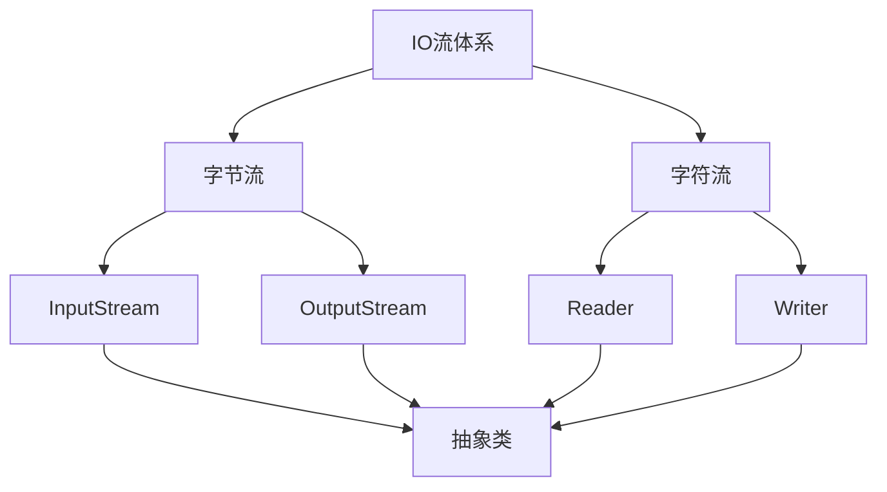

​							字节输入流		字节输出流		字符输入流	字符输出流

因为这四个是抽象类，创建不了对象		

 所以就需要创建子类对象

例子

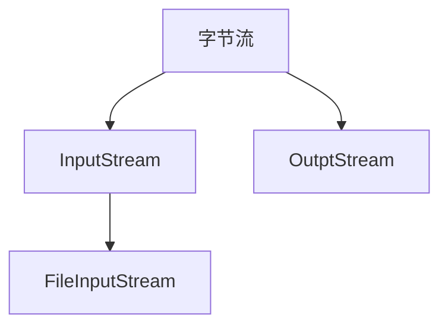

​										操作本地文件的字节输入流

​											FileInputStream

​										File作用，InputStream父类

### 字节输出流写出数据的细节

FileOutputStream

> 操作本地文件的字节输出流,可以把程序中的数据写入到文件中

书写步骤:

1. 创建字节输出流对象
2. 写入数据
3. 释放资源

FileOutputStream原理:

> ```java
> // 1. 在程序和文件之间开辟了一条通道
> FileOutputStream fos = new FileOutputStream("/home/hexiaolei/aaa/a.txt");
> // 2. 程序将内容写入到文件中
>  fos.write(97);
> // 3. 用完了需要关闭通道
> fos.close();
> ```

**总结以及代码**

```java
package IO;

import java.io.FileOutputStream;
import java.io.IOException;

public class IOdemo1 {
    public static void main(String[] args) throws IOException {
        /*
       FileOutputStream

    > 操作本地文件的字节输出流,可以把程序中的数据写入到文件中

    书写步骤:

    1. 创建字节输出流对象
        细节1： 参数是字符串或者是File对象都是可以的
            public FileOutputStream(String name) throws FileNotFoundException {
            this(name != null ? new File(name) : null, false);
    }
    源代码是这样写的
        细节2：如果文件不存在系统会自动创建一个，但是父路径必须存在
        细节3：如果文件已经存在，会把以存在文件内容清除在写入数据
    2. 写入数据
        细节1：write的方法是整数，但是实际上写到本地文件的是ASCII码表对应的字符
        97 --> a
    3. 释放资源
        每次使用完流以后，都需要释放
         */
        //1.创建对象
        //写入 输出流OutputStream
        //文件 File

        FileOutputStream fos = new FileOutputStream("/home/hexiaolei/aaa/z.txt");
        //2.写出数据
        fos.write(97);
        //3.释放资源
        fos.close();
    }
}

```

### FileOutputStream写入数据的三种方式

| 方法名称                                 | 说明                         |
| ---------------------------------------- | ---------------------------- |
| `void write(int b)`                      | 一次写一个字节数据           |
| `void write(byte[] b)`                   | 一次写一个字节数组数据       |
| `void write(byte[] b, int off, int len)` | 一次写一个字节数组的部分数据 |

 代码

```java
package IO;

import java.io.FileOutputStream;
import java.io.IOException;

public class FileOutputStreamDemo1 {
    public static void main(String[] args) throws IOException {
        /**
         * | `void write(int b)`                      | 一次写一个字节数据           |
         * | `void write(byte[] b)`                   | 一次写一个字节数组数据       |
         * | `void write(byte[] b, int off, int len)` | 一次写一个字节数组的部分数据 |
         */
        // 方式 1
        //创建对象
        FileOutputStream fos = new FileOutputStream("/home/hexiaolei/aaa/a.txt");
        //写入数据
        fos.write(99);
        fos.write(99);
        //释放资源
//        fos.close();

        // 方式 2
        byte[] bytes = {12,33,22,22,33,11,22,33,33,11};
        fos.write(bytes);

        // 方式3
        //解释：
            //参数1：需要读取的文件,
            //参数2：起始索引
            //参数3：读取个数
        fos.write(bytes,1,2);
        fos.close();
    }
}
```

###  换行和续写

代码

```java
package IO;

import java.io.FileOutputStream;
import java.io.IOException;

public class FileOutputStreamDemo2 {
    public static void main(String[] args) throws IOException {
        /*
        换行写:
            Windows: \r\n
            Linux: \n
            Mac:  \r
            细节:windows中,java对换行进行了优化,会自动补全,输入\n或者\r都是可以的
            不过还是建议写全
        续写:
         */
        FileOutputStream fos = new FileOutputStream("/home/hexiaolei/aaa/a.txt");
        fos.write("我是22计算机网络技术一班的".getBytes());
        //写出一个换行符就可以实现换行了
        fos.write("\n".getBytes());

        fos.write("666".getBytes());
        fos.close();

        //续写:需要使用FileOutputStream的另外一个构造方法,第二个参数是打开续写开关，为true不会把文件删除后在写入，而是在原有的基础上写入
        //如果参数为false（默认）,会先把文件删除后在写入
        FileOutputStream fos1 = new FileOutputStream("/home/hexiaolei/aaa/a.txt",true);
        fos1.write("你好，我是续写的内容".getBytes());
        fos1.close();
    }
}
```

**总结**

当然，以下是您提供内容的文本格式：

1. FileOutputStream的作用
   可以把程序中的数据写到本地文件上，是字节流的基本流。

2. 书写步骤
   创建对象，写出数据，释放资源

3. 三步操作的细节
   创建对象：文件存在、文件不存在、追加写入
   写出数据：写出整数、写出字节数组、换行写入


### 字节输入流的基本用法FileInputStream

> 读取本地文件的字节流，可以把文帝文件中的数据度渠道程序中

步骤:

1. 创建字节输入流对象
2. 读数据
3. 释放资源

代码

```java
package IO;

import java.io.FileInputStream;
import java.io.IOException;

public class FileInputStreamDemo1 {
    public static void main(String[] args) throws IOException {
        /*
        ### 字节输入流的基本用法FileInputStream

> 读取本地文件的字节流，可以把文帝文件中的数据度渠道程序中

步骤:

1. 创建字节输入流对象
2. 读数据
3. 释放资源
         */
        FileInputStream fis = new FileInputStream("/home/hexiaolei/aaa/a.txt");
        int r1 = fis.read();
        System.out.println(r1);
        int r2 = fis.read();
        System.out.println(r2);
        int r3 = fis.read();
        System.out.println(r3);
        int r4 = fis.read();
        System.out.println(r4);
        int r5 = fis.read();
        System.out.println(r5);
        int r6 = fis.read();
        System.out.println(r6);
        int r7 = fis.read();
        System.out.println(r7);//如果读取不到，会返回-1
        fis.close();
    }
}
```


### 字节流写入文件细节

代码

```java
package IO;

import java.io.FileInputStream;
import java.io.IOException;

public class FileInputStreamDemo1 {
    public static void main(String[] args) throws IOException {
        /*
        ### 字节输入流的基本用法FileInputStream

> 读取本地文件的字节流，可以把文帝文件中的数据度渠道程序中

步骤:

1. 创建字节输入流对象
    细节1：如果文件不存在，会直接报错
    输出流:不存在，创建
        把数据写到文件中(有数据)
    输入流：不存在，报错
        从文件中读取数据,数据在文件中，所以即使吧文件创建出来也是空的，没有任何意义

    程序最重要的是：数据。
2. 读数据
    细节1：一次读取一个字节，读取出来的是ASCII对应的数字
    细节2：当没有字节可以读取时会返回-1

3. 释放资源
         */
        FileInputStream fis = new FileInputStream("/home/hexiaolei/aaa/a.txt");
        //读取数据
//        int r1 = fis.read();
//        System.out.println(r1);
//        int r2 = fis.read();
//        System.out.println(r2);
//        int r3 = fis.read();
//        System.out.println(r3);
//        int r4 = fis.read();
//        System.out.println(r4);
//        int r5 = fis.read();
//        System.out.println(r5);
//        int r6 = fis.read();
//        System.out.println(r6);
//        int r7 = fis.read();
//        System.out.println(r7);//如果读取不到，会返回-1
        //字节流循环读取
        //while (fis.read() != -1) {
        //            System.out.print(fis.read());
        //        }
        //不可以这么写
        //因为read执行一次，都会读取当前字符并且移动一次指针
        int b;
        while ((b = fis.read()) != -1) {
            System.out.print((char) b);
        }
        fis.close();
    }
}
```

### 文件拷贝基本代码

```java
package IO;

import java.io.FileInputStream;
import java.io.FileOutputStream;
import java.io.IOException;

public class FileCopy {
    public static void main(String[] args) throws IOException {
        FileInputStream input = new FileInputStream("/home/hexiaolei/RosanMedia.mp4");
        FileOutputStream output = new FileOutputStream("/home/hexiaolei/aaa/b.mp4");
        int b;
        while ((b = input.read()) != -1) {
            output.write((char) b);
        }
        //释放资源规则
        //先开的后释放

        output.close();
        input.close();
    }
}
```

### 文件拷贝的弊端和解决方案

FileInputStream读取的问题

IO流：如果拷贝的文件过大,速度是否会受到影响

原因:一次拷贝一个字节

解决方式:一次读取多个字节

| 方法名称                         | 说明                   |
| -------------------------------- | ---------------------- |
| `public int read()`              | 一次读一个字节数据     |
| `public int read(byte[] buffer)` | 一次读一个字节数组数据 |

注意：一次性读取一个字节数组，每次读取尽量把数组装满

  优化后的代码

```java
package IO;

import java.io.FileInputStream;
import java.io.FileOutputStream;
import java.io.IOException;

public class NewFileCopy {
    public static void main(String[] args) throws IOException {
        /*
        | 方法名称                         | 说明                   |
| -------------------------------- | ---------------------- |
| `public int read()`              | 一次读一个字节数据     |
| `public int read(byte[] buffer)` | 一次读一个字节数组数据 |
         */
//        FileInputStream fis = new FileInputStream("/home/hexiaolei/aaa/a.txt");
//        FileOutputStream fos = new FileOutputStream("/home/hexiaolei/newRosan.mp4");
        //一次读取多少字节数据，具体读取多少，跟数组长度有关
        //返回值(len)：一次读取到多少个字节数据
//        int len = fis.read(bytes);
//        String str = new String(bytes);//(str)读取到的数据
//        System.out.println(str);


//        byte[] bytes = new byte[2];
//        int len;
//        len = fis.read(bytes);//0,0
//        System.out.println(new String(bytes));//ab
//        len = fis.read(bytes);//97,98
//        System.out.println(new String(bytes));//99,100
//        len = fis.read(bytes);//99,100
//        System.out.println(new String(bytes));//101,10

//        运行结果
        /*
        解释:
        因为是Linux操作系统,所以换行符是LF
        第一次读取到ab，存储到数组中,打印
        第二次读取到cd，覆盖之前的ab，打印
        第三次读取到e和回车符号,覆盖cd，打印
        第四次打印len时由于没有新字符了所以返回-1,
        最后一次打印由于没有清空数组，导致内容还是e和回车符号
         */


//        想要改变，可以使用这一种方式

//        int len1;//读取到的字节长度
//        byte[] bytes = new byte[2];
//        len1 = fis.read(bytes);
//        System.out.println(new String(bytes, 0, len1));
//        len1 = fis.read(bytes);
//        System.out.println(new String(bytes, 0, len1));
//        //前四个已经读取完毕，这里只剩e和换行符,所以读取长度还是2
//        len1 = fis.read(bytes);
//        System.out.println(new String(bytes, 0, len1 - 1));
//        int read = fis.read(bytes);
//        System.out.println("read = " + read);
//
//        fis.close();
//        System.out.println("hello\nWorld");


        //FileCopy改写
        FileInputStream fileInputStream = new FileInputStream("/home/hexiaolei/centos.iso");
        FileOutputStream fileOutputStream = new FileOutputStream("/home/hexiaolei/a.iso");

								//每次读取5MB
        byte[] bytes1 = new byte[1024 * 1024 * 5];
        int len;
        while ((len = fileInputStream.read(bytes1)) != -1) {
            fileOutputStream.write(bytes1,0,len);
        }
        fileOutputStream.close();
        fileInputStream.close();
    }
}

```

### 不同JDK捕获异常的方式

代码

```java
package IO;

import java.io.FileInputStream;
import java.io.FileOutputStream;
import java.io.IOException;

public class NewTCF {
    public static void main(String[] args) throws IOException {
        FileInputStream fileInputStream = new FileInputStream("/home/hexiaolei/RosanMedia.mp4");
        FileOutputStream fileOutputStream = new FileOutputStream("/home/hexiaolei/a.iso");
        try (fileOutputStream;fileInputStream){//写在这里面的对象(的类需要继承AutoCloseable接口)，方法执行结束后会自动释放资源
            byte[] bytes1 = new byte[1024 * 1024 * 5];
            int len;
            while ((len = fileInputStream.read(bytes1)) != -1) {
                fileOutputStream.write(bytes1,0,len);
            }
        }catch (IOException e ){
            e.printStackTrace();
        }


    }
}
```

版本区别


**只有继承于AutoCloseable的类才能写在try的括号内**


### 字符集详解(ASCII,GBK)

存储英文一个字节就可以了

ASCII:英文

GBK:英文，中文

Unicode:英文，中文 

计算机的存储规则（英文）

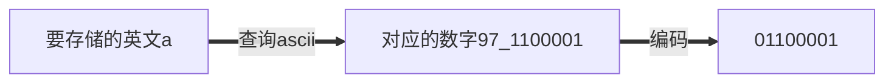

#### ASCII编码和解码过程

1. **查询ASCII**: 当你需要存储字符'a'时，首先查询其ASCII值，结果是97。
2. **编码**: 将这个十进制数97转换为二进制，得到0110 0001。
3. **解码**: 当你从存储介质读取到二进制数0110 0001时，通过ASCII解码规则（直接转成十进制），你得到数字97，然后查询这个数字对应的字符，结果是'a'。

字符集详解(Unicode)

UTF-8编码规则:1-4四个字节

ASCII：一个字节

中文：三个字节

UTF-8是Unicode字符集的一种编码方式


### 为什么会有乱码

原因1：读取数据时没有读取完整个汉字

原因2：编码和解码的方式不统一

如何避免出现乱码

1. 不要用字节流读取文件
2. 编码解码时使用同一个码表，同一种编码方式

### Java中编码和解码的方法实现

**Java**中编码的方法

| String类中的方法                             | 说明                 |
| -------------------------------------------- | -------------------- |
| `public byte[] getBytes()`                   | 使用默认方式进行编码 |
| `public byte[] getBytes(String charsetName)` | 使用指定方式进行编码 |

**Java**中解码的方法

| String类中的方法                           | 说明                 |
| ------------------------------------------ | -------------------- |
| `String(byte[] bytes)`                     | 使用默认方式进行解码 |
| `String(byte[] bytes, String charsetName)` | 使用指定方式进行解码 |

代码

```java
package IO;

import java.io.UnsupportedEncodingException;
import java.util.Arrays;

public class CharSetDemo1 {
    public static void main(String[] args) throws UnsupportedEncodingException {
        /*
        # Java中编码的方法

| String类中的方法                                      | 说明                   |
|-------------------------------------------------------|------------------------|
| `public byte[] getBytes()`                            | 使用默认方式进行编码   |
| `public byte[] getBytes(String charsetName)`          | 使用指定方式进行编码   |

# Java中解码的方法

| String类中的方法                                      | 说明                   |
|-------------------------------------------------------|------------------------|
| `String(byte[] bytes)`                                | 使用默认方式进行解码   |
| `String(byte[] bytes, String charsetName)`            | 使用指定方式进行解码   |
         */
        //1.编码
        String str = "I'm学生";
        byte[] bytes = str.getBytes();//UTF-8,一个英文一个字节，一个中文三个字节
        System.out.println(Arrays.toString(bytes));


        byte[] bytes1 = str.getBytes("GBK");//指定为GBK,一个英文一个字节，一个中文两个字节
        System.out.println(Arrays.toString(bytes1));


        //2.解码
        String str1 = new String(bytes);
        System.out.println(str1);
        
        System.out.println(new String(bytes,"GBK"));
    }
}

```

效果

```shell
[73, 39, 109, -27, -83, -90, -25, -108, -97]
[73, 39, 109, -47, -89, -55, -6]
I'm学生
I'm瀛︾敓
```

### 字符输入流-空参read方法

字符流：底层就是字节流加上字符集

特点：

- 输入流：一次读一个字节，遇到中文时一次读多个字节
- 输出流：底层会把数据按照指定的编码方式进行编码，变成字节写入到文件中

使用场景：纯文本文件的操作

Rider：字符输入流

Writer：字符输出流

####  FileReader

1. 创建字符输入流对象
2. 读取数据

> | 成员方法                         | 说明                         |
> | -------------------------------- | ---------------------------- |
> | `public int read()`              | 读取数据，读到末尾返回-1     |
> | `public int read(char[] buffer)` | 读取多个数据，读到末尾返回-1 |
>
> ### 细节说明
>
> - **细节1**: 按字节进行读取，遇到中文字符时，会一次读取多个字节。读取后进行解码，返回一个整数。
> - **细节2**: 当读取到文件末尾时，`read` 方法将返回-1。

3. 释放资源

 代码

```java
package IO.CharSetDemo;

import java.io.FileReader;
import java.io.IOException;

public class CharSetDemo2 {
    public static void main(String[] args) throws IOException {

//| 成员方法                         | 说明                         |
//| -------------------------------- | ---------------------------- |
//| `public int read()`              | 读取数据，读到末尾返回-1     |
//| `public int read(char[] buffer)` | 读取多个数据，读到末尾返回-1 |
        //1.创建对象
        FileReader fileReader = new FileReader("/home/hexiaolei/aaa/a.txt");
        //2.读取数据read(),底层也是字节流，默认一个字节一个字节读取，遇到中文会一次读取多个
        int ch;
        //空参read细节:默认按照字节读取，如果遇到中文就一次读取多个,
        //读取之后：方法底层将会进行解码并且转换为十进制
        //最后将这个十进制作为返回值
        //这个十进制也表示在字符集上的数字
        //英文:文件里面的数据 0110 0001
        //  read进行读取:解码转换为十进制97
        //中文：文件里面数据 11100110 10110001 10001001
        //  read进行读取：解码转换为十进制 27721
        //看到实际字符可以强转
        while ((ch = fileReader.read()) != -1) {
            System.out.print((char) ch+"\t");
            System.out.print(ch + "\t");
        }
        //3.释放资源
        fileReader.close();
    }
}

```

### 有参数read方法详细解释

 代码

```java
package IO.CharSetDemo;

import java.io.FileReader;
import java.io.IOException;

public class FileReaderDemo3 {
    public static void main(String[] args) throws IOException {

        //| `public int read(char[] buffer)` | 读取多个数据，读到末尾返回-1 |
        FileReader fileReader = new FileReader("/home/hexiaolei/aaa/a.txt");

        char[] chars = new char[13];
        //读取到的长度
        int len;
        //read(char)底层原理:读取数据，解码，强制转换，把强转以后的字符放到数组中
        //空参的read+强制类型转换
        while ((len=fileReader.read(chars))!=-1){
            System.out.println(new String(chars,0,len));
        }
        fileReader.close();

    }
}
```

### 字符输出流写出数据

FileWrite

**构造方法**

| 构造方法                                             | 说明                             |
| ---------------------------------------------------- | -------------------------------- |
| `public FileWriter(File file)`                       | 创建字符输出流关联本地文件       |
| `public FileWriter(String pathname)`                 | 创建字符输出流关联本地文件       |
| `public FileWriter(File file, boolean append)`       | 创建字符输出流关联本地文件，续写 |
| `public FileWriter(String pathname, boolean append)` | 创建字符输出流关联本地文件，续写 |


成员方法

| 成员方法                                    | 说明                   |
| ------------------------------------------- | ---------------------- |
| `void write(int c)`                         | 写出一个字符           |
| `void write(String str)`                    | 写出一个字符串         |
| `void write(String str, int off, int len)`  | 写出一个字符串的一部分 |
| `void write(char[] cbuf)`                   | 写出一个字符数组       |
| `void write(char[] cbuf, int off, int len)` | 写出字符数组的一部分   |

代码

```java
package IO.CharSetDemo;

import java.io.FileWriter;
import java.io.IOException;

public class FileWriteDemo1 {
    public static void main(String[] args) throws IOException {


        /*
        | 构造方法                                      | 说明                             |
|-----------------------------------------------|----------------------------------|
| `public FileWriter(File file)`                | 创建字符输出流关联本地文件       |
| `public FileWriter(String pathname)`          | 创建字符输出流关联本地文件       |
| `public FileWriter(File file, boolean append)`| 创建字符输出流关联本地文件，续写 |
| `public FileWriter(String pathname, boolean append)`| 创建字符输出流关联本地文件，续写 |
         */
        /*
        | 成员方法                                    | 说明                   |
| ------------------------------------------- | ---------------------- |
| `void write(int c)`                         | 写出一个字符           |
| `void write(String str)`                    | 写出一个字符串         |
| `void write(String str, int off, int len)`  | 写出一个字符串的一部分 |
| `void write(char[] cbuf)`                   | 写出一个字符数组       |
| `void write(char[] cbuf, int off, int len)` | 写出字符数组的一部分   |
         */
        FileWriter fw = new FileWriter("/home/hexiaolei/aaa/filewrite.txt");
        fw.write(25105);//根据字符集编码方式进行编码，然后把编码之后的数据写入到文件之中
        fw.write("你好聪明？？？");
        fw.close();
    }
}

```


### 字符串底层原理详解

在底层会在内存里创建一个缓冲区,长度为8192的字节数组

1 创建字符输入流对象

​	底层：关联文件，并创建缓冲区(长度为8192的字节数足)

2 读取数据

​	底层：

1. 判断缓冲区里面是否有数据可以读取

   1. 缓冲区里面没有数据:就从文件里读取数据，放到缓冲区里面，每次尽可能砖墁缓冲区,如果文件中也没有数据了，返回-1
   2. 缓冲区里面有数据: 就从缓冲区里面读取

   

   如果读取超过8192字节的数据,第一次读取了8192个字节到缓冲区，第二次会将剩下的数据也放在缓冲区

   示例

   

   代码

   

   ```java
   package IO.CharSetDemo;
   
   import java.io.FileReader;
   import java.io.FileWriter;
   import java.io.IOException;
   
   public class FileReaderDetailed {
       public static void main(String[] args) throws IOException {
   //        FileWriter fr = new FileWriter("/home/hexiaolei/aaa/all_all_a.txt");
   //
   //
   //        for (int i = 0; i < 8192; i++) {
   //            fr.write(97);
   //        }
   //
   //        fr.write(98);
   //
   //
   //        fr.close();
   //
   
           //有一种情况,
           FileReader fileReader = new FileReader("/home/hexiaolei/aaa/all_all_a.txt");
           //会把数据放到缓冲区
           fileReader.read();
           //不加append参数会把文件内容清空
           FileWriter fileWriter = new FileWriter("/home/hexiaolei/aaa/all_all_a.txt");
   
   
           int ch;
           //这里会从缓冲区里面读取
           while ((ch = fileReader.read()) != -1) {
               System.out.println((char) ch);
           }
           //解释：还是可以读取到文件内容的，因为第一次read的时候，filereader会把数据放到缓冲区，然后filewrite会把文件内容清空但是不会把缓冲区清空
           //所以现在只能读取缓冲区里面的内容,读取完就没有了
           //所以这里结果就是全都是a
           fileWriter.close();
           fileReader.close();
       }
   }
   
   ```

   ### 字符输出流原理解析

 在底层，也会创建一个长度为8192的字节数组(缓冲区)

三种情况会把缓冲区里面的数据写入到文件中

1. 装满了

2. 手动刷新(flush)

   1. | 成员方法              | 说明                               |
      | --------------------- | ---------------------------------- |
      | `public void flush()` | 将缓冲区中的数据，刷新到本地文件中 |
      | `public void close()` | 释放资源/关流                      |

   2. 区别：flush刷新以后：可以继续写入数据，但是close以后会直接关闭 

3. 释放资源

### 拷贝文件(包括子文件夹)

代码

```java
package IO.CharSetDemo;

import java.io.File;
import java.io.FileInputStream;
import java.io.FileOutputStream;
import java.io.IOException;

public class FileCopyChar {
    //复制文件(包括子文件夹)
    public static void main(String[] args) throws IOException {
        File source = new File("/home/hexiaolei/aaa/source");
        File dest = new File("/home/hexiaolei/aaa/dest");
        copyFile(source, dest);

    }

    /*
    source数据源
    dest目的地

     */
    public static void copyFile(File source, File dest) throws IOException {
        //判断目的文件夹是否存在，如果不存在就创建
        dest.mkdir();
        File[] src = source.listFiles();
        //判断非空并且循环
        if (src != null) {
            for (File file : src) {
                //是否为文件，如果是文件开始复制
                if (file.isFile()) {
                    //文件输入流 参数:源文件名
                    FileInputStream fip = new FileInputStream(file);
                    //文件输出流，参数:目的文件夹和源文件名
                    FileOutputStream fop = new FileOutputStream(new File(dest, file.getName()));
                    byte[] bytes = new byte[1024];
                    int len;
                    while ((len = fip.read(bytes)) != -1) {
                        fop.write(bytes, 0, len);
                    }
                    fop.close();
                    fip.close();
                } else {
                    copyFile(file,new File(dest,file.getName()));
                }

            }
        }
    }
}

```


### 加密文件

代码

```java
 package IO.CharSetDemo;

import java.io.FileInputStream;
import java.io.FileOutputStream;
import java.io.IOException;

public class CodeFile {
    public static void main(String[] args) throws IOException {
        /*
       **文件加密**

为了保证文件的安全性，就需要对原始文件进行加密存储，再使用的时候再对其进行解密处理。

**加密原理：**
对原始文件中的每一个字节数据进行更改，然后将更改以后的数据存储到新的文件中。

**解密原理：**
读取加密之后的文件，按照加密的规则反向操作，变成原始文件。
           ^ : 异或
           两边相同 : false
           两边不同 : true
         */


        System.out.println(true ^ true);
        System.out.println(false ^ true);

        //数字异或计算
        System.out.println(100 ^ 10);
        /*
        原理:
        100:1100100
        10:1010

        1100100
      ^ 0001010
        ----------
        1101110 十进制:110
        第二次计算110 ^ 10
        1101110
        0001010
        ----------
        1100100 十进制:100
         */
        System.out.println(110 ^ 10);


        System.out.println("开始");
//        code();
        encode();
    }
    public static void code() throws IOException {
        FileInputStream fip = new FileInputStream("/home/hexiaolei/aaa/泰坦钱包地址.txt");
        FileOutputStream fop = new FileOutputStream("/home/hexiaolei/aaa/code.txt");
        int b;
        while ((b=fip.read())!=-1){
            fop.write(b ^ 100);
        }
        fop.close();
        fip.close();
    }
    public static void encode() throws IOException {
        FileInputStream fip = new FileInputStream("/home/hexiaolei/aaa/code.txt");
        FileOutputStream fop = new FileOutputStream("/home/hexiaolei/aaa/encode.txt");
        int b;
        while ((b=fip.read())!=-1){
            fop.write(b ^ 100);
        }
        fop.close();
        fip.close();
    }

}

```

### 文件排序

```java
package IO.CharSetDemo;

import java.io.FileReader;
import java.io.FileWriter;
import java.io.IOException;
import java.util.Arrays;

public class newSortFile {
    public static void main(String[] args) throws IOException {
        FileReader fr = new FileReader("/home/hexiaolei/aaa/a.txt");
        FileWriter fw = new FileWriter("/home/hexiaolei/aaa/a_result.txt");
        StringBuilder strb = new StringBuilder();
        int ch;
        while ((ch = fr.read()) != -1) {
            if (ch == '\n' || ch == '\r') {
                break;
            }
            strb.append((char) ch);
        }
        System.out.println(strb);


        Integer[] array = Arrays.stream(strb.toString().split("-"))
                .map(Integer::parseInt)
                .sorted()
                .toArray(Integer[]::new);

        String str = Arrays.toString(array).replace(", ","-");
        String result = str.substring(1, str.length() - 1);


        fw.write(result);
        fw.close();
        fr.close();

    }
}

```

old

```java
package IO.CharSetDemo;

import java.io.FileReader;
import java.io.FileWriter;
import java.io.IOException;
import java.util.ArrayList;
import java.util.Collections;

public class sortFile {
    public static void main(String[] args) throws IOException {
        //将2-3-1-4-7-8转换为有顺序的
        //1-2-3-4-7-8
        FileReader fr = new FileReader("/home/hexiaolei/aaa/a.txt");
        FileWriter fw = new FileWriter("/home/hexiaolei/aaa/a_result.txt");
        StringBuilder strb = new StringBuilder();
        int ch;
        while ((ch = fr.read()) != -1) {
            if (ch == '\n' || ch == '\r') {
                break;
            }
            strb.append((char) ch);
        }
        System.out.println(strb);

        //排序
        String string = strb.toString();
        String[] arr = string.split("-");
        ArrayList<Integer> list = new ArrayList<>();

        for (int i = 0; i < arr.length; i++) {
            int i1 = Integer.parseInt(arr[i]);
            list.add(i1);
        }
        Collections.sort(list);
        System.out.println(list);
        //写出
        for (int i = 0; i < list.size(); i++) {
            if (i == list.size() - 1) {
                //变成字符串是原样写出
                fw.write(list.get(i) + "");
            } else {
                fw.write(list.get(i) + "-");
            }
        }
        fw.close();
        fr.close();
    }

}

```

### 字节缓冲流拷贝文件(一次读写一个字节 )

缓冲流


字节缓冲流

原理：底层自带一个长度为8192的缓冲区来提高性能

| 方法名称                                     | 说明                                     |
| -------------------------------------------- | ---------------------------------------- |
| public BufferedInputStream(InputStream is)   | 把基本流包装成高级流，提高读取数据的性能 |
| public BufferedOutputStream(OutputStream os) | 把基本流包装成高级流，提高写出数据的性能 |

代码BufferedStreamDemo1.java

```java
package IO.Buffered;

import java.io.*;

public class BufferedStreamDemo1 {
    public static void main(String[] args) throws IOException {
        //字节缓冲流拷贝文件
        //创建缓冲区对象
        BufferedInputStream fip = new BufferedInputStream(new FileInputStream("/home/hexiaolei/aaa/b.txt"));//可以手动制定缓冲区大小
        BufferedOutputStream fop = new BufferedOutputStream(new FileOutputStream("/home/hexiaolei/aaa/b_result.txt"));
        int b;
        while ((b = fip.read()) != -1) {
            fop.write(b);
        }
        fop.close();
        fip.close();
    }
}
```


### 字节缓冲流拷贝文件(一次读写一个字节数组 )

代码BufferedStreamDemo2.java

```java
package IO.Buffered;

import java.io.*;

public class BufferedStreamDemo2 {
    public static void main(String[] args) throws IOException {
        //字节缓冲流拷贝文件(一次一个字节数组)

        BufferedInputStream bis = new BufferedInputStream(new FileInputStream("/home/hexiaolei/aaa/b.txt"));
        BufferedOutputStream bos = new BufferedOutputStream(new FileOutputStream("/home/hexiaolei/aaa/b_result.txt"));

        int len;
        byte[] bytes = new byte[512];//创建的字节数组
        while ((len = bis.read(bytes)) != -1) {
            bos.write(bytes, 0, len);
        }
        bos.close();
        bis.close();
    }
}

```

### 字节缓冲流提高效率原理


### 字符缓冲流拷贝文件

原理：底层自带了长度为8192的缓冲区提高性能

| 方法名称                        | 说明               |
| ------------------------------- | ------------------ |
| public BufferedReader(Reader r) | 把基本流变成高级流 |
| public BufferedWriter(Writer r) | 把基本流变成高级流 |


代码BufferedReader类

```java
package IO.Buffered;

import java.io.BufferedReader;
import java.io.FileReader;
import java.io.IOException;

public class BufferedReaderDemo1 {
    public static void main(String[] args) throws IOException {
        /*
            字符缓冲输入流
            构造方法:
            public BufferedReader(Reader r) 把基本流变成高级流
            特有方法:
            public void readLine() 读一整行
         */
        //1.创建字符缓冲流对象
        BufferedReader brd = new BufferedReader(new FileReader("/home/hexiaolei/aaa/b.txt"));
        //2.读取一行数据
        //readLine读取一整行的数据，遇到回车换行就会结束
        //不会把回车换行读取到内存中
        String line;
        //循环,如果没有读取到内容会返回null不是-1
        while ((line = brd.readLine()) != null) {
            System.out.println(line);
        }
        //关流
        brd.close();
    }
}

```

代码:BufferedWriter类

```java
package IO.Buffered;

import java.io.BufferedWriter;
import java.io.FileWriter;
import java.io.IOException;

public class BufferedWriterDemo1 {
    public static void main(String[] args) throws IOException {
        //1.创建字符缓冲输出流对象
        BufferedWriter bw = new BufferedWriter(new FileWriter("/home/hexiaolei/aaa/b_result.txt"));
        //2.写出数据
        bw.write("fuck you");
        //换行
        bw.newLine();
        bw.write("love you");
        //3.关流
        bw.close();

    }
}

```

### 综合练习

#### 四种拷贝方式效率对比

代码

```java
package IO.Test;

import java.io.*;

public class FourMethodCalculateFileTime {
    public static void main(String[] args) throws IOException {
        long start = System.currentTimeMillis();
        //1.字节流，一次一个字节  结果：循环45亿次要很久
//        method1();
        //2.字节流，一次一个字节数组    结果:7s
//        method2();
        //3.缓冲字节流，一次一个字节    结果：52s
        method3();
        //4.缓冲字节流，一次一个字节数组  结果:6s
//        method4();
        long end = System.currentTimeMillis();
        System.out.println((end-start)/1000+"秒");
    }

    public static void method1() throws IOException {
        FileInputStream fr = new FileInputStream("/home/hexiaolei/download/iso_file/CentOS-7-x86_64-DVD-2009.iso");
        FileOutputStream fw = new FileOutputStream("/home/hexiaolei/test.iso");
        int b;
        while ((b = fr.read()) != -1) {
            fw.write(b);
        }
        fw.close();
        fr.close();
    }

    public static void method2() throws IOException {
        FileInputStream fr = new FileInputStream("/home/hexiaolei/download/iso_file/CentOS-7-x86_64-DVD-2009.iso");
        FileOutputStream fw = new FileOutputStream("/home/hexiaolei/test.iso");
        int len;
        byte[] bytes = new byte[8192];
        while ((len = fr.read(bytes)) != -1) {
            fw.write(bytes, 0, len);
        }
        fw.close();
        fr.close();
    }

    public static void method3() throws IOException {
        BufferedInputStream bi = new BufferedInputStream(new FileInputStream("/home/hexiaolei/download/iso_file/CentOS-7-x86_64-DVD-2009.iso"));
        BufferedOutputStream bo = new BufferedOutputStream(new FileOutputStream("/home/hexiaolei/test.iso"));
        int b;
        while ((b = bi.read()) != -1) {
            bo.write(b);
        }
        bo.close();
        bi.close();
    }

    public static void method4() throws IOException {
        BufferedInputStream bi = new BufferedInputStream(new FileInputStream("/home/hexiaolei/download/iso_file/CentOS-7-x86_64-DVD-2009.iso"));
        BufferedOutputStream bo = new BufferedOutputStream(new FileOutputStream("/home/hexiaolei/test.iso"));
        int len;
        byte[] bytes = new byte[8192];
        while ((len = bi.read(bytes)) != -1) {
            bo.write(bytes,0,len);
        }
        bo.close();
        bi.close();
    }
}

```

#### 恢复出师表顺序

代码

```java
package IO.Test;

import java.io.*;
import java.util.Map;
import java.util.TreeMap;

public class csb {
    public static void main(String[] args) throws IOException {
        BufferedReader br = new BufferedReader(new FileReader("/home/hexiaolei/aaa/csb.txt"));
        BufferedWriter bw = new BufferedWriter(new FileWriter("/home/hexiaolei/aaa/csb_ok.txt"));
        TreeMap<Integer, String> map = new TreeMap<>();
        String line;
        while ((line = br.readLine()) != null) {
            String[] split = line.split("\\.");
            int key = Integer.parseInt(split[0]);
            //如果想要键是一整句话，可以把这个的split[1]写为line
            String value = split[1];
            map.put(key, value);
        }

//        map.forEach((x,y)-> System.out.println(x+":"+y));
        for (Map.Entry<Integer, String> entry : map.entrySet()) {
            //然后这里可以只写entry.getValue()
            bw.write(entry.getKey() + "." + entry.getValue());
            bw.newLine();
        }
        bw.close();
        br.close();
    }
}

```

#### 计算程序执行次数

代码

```java
package IO.Test;

import java.io.*;

public class CountTime {
    public static void main(String[] args) throws IOException {
        //IO使用原则：随用随创建
        //1.关联文件
        BufferedReader br = new BufferedReader(new FileReader("/home/hexiaolei/aaa/count.txt"));
        //2.逻辑
        String line = br.readLine();
        int count = Integer.parseInt(line);
        //表示又运行了一次
        count++;
        if (count >= 3) {
            System.out.println("超过三次,请付费");
        } else {
            System.out.println("欢迎第"+count+"次使用");
        }
//        System.out.println(read);
        BufferedWriter bw = new BufferedWriter(new FileWriter("/home/hexiaolei/aaa/count.txt"));
        //写入时要加上双引号作为str字符串传入，否则如果直接传进去数字为转化为ascii码写入
        bw.write(count+"");

        //3.关流
        br.close();
        bw.close();
    }
}

```

### 转换流


指定字符编码读取数据ConvertStreamDemo1

代码

```java
package IO.ConvertStream;

import java.io.FileReader;
import java.io.IOException;
import java.nio.charset.Charset;

public class ConvertStreamDemo1 {
    public static void main(String[] args) throws IOException {
        /*
        转换
        在linux内将utf-8转换为gbk字符集命令为
                 源编码   目标编码         源文件           目的文件
        iconv -f utf-8 -t gbk example.txt > example.txt
         */
        //1.创建转换流对象，关联文件并且制定gbk字符集 （ 放弃）
//        InputStreamReader isr = new InputStreamReader(new FileInputStream("/home/hexiaolei/aaa/gbk_file.txt"), "GBK");
//        //2.读取数据
//        int b;
//        while ((b = isr.read()) != -1) {
//            System.out.print((char) b);
//        }
//        //3.释放资源
//        isr.close();
        //需要掌握的方法
        //指定字符编码读取数据
        FileReader fr = new FileReader("/home/hexiaolei/aaa/gbk_file.txt", Charset.forName("GBK"));
        int ch;
        while ((ch=fr.read())!=-1){
            System.out.print((char)ch);
        }
    }
}
```

指定字符集写出数据ConvertStreamDemo2

```java
package IO.ConvertStream;

import java.io.FileWriter;
import java.io.IOException;
import java.nio.charset.Charset;

public class ConvertStreamDemo2 {
    public static void main(String[] args)throws IOException {
        /*
        利用转换流指定的字符编码写出数据
         */
        FileWriter fw = new FileWriter("/home/hexiaolei/aaa/out_gbk_file.txt", Charset.forName("GBK"));
        fw.write("HelloWorld这是gbk编码的文件");
        fw.close();
    }
}

```

读取gbk文件写出为utf-8ConvertStreamDemo3

代码

```java
package IO.ConvertStream;

import java.io.FileReader;
import java.io.FileWriter;
import java.io.IOException;
import java.nio.charset.Charset;
import java.nio.charset.StandardCharsets;

public class ConvertStreamDemo3 {
    public static void main(String[] args) throws IOException {
        //读取gbk文件，写出为utf-8
        FileReader fr = new FileReader("/home/hexiaolei/aaa/gbk_file.txt", Charset.forName("GBK"));
        FileWriter fw = new FileWriter("/home/hexiaolei/aaa/gbk_file_out.txt", StandardCharsets.UTF_8);
        int ch;
        while ((ch = fr.read()) != -1) {
            fw.write((char) ch);
        }
        fw.close();
        fr.close();
    }
}
```

使用字节流读取一整行代码不乱码ConvertStreamDemo4

代码

```java
package IO.ConvertStream;

import java.io.BufferedReader;
import java.io.FileInputStream;
import java.io.IOException;
import java.io.InputStreamReader;

public class ConvertStreamDemo4 {
    public static void main(String[] args) throws IOException {
        //利用字节流读取文件中的数据，每次读一整行，而且不能出现乱码
        ////1. 字节流在读取中文的时候，是会出现乱码的，但是字符流可以搞定
        ////2. 字节流里面是没有读一整行的方法的，只有字符缓冲流才能搞定
//        //字节流
//        FileInputStream fis  = new FileInputStream("/home/hexiaolei/aaa/a.txt");
//        //转换流
//        InputStreamReader isr = new InputStreamReader(fis);
//        //字符缓冲流
//        BufferedReader br = new BufferedReader(isr);
//        String line = br.readLine();
//        System.out.println(line);
//        br.close();

        //最终代码
        BufferedReader br = new BufferedReader(new InputStreamReader(new FileInputStream("/home/hexiaolei/aaa/a.txt")));
        String line;
        while ((line=br.readLine())!=null){
            System.out.println(line);
        }
        //使用字节流会乱码的代码
//        FileInputStream fis = new FileInputStream("/home/hexiaolei/aaa/a.txt");
//        int b;
//        while ((b=fis.read())!=-1){
//            System.out.println((char)b);
//        }
    }
}
```

### 序列化流/对象操作输出流

>  可以把Java对象写到本地文件中

| 构造方法                                    | 说明                 |
| ------------------------------------------- | -------------------- |
| public ObjectOutputStream(OutputStream out) | 把基本流包装为高级流 |

| 成员方法                                    | 说明                           |
| ------------------------------------------- | ------------------------------ |
| `public final void writeObject(Object obj)` | 把对象序列化（写出）到文件中去 |

代码ObjectStreamDemo1类

```java
package IO.ObjectStream;

import java.io.FileOutputStream;
import java.io.IOException;
import java.io.ObjectOutputStream;

public class ObjectStreamDemo1 {
    public static void main(String[] args) throws IOException {
        //利用序列化流将一个对象写入到文件中
        /*
        | 构造方法                                    | 说明                 |
| ------------------------------------------- | -------------------- |
| public ObjectOutputStream(OutputStream out) | 把基本流包装为高级流 |

| 成员方法                                    | 说明                           |
| ------------------------------------------- | ------------------------------ |
| `public final void writeObject(Object obj)` | 把对象序列化（写出）到文件中去 |
         */
        //1.创建对象
        Student stu =new Student("hexiaolei",11);
        //2.创建序列化流对象
        ObjectOutputStream oos = new ObjectOutputStream(new FileOutputStream("/home/hexiaolei/aaa/object.txt"));
        //3.写入数据
        oos.writeObject(stu);
        //4.关流
        oos.close();
    }
}
```

Student类

```java
package IO.ObjectStream;

import java.io.Serializable;


/*
Serializable类是没有抽象方法的，意思是标记型接口
一旦实现了这个接口，那么就表示当前student类对象可以被序列化
理解：
一个物品的合格证
 */
public class Student implements Serializable {
    private String name;
    private int age;

    public Student() {
    }

    public Student(String name, int age) {
        this.name = name;
        this.age = age;
    }

    public String getName() {
        return name;
    }

    public void setName(String name) {
        this.name = name;
    }

    public int getAge() {
        return age;
    }

    public void setAge(int age) {
        this.age = age;
    }
}

```

### 反序列化/对象操作输入流

>  可以把序列化到本地文件的对象,读取到程序里面

 

| 构造方法                                    | 说明               |
| ------------------------------------------- | ------------------ |
| `public ObjectInputStream(InputStream out)` | 把基本流变成高级流 |

| 成员方法                     | 说明                                       |
| ---------------------------- | ------------------------------------------ |
| `public Object readObject()` | 把序列化到本地文件中的对象，读取到程序中来 |

代码

```java
package IO.ObjectStream;

import java.io.FileInputStream;
import java.io.IOException;
import java.io.ObjectInputStream;

public class ObjectStreamDemo2 {
    public static void main(String[] args) throws IOException, ClassNotFoundException {
        /*
        > 可以把序列化到本地文件的对象,读取到程序里面


| 构造方法                                    | 说明               |
| ------------------------------------------- | ------------------ |
| `public ObjectInputStream(InputStream out)` | 把基本流变成高级流 |

| 成员方法                     | 说明                                       |
| ---------------------------- | ------------------------------------------ |
| `public Object readObject()` | 把序列化到本地文件中的对象，读取到程序中来 |
         */

        //创建反序列化对象，并且关联序列化到本地文件的对象
        ObjectInputStream ois = new ObjectInputStream(new FileInputStream("/home/hexiaolei/aaa/object.txt"));
        //读取对象并且强制转换
        Student o = (Student) ois.readObject();
        //打印对象
        System.out.println(o);
    }
}

```

！！！Student类和上面的一样

### 序列化和反序列化的使用细节

序列化流/反序列化流的细节汇总

 1. 使用序列化流将对象写到文件时，需要让Javabean类实现Serializable接口。否则，会出现NotSerializableException异常

2序列化流写到文件中的数据是不能修改的，一旦修改就无法再次读回来了

 3. 序列化对象后，修改了Javabean类，再次反序列化，会不会有问题？   - 会出问题，会抛出InvalidClassException异常  

**解决方案**：给Javabean类添加serialVersionUID（序列号、版本号）

 4.如果一个对象中的某个成员变量的值不想被序列化，又该如何实现呢？   

 **解决方案**：给该成员变量加transient关键字修饰，该关键字标记的成员变量不参与序列化过程 


序列化类

```java
package IO.ObjectStream.test;

import java.io.FileOutputStream;
import java.io.IOException;
import java.io.ObjectOutputStream;
import java.util.ArrayList;

public class test1 {
    public static void main(String[] args) throws IOException {
        //将多个自定义对象序列化到文件中,但是对象的个数不确定


        //1.序列化多个对象
        Student s1 = new Student("h", 1, "苏州");
        Student s2 = new Student("x", 2, "北京");
        Student s3 = new Student("l", 4, "南极");
        //2.创建序列化流对象
        ObjectOutputStream oos = new ObjectOutputStream(new FileOutputStream("/home/hexiaolei/aaa/student.txt"));
        //在反序列化时不知道对象有几个的时候，可以在序列化时将对象都放入一个arraylist里面，然后序列化这个arraylist对象然后在读取时使用增强for即可
        ArrayList<Student> list = new ArrayList<>();
        list.add(s1);
        list.add(s2);
        list.add(s3);
        oos.writeObject(list);
        oos.close();
    }
}

```

反序列化类

```java
package IO.ObjectStream.test;

import java.io.FileInputStream;
import java.io.IOException;
import java.io.ObjectInputStream;
import java.util.ArrayList;

public class Test2 {
    public static void main(String[] args) throws IOException, ClassNotFoundException {
        //创建反序列化流对象
        ObjectInputStream ois = new ObjectInputStream(new FileInputStream("/home/hexiaolei/aaa/student.txt"));
        ArrayList<Student> list= (ArrayList<Student>) ois.readObject();
        for (Student student : list) {
            System.out.println(student.toString());
        }
    }
}

```

Student类

```java
package IO.ObjectStream.test;

import java.io.Serial;
import java.io.Serializable;

public class Student implements Serializable {

    @Serial
    private static final long serialVersionUID = 8105601762390111265L;
    private String name;
    private int age;
    private String address;

    public Student() {
    }

    public Student(String name, int age, String address) {
        this.name = name;
        this.age = age;
        this.address = address;
    }

    public String getName() {
        return name;
    }

    public void setName(String name) {
        this.name = name;
    }

    public int getAge() {
        return age;
    }

    public void setAge(int age) {
        this.age = age;
    }

    public String getAddress() {
        return address;
    }

    public void setAddress(String address) {
        this.address = address;
    }

    @Override
    public String toString() {
        return "Student{" +
                "name='" + name + '\'' +
                ", age=" + age +
                ", address='" + address + '\'' +
                '}';
    }
}

```

### 字节打印流

分类:打印流一般指的是：PrintStream(字节打印流),PrintWriter(字符打印流)类

特点1：只能操作文件目的地，不操作数据源

特点2：特有的写出方法可以实现，数据原样写出

例如：打印：97 文件中:97

打印true	文件中:true

特点3：特有的写出方法可以实现自动刷新，自动换行

打印一次数据 = 写出 + 换行 + 刷新

没有缓冲区，所以自动刷新开不开启都一样

字节打印流:

| 构造方法                                                     | 说明                             |
| ------------------------------------------------------------ | -------------------------------- |
| public PrintStream(OutputStream/File/String)                 | 关联字节输出流 / 文件 / 文件路径 |
| public PrintStream(String fileName, Charset charset)         | 指定字符编码                     |
| public PrintStream(OutputStream out, boolean autoFlush)      | 自动刷新                         |
| public PrintStream(OutputStream out, boolean autoFlush, String encoding) | 指定字符编码且自动刷新           |

| 成员方法                                          | 说明                                       |
| ------------------------------------------------- | ------------------------------------------ |
| public void write(int b)                          | 常规方法：规则跟之前一样，将指定的字节写出 |
| public void println(Xxx xx)                       | 特有方法：打印任意数据，自动刷新，自动换行 |
| public void print(Xxx xx)                         | 特有方法：打印任意数据，不换行             |
| public void printf(String format, Object... args) | 特有方法：带有占位符的打印语句，不换行     |

代码

```java
package IO.PrintStream;

import java.io.FileNotFoundException;
import java.io.FileOutputStream;
import java.io.PrintStream;
import java.nio.charset.StandardCharsets;

public class PrintStreamDemo1 {
    public static void main(String[] args) throws FileNotFoundException {
        /*
        | 构造方法                                                     | 说明                             |
| ------------------------------------------------------------ | -------------------------------- |
| public PrintStream(OutputStream/File/String)                 | 关联字节输出流 / 文件 / 文件路径 |
| public PrintStream(String fileName, Charset charset)         | 指定字符编码                     |
| public PrintStream(OutputStream out, boolean autoFlush)      | 自动刷新                         |
| public PrintStream(OutputStream out, boolean autoFlush, String encoding) | 指定字符编码且自动刷新           |

| 成员方法                                          | 说明                                       |
| ------------------------------------------------- | ------------------------------------------ |
| public void write(int b)                          | 常规方法：规则跟之前一样，将指定的字节写出 |
| public void println(Xxx xx)                       | 特有方法：打印任意数据，自动刷新，自动换行 |
| public void print(Xxx xx)                         | 特有方法：打印任意数据，不换行             |
| public void printf(String format, Object... args) | 特有方法：带有占位符的打印语句，不换行     |
         */
        ///1.创建字节打印流对象
        PrintStream ps = new PrintStream(new FileOutputStream("/home/hexiaolei/aaa/printstream.txt"),true, StandardCharsets.UTF_8);
        //2.写出数据
        ps.println(97);
        ps.print(true);
        ps.println();
        ps.printf("%s 爱上了 %s","wwww","aaa");
        ps.close();
    }
}

```

### 字符打印流

因为底层有缓冲区所以想要使用自动刷新就必须手动开启

| 构造方法                                                     | 说明                             |
| ------------------------------------------------------------ | -------------------------------- |
| public PrintWriter(Write/File/String)                        | 关联字节输出流 / 文件 / 文件路径 |
| public PrintWriter(String fileName, Charset charset)         | 指定字符编码                     |
| public PrintWriter(Write w, boolean autoFlush)               | 自动刷新                         |
| public PrintWriter(OutputStream out, boolean autoFlush, Charset charset) | 指定字符编码且自动刷新           |

| 成员方法                                          | 说明                                         |
| ------------------------------------------------- | -------------------------------------------- |
| public void write(...)                            | 常规方法：规则跟之前一样，写出字节或者字符串 |
| public void println(Xxx xx)                       | 特有方法：打印任意类型的数据并且换行         |
| public void print(Xxx xx)                         | 特有方法：打印任意类型的数据，不换行         |
| public void printf(String format, Object... args) | 特有方法：带有占位符的打印语句               |

代码

```java
package IO.PrintStream;

import java.io.FileWriter;
import java.io.IOException;
import java.io.PrintWriter;

public class PrintStreamDemo2 {
    public static void main(String[] args) throws IOException {
        /*
        构造方法	说明
public PrintWriter(Write/File/String)	关联字节输出流 / 文件 / 文件路径
public PrintWriter(String fileName, Charset charset)	指定字符编码
public PrintWriter(Write w, boolean autoFlush)	自动刷新
public PrintWriter(OutputStream out, boolean autoFlush, Charset charset)	指定字符编码且自动刷新
成员方法	说明
public void write(...)	常规方法：规则跟之前一样，写出字节或者字符串
public void println(Xxx xx)	特有方法：打印任意类型的数据并且换行
public void print(Xxx xx)	特有方法：打印任意类型的数据，不换行
public void printf(String format, Object... args)	特有方法：带有占位符的打印语句
         */
        //1.创建字符打印流对象
        PrintWriter pw = new PrintWriter(new FileWriter("/home/hexiaolei/aaa/printwriter.txt"),true);
        //2.写出数据
        pw.println("你好我是hhh");
        //只打印，不换行
        pw.print("aaa");
        pw.printf("%s fuck %s","a","b");
        pw.close();
    }
}

```

字节打印流和输出语句sout的关系

```java
 //获取打印流的对象，此打印流在虚拟机启动的时候，由虚拟机创建，默认指向控制台
        //特殊的打印流，系统中的标准输出流,不能被关闭
        PrintStream out = System.out;
        out.println("aaa");
```


### 解压缩流

压缩包里面每一个文件都是一个zipentry对象

解压本质:把每个把ZipEntry按照层级拷贝到本地另外一个文件夹中

Java只能识别zip压缩包

P113-115先暂时不搞，顺便看一看之前拷贝有子文件夹的代码

### IO流-43-常用工具包(Commons-io)

Commons-io使用步骤

1. 在项目中创建一个文件夹:lib
2. 将jar包复制粘贴到lib文件夹
3. 右键点击jar包，选择 Add as Library 点击ok
4. 在类中导包使用

大概的方法

| FileUtils 类（文件 / 文件夹相关）                            | 说明                       |
| ------------------------------------------------------------ | -------------------------- |
| static void copyFile(File srcFile, File destFile)            | 复制文件                   |
| static void copyDirectory(File srcDir, File destDir)         | 复制文件夹                 |
| static void copyDirectoryToDirectory(File srcDir, File destDir) | 复制文件夹                 |
| static void deleteDirectory(File directory)                  | 删除文件夹                 |
| static void cleanDirectory(File directory)                   | 清空文件夹                 |
| static String readFileToString(File file, Charset encoding)  | 读取文件中的数据变成字符串 |
| static void write(File file, CharSequence data, String encoding) | 写出数据                   |

| IOUtils 类（流相关）                                         | 说明       |
| ------------------------------------------------------------ | ---------- |
| public static int copy(InputStream input, OutputStream output) | 复制文件   |
| public static int copyLarge(Reader input, Writer output)     | 复制大文件 |
| public static String readLines(Reader input)                 | 读取数据   |
| public static void write(String data, OutputStream output)   | 写出数据   |

简单代码

```java
package CommonsIO;

import org.apache.commons.io.FileUtils;
import org.apache.commons.io.IOUtils;

import java.io.File;
import java.io.FileReader;
import java.io.FileWriter;
import java.io.IOException;

public class CommonsIODemo1 {
    public static void main(String[] args) throws IOException {
        /*
        | FileUtils 类（文件 / 文件夹相关）                            | 说明                       |
| ------------------------------------------------------------ | -------------------------- |
| static void copyFile(File srcFile, File destFile)            | 复制文件                   |
| static void copyDirectory(File srcDir, File destDir)         | 复制文件夹                 |
| static void copyDirectoryToDirectory(File srcDir, File destDir) | 复制文件夹                 |
| static void deleteDirectory(File directory)                  | 删除文件夹                 |
| static void cleanDirectory(File directory)                   | 清空文件夹                 |
| static String readFileToString(File file, Charset encoding)  | 读取文件中的数据变成字符串 |
| static void write(File file, CharSequence data, String encoding) | 写出数据                   |

| IOUtils 类（流相关）                                         | 说明       |
| ------------------------------------------------------------ | ---------- |
| public static int copy(InputStream input, OutputStream output) | 复制文件   |
| public static int copyLarge(Reader input, Writer output)     | 复制大文件 |
| public static String readLines(Reader input)                 | 读取数据   |
| public static void write(String data, OutputStream output)   | 写出数据   |
         */

        FileUtils.copyFile(new File("/home/hexiaolei/aaa/a.txt"),new File("/home/hexiaolei/bbb/bbb.txt"));
        FileUtils.copyDirectoryToDirectory(new File("/home/hexiaolei/aaa"),new File("/home/hexiaolei/aaa/b"));
        IOUtils.copy(new FileReader("/home/hexiaolei/download/iso_file/CentOS-7-x86_64-DVD-2009.iso"),new FileWriter("/home/hexiaolei/aaa.iso"));
    }
}

```

commons-io文档在idea中的commonsIO包中

### IO流-43-常用工具包HuTool

| 相关类            | 说明                            |
| ----------------- | ------------------------------- |
| IoUtil            | 流操作工具类                    |
| FileUtil          | 文件读写和操作的工具类          |
| FileTypeUtil      | 文件类型判断工具类              |
| WatchMonitor      | 目录、文件监听                  |
| ClassPathResource | 针对 ClassPath 中资源的访问封装 |
| FileReader        | 封装文件读取                    |
| FileWriter        | 封装文件写入                    |

[Hutool官网](https://www.hutool.cn/docs/#/)

简单代码示例

```java
package Hutool;

import cn.hutool.core.io.FileUtil;

import java.io.File;
import java.nio.charset.StandardCharsets;
import java.util.List;
import java.util.Map;
import java.util.Set;

public class HutoolDemo2 {
    public static void main(String[] args) {
        /*
        FileUtil类:
 - file：根据参数创建一个file对象
 - touch：根据参数创建文件
 - writeLines：把集合中的数据写出到文件中，覆盖模式。
 - appendLines：把集合中的数据写出到文件中，续写模式。
 - readLines：指定字符编码，把文件中的数据，读到集合中。
 - readUtf8Lines：按照UTF - 8的形式，把文件中的数据，读到集合中
 - copy：拷贝文件或者文件夹
         */
        File file = FileUtil.file(new File("/home/hexiaolei/aaa"), "b", "c", "d", "fuck.txt");
        System.out.println(file);///home/hexiaolei/aaa/b/c/d/fuck.txt

        File touch = new File("/home/hexiaolei/xxx/xxx/xxx/a.txt");
        //touch命令，如果父级路径不存在，那么会自动创建
        FileUtil.touch(touch);


        //将集合写入文件

        Set<Map.Entry<String, String>> entries = System.getenv().entrySet();
        for (Map.Entry<String, String> entry : entries) {
            System.out.println(entry.getKey());
        }
        //writeLines会覆盖之前的内容
        FileUtil.writeLines(entries,"/home/hexiaolei/aaa/env.txt", StandardCharsets.UTF_8);
        //读取文件内容到集合
        List<String> strings = FileUtil.readLines("/home/hexiaolei/aaa/env.txt", StandardCharsets.UTF_8);
        for (String string : strings) {
            System.out.println(string);
        }

    }
}

```

### 综合练习01-网络爬虫（爬取姓氏）

跳过


## 多线程 & JUC

### 多线程&JUC-01-什么是多线程

线程

>  线程是操作系统能够进行运算调度的最小单位。他被包含在**进程**之中，是进程中的实际运作单位

进程

> 进程是程序的基本执行实体

简单理解：应用软件中互相独立的，可以同时运行的功能

多线程应用场景

软件中的耗时操作

- 拷贝，迁移大文件
- 加载大量的资源文件

总结 : 

1. 什么是多线程？
   有了多线程，我们就可以让程序同时做多件事情
2. 多线程的作用？
   提高效率
3. 多线程的应用场景？
   只要你想让多个事情同时运行就需要用到多线程
   比如：软件中的耗时操作、所有的聊天软件、所有的服务器

### 多线程&JUC-02-并发和并行

并发：在同一时刻，有多个指令在单个CPU上==交替==执行

并行：在同一时刻，有多个指令同时在多个CPU上==同时==执行

### 多线程&JUC-03-多线程的第一种实现方式

1. 继承Thread类的方式进行实现
2. 实现Runnable接口的方式进行实现
3. 利用Callable接口和Future接口方式实现

 MyThreadDemo1

代码

```java
package MultipleThread;

public class MyThreadDemo1 extends Thread{

    @Override
    public void run() {
        //书写线程需要执行的代码
        for (int i = 0; i < 1000; i++) {
            System.out.println("我是"+getName()+"HelloWorld");
        }
    }
}

```

MultipleThreadDemo1

代码

```java
package MultipleThread;

public class MultipleTreadDemo1 {
    public static void main(String[] args) {
        //start()表示开启线程
        MyThreadDemo1 myThreadDemo1 = new MyThreadDemo1();
        MyThreadDemo1 myThreadDemo2 = new MyThreadDemo1();
        myThreadDemo1.setName("线程1");
        myThreadDemo2.setName("线程2");
        myThreadDemo1.start();
        myThreadDemo2.start();

    }
}

```

### 多线程&JUC-03-多线程的第二种实现方式

实现Runnable接口的方式实现的

MultipleThreadDemo2

代码

```java
package MultipleThread;

public class MultipleThreadDemo2 {
    public static void main(String[] args) {
        /*
        多线程的第二种启动方式
         1.自己创建一个类继承Runnable接口
         2.重写里面的run方法
         3.创建一个类的对象
         4.创建一个Thread类对象并且把自己创建的类放进去，然后开启线程
         */
        //创建MyThreadDemo2的对象
        MyThreadDemo2 myThreadDemo2 = new MyThreadDemo2();
        //创建线程对象
        Thread t1 = new Thread(myThreadDemo2);
        Thread t2 = new Thread(myThreadDemo2);
        //设置名字
        t1.setName("t1");
        t2.setName("t2");
        t1.start();
        t2.start();
    }
}


```

MyThreadDemo2

代码

```java
package MultipleThread;

public class MyThreadDemo2 implements Runnable{

    @Override
    public void run() {
        for (int i = 0; i < 10; i++) {//t1 t2 如果是t1执行到这个方法，那这里的t就是t1
            //获取当前线程的对象
            Thread t = Thread.currentThread();
            System.out.println(t.getName()+"---"+i);
        }
    }
}

```

### 多线程&JUC-03-多线程的第三种实现方式

利用Callable接口和Future接口方式实现

MyCallable类

代码

```java
package MultipleThread;

import java.util.Map;
import java.util.concurrent.Callable;

public class MyCallable implements Callable<Map<String,String>> {

    @Override
    public Map<String, String> call() throws Exception {
        //求环境变量中总共有几个键和几个值
           return System.getenv();
    }
}

```

MultipleThredDemo3

代码

```java
package MultipleThread;

import java.util.Map;
import java.util.concurrent.ExecutionException;
import java.util.concurrent.FutureTask;

public class MultipleThreadDemo3 {
    public static void main(String[] args) throws ExecutionException, InterruptedException {
/*
    多线程第三种实现方式:
        特点：可以获取到多线程运行返回的结果
         1. 创建一个类MyCallable实现Callable接口
         2. 重写call()方法,有返回值，表示多线程返回的结果
         3. 测试类中，先创建MyCallable对象(表示多线程要执行的任务)
         4. 创建FutureTask对象(作用是管理多线程运行的结果)
         5. 创建Thread对象,并且启动
         6.启动
     */
        MyCallable myCallable = new MyCallable();
        FutureTask<Map<String,String>> futureTask = new FutureTask<>(myCallable);
        Thread thread = new Thread(futureTask);
        thread.start();
        //方法作用是获取多线程的结果
        System.out.println("futureTask.get() = " + futureTask.get());
    }
}

```

|                                       |                                              |                                              |
| ------------------------------------- | -------------------------------------------- | -------------------------------------------- |
| 优点                                  | 缺点                                         |                                              |
| 继承 Thread 类                        | 编程比较简单，可以直接使用 Thread 类中的方法 | 扩展性较差，不能再继承其他的类               |
| 实现 Runnable 接口/实现 Callable 接口 | 扩展性强，实现该接口的同时还可以继承其他的类 | 编程相对复杂，不能直接使用 Thread 类中的方法 |

### 多线程&JUC-03-多线程中常见的成员方法

常见成员方法 

| 方法名称                         | 说明                                     |
| -------------------------------- | ---------------------------------------- |
| String getName()                 | 返回此线程的名称                         |
| void setName(String name)        | 设置线程的名字（构造方法也可以设置名字） |
| static Thread currentThread()    | 获取当前线程的对象                       |
| static void sleep(long time)     | 让线程休眠指定的时间，单位为毫秒         |
| setPriority(int newPriority)     | 设置线程的优先级                         |
| final int getPriority()          | 获取线程的优先级                         |
| final void setDaemon(boolean on) | 设置为守护线程                           |
| public static void yield()       | 出让线程 / 礼让线程                      |
| public static void join()        | 插入线程 / 插队线程                      |

MyThreadDemo1代码

```java
package MultipleThread.MyThreadMethod;

public class MyThreadDemo1 {
    public static void main(String[] args) throws InterruptedException {
        //常见成员方法
        /*
                String getName () 返回此线程的名称
                void setName (String name)设置线程的名字（构造方法也可以设置名字）
                细节：
                    如果没有给线程设置名字，线程也是由默认名字的，格式为:Thread-(id)从0开始
                    如果要给线程设置名字，可以用set方法设置，也可以通过构造方法实现(构造方法不可以继承，需要使用super)
                static Thread currentThread ()获取当前线程的对象
                细节：
                    当JVM启动以后，会启动多条线程，
                    其中有一条就叫main他的作用就是调用main方法，并执行里面的代码
                    之前编写的所有方法都是运行在main线程中

                static void sleep (long time)让线程休眠指定的时间，单位为毫秒
                细节：
                    1.哪条线程执行到这个方法，哪条线程就会在这里停留对应的时间
                    2.停留时间跟参数有关
                    3.当时间到了以后线程会自动醒来然后执行接下来的代码
         */
        Thread.sleep(5000);
        MyThread thread1 = new MyThread("线程1");
        MyThread thread2 = new MyThread("线程2");
        thread1.start();
        thread2.start();
        new Thread(()-> System.out.println("Fuck"),"线程3").start();
    }
}

```

MyThread代码

```java
package MultipleThread.MyThreadMethod;

public class MyThread extends Thread{
    public MyThread() {
        super();
    }

    public MyThread(String name) {
        super(name);
    }

    @Override
    public void run() {
        for (int j = 0; j < 100; j++) {
            try {
                Thread.sleep(100);
                System.out.println("休眠了100毫秒");
            } catch (InterruptedException e) {
                throw new RuntimeException(e);
            }
            System.out.println(getName()+"@"+j);
        }
    }
}

```

